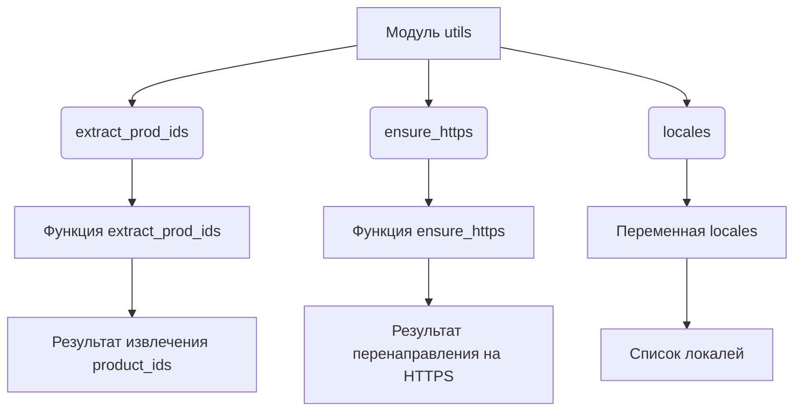
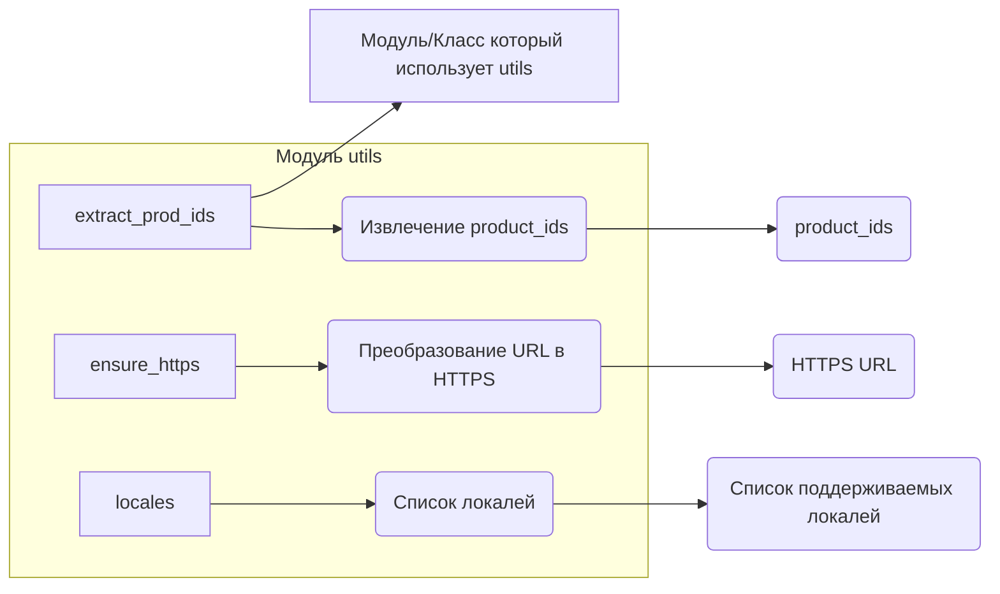

# <input code>

```python
## \file hypotez/src/suppliers/aliexpress/utils/__init__.py
# -*- coding: utf-8 -*-
#! venv/Scripts/python.exe
#! venv/bin/python/python3.12

"""
.. module: src.suppliers.aliexpress.utils 
	:platform: Windows, Unix
	:synopsis:

"""
MODE = 'dev'

from .extract_product_id import extract_prod_ids
from .ensure_https import ensure_https
from .locales import locales
```

# <algorithm>



**Описание алгоритма:**

Модуль `utils` импортирует функции и переменные из подмодулей, которые обеспечивают вспомогательные функции для работы с данными, связанными с сайтом AliExpress.

- `extract_prod_ids`:  Извлекает идентификаторы продуктов.
- `ensure_https`:  Преобразует URL-адреса в HTTPS.
- `locales`:  Содержит список поддерживаемых локалей.

Внутри модуля нет значимых вычислений, только импорты.  Главное действие – доступ к функциональности других модулей.


# <mermaid>



# <explanation>

**Импорты:**

- `from .extract_product_id import extract_prod_ids`: Импортирует функцию `extract_prod_ids` из подмодуля `extract_product_id`.  Подразумевается, что этот подмодуль находится в директории `hypotez/src/suppliers/aliexpress/utils/extract_product_id.py` и содержит функцию для извлечения идентификаторов продуктов с сайта AliExpress.
- `from .ensure_https import ensure_https`: Импортирует функцию `ensure_https` из подмодуля `ensure_https`. Эта функция, скорее всего, отвечает за перенаправление HTTP-ссылок на HTTPS. Расположение аналогично предыдущему случаю.
- `from .locales import locales`: Импортирует переменную `locales` (вероятно, список или словарь) из подмодуля `locales`. Эта переменная, вероятно, хранит информацию о поддерживаемых языках или локалях для работы с сайтом AliExpress.  

**Переменные:**

- `MODE = 'dev'`:  Переменная, вероятно, задаёт режим работы (например, 'dev' - режим разработки, 'prod' - продакшн). Эта переменная используется для настройки других компонентов приложения, например, для выбора используемых ресурсов.

**Функции (предполагаемые):**

- `extract_prod_ids`: Функция для извлечения идентификаторов продуктов с AliExpress.  Она получает данные с сайта и возвращает список идентификаторов.  Возможные аргументы – URL, заголовки, куки и другие параметры для запроса.
- `ensure_https`: Функция для перенаправления HTTP-ссылок на HTTPS, необходимая для безопасного взаимодействия с сайтом.  Возможно принимает URL и возвращает соответствующий HTTPS URL.
- `locales`: Вероятно, переменная, содержащая список доступных языковых локалей для AliExpress.  Это может быть словарь или список словарей.

**Классы (предполагаемые):**

Никаких классов не определено.

**Взаимосвязи с другими частями проекта:**

Этот модуль `utils` предоставляет вспомогательные функции для работы с данными, необходимыми другим частям приложения, связанными с AliExpress. Например, функции для извлечения данных, преобразования URL и работы с языковыми настройками. Без анализа других файлов проекта сложно точно определить, куда конкретно передаются значения.  Логически, функции `extract_prod_ids`, `ensure_https`  будут вызваны из других модулей, обрабатывающих данные AliExpress (например, `src.suppliers.aliexpress.scraper` или подобных).


**Возможные ошибки и улучшения:**

- Не указано, как обрабатываются исключения.
- Отсутствует документация внутри функций (docstrings), что затрудняет понимание их назначения и использования.
- Нет проверки входных данных.
- Нет обработки ошибок (например, при ошибках сети или при парсинге данных).
- Не описан способ использования переменной `MODE`.


В целом, код структурирован и организован в соответствии с принципами ООП.