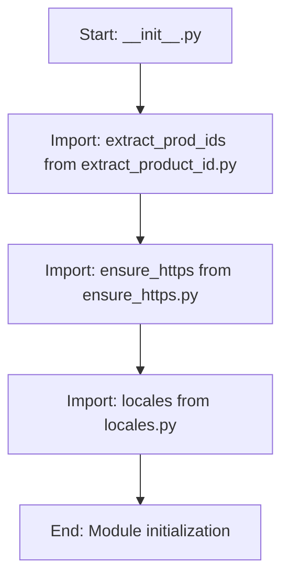

## Анализ кода `hypotez/src/suppliers/aliexpress/utils/__init__.py`

### <алгоритм>
1. **Импорт модулей:**
   - Импортируется функция `extract_prod_ids` из модуля `extract_product_id.py`. Эта функция, вероятно, предназначена для извлечения идентификаторов продуктов из какого-либо источника данных (например, URL, текста).
   - Импортируется функция `ensure_https` из модуля `ensure_https.py`. Эта функция, вероятно, обеспечивает, чтобы URL-адреса имели протокол HTTPS, приводя HTTP к HTTPS.
   - Импортируется переменная `locales` из модуля `locales.py`. Эта переменная, скорее всего, содержит данные о локалях, например, словари с языковыми кодами и их названиями.

**Пример:**
   ```
   1.  Загрузка:
        - Импорт `extract_prod_ids` (функция).
        - Импорт `ensure_https` (функция).
        - Импорт `locales` (переменная).
   ```

### <mermaid>

### <объяснение>
**Импорты:**
- `from .extract_product_id import extract_prod_ids`:
    -  Импортирует функцию `extract_prod_ids` из модуля `extract_product_id.py`, находящегося в той же директории.
    -  `extract_prod_ids` скорее всего предназначена для извлечения идентификаторов продуктов AliExpress из каких-либо источников (например, URL-адресов или текста HTML). Она используется далее в проекте для работы с идентификаторами продуктов.
- `from .ensure_https import ensure_https`:
    -  Импортирует функцию `ensure_https` из модуля `ensure_https.py`, находящегося в той же директории.
    -  `ensure_https` скорее всего преобразует любые URL-адреса HTTP в HTTPS, обеспечивая безопасность при запросах. Это повышает надежность и безопасность проекта, гарантируя использование HTTPS.
- `from .locales import locales`:
    -  Импортирует переменную `locales` из модуля `locales.py`, находящегося в той же директории.
    -  `locales` скорее всего представляет собой словарь или структуру данных, содержащую информацию о локалях (языковых стандартах), поддерживаемых AliExpress, например, языковые коды и их имена. Эта переменная используется в проекте для настройки поведения в зависимости от региональных настроек.

**Общее:**
 - Файл `__init__.py` в Python используется для обозначения директории как пакета. В данном случае, `src.suppliers.aliexpress.utils` является пакетом, и этот файл инициализирует его, делая функции и переменные, определенные в других модулях этого пакета, доступными через импорт этого пакета.
- Модули `extract_product_id.py`, `ensure_https.py` и `locales.py` являются частью пакета `utils` и содержат полезные функции и данные, необходимые для работы с данными AliExpress.
-  Этот подход делает код более модульным и легким в обслуживании.

**Потенциальные улучшения:**
- Можно было бы добавить документацию к каждой функции, это повысит читаемость.
- Можно было бы расширить функционал с помощью дополнительных утилит, например, для парсинга цен или изображений.

**Взаимосвязи с другими частями проекта:**
- Этот пакет `utils` скорее всего используется в других частях проекта, где требуется извлекать идентификаторы продуктов AliExpress, гарантировать использование HTTPS и поддерживать локали.  Например, при сборе данных о продуктах с сайта AliExpress, эти утилиты могут быть использованы для обработки URL-адресов, извлечения идентификаторов и настройки поведения в зависимости от языка.