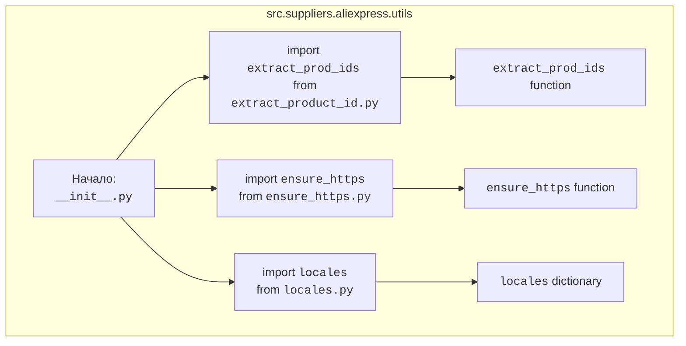

## Анализ кода `hypotez/src/suppliers/aliexpress/utils/__init__.py`

### 1. <алгоритм>

**Общая задача:** Инициализация пакета `utils` для работы с поставщиком AliExpress, предоставляя набор утилит для извлечения идентификаторов продуктов, обеспечения HTTPS протокола и работы с локалями.

**Блок-схема:**

**Примеры:**

- **`extract_prod_ids`**:
   - Вход: URL товара AliExpress, например, `"https://aliexpress.com/item/1234567890.html"`.
   - Выход: Список идентификаторов продуктов, например, `["1234567890"]`.
   - Пример использования: `product_ids = extract_prod_ids("https://aliexpress.com/item/1234567890.html")`

- **`ensure_https`**:
    - Вход: URL, например, `"http://aliexpress.com/item/1234567890.html"`.
    - Выход: URL с HTTPS, например, `"https://aliexpress.com/item/1234567890.html"`.
    - Пример использования: `secure_url = ensure_https("http://aliexpress.com/item/1234567890.html")`

- **`locales`**:
    - Вход: Отсутствует (это словарь).
    - Выход: Словарь, например, `{"ru": "ru_RU", "en": "en_US"}`.
    - Пример использования: `russian_locale = locales.get("ru")`

### 2. <mermaid>

**Объяснение диаграммы:**

-   `Start`: Начало выполнения `__init__.py`, инициирующее импорты.
-   `extract_product_id`: Импорт функции `extract_prod_ids` из модуля `extract_product_id.py`.
-   `ensure_https_import`: Импорт функции `ensure_https` из модуля `ensure_https.py`.
-   `locales_import`: Импорт словаря `locales` из модуля `locales.py`.
-   `extract_product_id_end`: Представление функции `extract_prod_ids`, готовой к использованию.
-    `ensure_https_end`: Представление функции `ensure_https`, готовой к использованию.
-   `locales_end`: Представление словаря `locales`, готового к использованию.

### 3. <объяснение>

**Импорты:**

-   `from .extract_product_id import extract_prod_ids`: Импортирует функцию `extract_prod_ids` из модуля `extract_product_id.py`, находящегося в том же пакете `src.suppliers.aliexpress.utils`. Эта функция, вероятно, используется для извлечения идентификаторов товаров из URL-адресов AliExpress.
-   `from .ensure_https import ensure_https`: Импортирует функцию `ensure_https` из модуля `ensure_https.py`, расположенного в текущем пакете. Эта функция отвечает за преобразование URL-адресов в HTTPS, что обеспечивает безопасность соединения.
-   `from .locales import locales`: Импортирует словарь `locales` из модуля `locales.py`. Этот словарь, вероятно, хранит соответствия между кодами языков (например, `ru`, `en`) и их полными локалями (например, `ru_RU`, `en_US`).

**Классы:**

-   В данном коде нет классов.

**Функции:**

-   `extract_prod_ids`:
    -   **Аргументы**: URL-адрес товара AliExpress (ожидается строка).
    -   **Возвращаемое значение**: Список строк, представляющих идентификаторы продуктов.
    -   **Назначение**: Извлекает идентификаторы товаров из URL-адресов AliExpress.
    -   **Пример**: `extract_prod_ids("https://aliexpress.com/item/1234567890.html")` может вернуть `["1234567890"]`.
-   `ensure_https`:
    -   **Аргументы**: URL-адрес (ожидается строка).
    -   **Возвращаемое значение**: URL-адрес, начинающийся с HTTPS.
    -   **Назначение**: Принудительно преобразует URL-адреса в HTTPS.
    -   **Пример**: `ensure_https("http://aliexpress.com/item/1234567890.html")` вернет `"https://aliexpress.com/item/1234567890.html"`.

**Переменные:**

-   `locales`:
    -   **Тип**: Словарь (dict).
    -   **Использование**: Содержит соответствие между кодами языков и локалями, например, `{"ru": "ru_RU", "en": "en_US"}`.

**Потенциальные ошибки и области для улучшения:**

1.  **Отсутствие обработки исключений**: В коде не видно обработки возможных исключений в функциях `extract_prod_ids` и `ensure_https`. Например, `extract_prod_ids` может не найти идентификаторы в URL, а `ensure_https` может работать некорректно с невалидными URL. Необходимо добавить соответствующие `try...except` блоки для обработки возможных ошибок.
2.  **Локализация `locales`**: Локализация может быть более сложной и зависеть от разных факторов, таких как регион и настройки пользователя. Словарь `locales` может потребовать расширения и поддержки более сложных сценариев локализации.
3. **Отсутствие документации**: Код не имеет детальной документации для функций. Рекомендуется добавить docstring для каждой функции, описывая её назначение, аргументы и возвращаемые значения.
4.  **Проверка типов**:  Можно добавить проверки типов аргументов для обеспечения надёжности функций.

**Взаимосвязи с другими частями проекта:**

-   Этот пакет `utils` предназначен для использования внутри модуля `aliexpress`, где вероятно есть другие компоненты (например, парсеры, клиенты API).
-   Функции `extract_prod_ids` и `ensure_https` могут использоваться в других модулях для обработки URL-адресов AliExpress.
-   Словарь `locales` может использоваться для настройки корректной работы парсеров и формирования запросов к API AliExpress на разных языках.

**Цепочка взаимосвязей:**

`hypotez/src/suppliers/aliexpress/__init__.py` → `hypotez/src/suppliers/aliexpress/utils/__init__.py` → `hypotez/src/suppliers/aliexpress/utils/extract_product_id.py` + `hypotez/src/suppliers/aliexpress/utils/ensure_https.py` + `hypotez/src/suppliers/aliexpress/utils/locales.py` → Другие части проекта (парсеры, API-клиенты, и т.д.).

В заключение, код инициализирует набор полезных утилит для работы с AliExpress, но требует добавления обработки ошибок, проверки типов и более подробной документации.