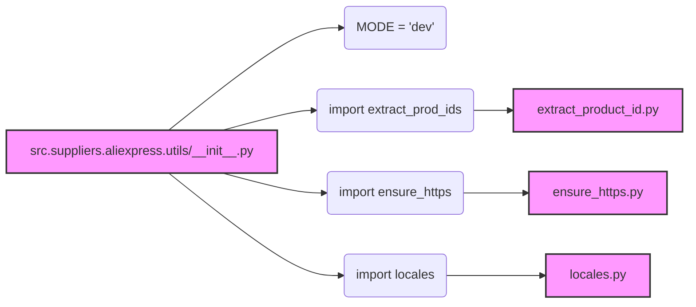

## Анализ кода `hypotez/src/suppliers/aliexpress/utils/__init__.py`

### 1. <алгоритм>

**Блок-схема:**

1.  **Начало:** Инициализация модуля `src.suppliers.aliexpress.utils`.
2.  **Определение `MODE`:** Переменной `MODE` присваивается значение `'dev'`.
    *   _Пример:_ `MODE = 'dev'`.
3.  **Импорт `extract_prod_ids`:** Импортируется функция `extract_prod_ids` из модуля `extract_product_id.py`.
    *   _Пример:_ `from .extract_product_id import extract_prod_ids`.
4.  **Импорт `ensure_https`:** Импортируется функция `ensure_https` из модуля `ensure_https.py`.
    *   _Пример:_ `from .ensure_https import ensure_https`.
5.  **Импорт `locales`:** Импортируется переменная `locales` из модуля `locales.py`.
    *   _Пример:_ `from .locales import locales`.
6.  **Конец:** Модуль инициализирован, и его компоненты готовы к использованию.

**Поток данных:**

-   Импортированные функции и переменные (`extract_prod_ids`, `ensure_https`, `locales`) становятся доступными для использования в других модулях, импортирующих `src.suppliers.aliexpress.utils`.

### 2. <mermaid>

**Анализ зависимостей:**

*   `src.suppliers.aliexpress.utils/__init__.py`: Является точкой входа для пакета `utils` и импортирует функции и переменные из других модулей.
*   `extract_product_id.py`: Содержит функцию `extract_prod_ids`, которая вероятно, извлекает идентификаторы продуктов.
*   `ensure_https.py`: Содержит функцию `ensure_https`, которая, по всей видимости, преобразует URL в HTTPS формат.
*   `locales.py`: Содержит переменную `locales`, представляющую собой список или словарь локалей.

### 3. <объяснение>

**Импорты:**

-   `from .extract_product_id import extract_prod_ids`:
    -   Импортирует функцию `extract_prod_ids` из модуля `extract_product_id.py`, находящегося в той же директории (относительный импорт).
    -   Предполагается, что `extract_prod_ids` занимается извлечением идентификаторов продуктов из каких-либо данных (например, URL-адресов или HTML).
    -   Связь с другими пакетами: Эта функция может использоваться в других частях проекта, где необходимо обрабатывать данные, связанные с товарами AliExpress.
-   `from .ensure_https import ensure_https`:
    -   Импортирует функцию `ensure_https` из модуля `ensure_https.py`, находящегося в той же директории.
    -   Вероятно, функция `ensure_https` преобразует URL-адреса в HTTPS протокол, обеспечивая безопасность соединения.
    -   Связь с другими пакетами: Эта функция может использоваться в модулях, которые работают с сетевыми запросами.
-  `from .locales import locales`:
    -   Импортирует переменную `locales` из модуля `locales.py`, находящегося в той же директории.
    -   `locales` предположительно содержит информацию о поддерживаемых локалях (например, языках и странах).
    -   Связь с другими пакетами: Эта переменная может использоваться для настройки поведения приложения в зависимости от локали пользователя.

**Переменные:**

-   `MODE = 'dev'`:
    -   Глобальная переменная `MODE`, установленная в значение `'dev'`.
    -   Определяет режим работы модуля или всего приложения (разработка, тестирование, продакшн).
    -   Может влиять на логику выполнения кода (например, использование мок-данных в режиме разработки).

**Функции и классы:**

-   В данном файле нет определения функций или классов. Он служит для импорта и агрегации других модулей пакета `utils`.

**Потенциальные ошибки и области для улучшения:**

-   Отсутствие документации для импортируемых функций/переменных: Необходимо добавить docstrings к функциям `extract_prod_ids`, `ensure_https` и переменной `locales` для понимания их функциональности.
-   Жестко заданное значение `MODE`: Возможно, стоит сделать переменную `MODE` конфигурируемой через переменные окружения, чтобы можно было легко переключать режимы работы приложения без изменения кода.

**Цепочка взаимосвязей с другими частями проекта:**

1.  Модуль `src.suppliers.aliexpress.utils` предоставляет утилиты, которые могут использоваться другими модулями, связанными с обработкой данных от AliExpress.
2.  Например, модули для парсинга HTML-страниц AliExpress могли бы использовать `extract_prod_ids` для извлечения идентификаторов товаров и `ensure_https` для приведения URL к безопасному протоколу.
3.  В модулях, отвечающих за локализацию приложения, может использоваться переменная `locales` для предоставления корректного перевода и форматирования.
4.  Модули, которые занимаются запросами к API AliExpress, вероятно используют эти утилиты для предварительной обработки данных.

В целом, этот `__init__.py` файл предоставляет набор общих утилит для работы с данными AliExpress, что способствует модульности и повторному использованию кода в проекте.