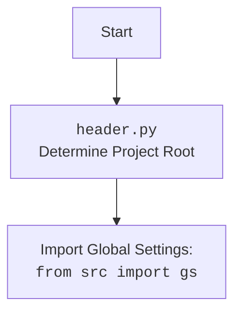

## <алгоритм>

**1. `ensure_https(prod_ids)` (Главная функция):**

   -   **Вход**: `prod_ids` (может быть строкой или списком строк).
   -   **Проверка типа `prod_ids`**:
        -   **Если `prod_ids` это список**:
            -   Применяется функция `ensure_https_single` к каждому элементу списка.
            -   Возвращается новый список с обработанными URL.
        -   **Если `prod_ids` это строка**:
            -   Вызывается `ensure_https_single` для обработки строки.
            -   Возвращается результат.
   -   **Пример:**
      -   Вход: `prod_ids` = "example_product_id"
         -  `prod_ids` строка -> вызывается `ensure_https_single`
         -  `ensure_https_single` обрабатывает строку и возвращает "https://www.aliexpress.com/item/example_product_id.html"
      -   Вход: `prod_ids` = ["example_product_id1", "https://www.aliexpress.com/item/example_product_id2.html"]
         -  `prod_ids` список ->  `ensure_https_single` вызывается для каждого элемента списка
         -  `ensure_https_single` преобразует элементы и возвращает список  ['https://www.aliexpress.com/item/example_product_id1.html', 'https://www.aliexpress.com/item/example_product_id2.html']

**2. `ensure_https_single(prod_id)` (Вспомогательная функция):**
    -   **Вход**: `prod_id` (строка, представляющая URL или ID продукта).
    -   Вызывает функцию `extract_prod_ids(prod_id)` для извлечения ID продукта из входной строки.
        -   **Если `extract_prod_ids` возвращает ID продукта** (`_prod_id` не является None или пустой строкой):
            -   Формирует полную URL, добавляя `https://www.aliexpress.com/item/` в начало и `.html` в конец извлеченного ID, затем возвращает результат.
        -   **Если `extract_prod_ids` возвращает None или пустую строку:**
            -   Выводится сообщение об ошибке в лог с использованием `logger.error`.
            -   Возвращается исходная строка `prod_id` без изменений.
    -   **Примеры:**
        -   Вход: `prod_id` = "example_product_id"
           - `extract_prod_ids` возвращает "example_product_id"
           - возвращает "https://www.aliexpress.com/item/example_product_id.html"
        -   Вход: `prod_id` = "https://www.aliexpress.com/item/example_product_id"
            - `extract_prod_ids` возвращает None
            - Выводит сообщение об ошибке в лог.
            - Возвращает "https://www.aliexpress.com/item/example_product_id"

**Поток данных:**

1.  В `ensure_https` функция получает `prod_ids` (строка или список строк).
2.  `ensure_https` вызывает `ensure_https_single` для каждой строки.
3.  `ensure_https_single` вызывает `extract_prod_ids`.
4.  `extract_prod_ids` возвращает извлеченный ID или `None`.
5.  `ensure_https_single` формирует URL или возвращает исходную строку, если `extract_prod_ids` вернул `None`.
6.  `ensure_https` возвращает обработанную строку или список строк.

## <mermaid>

```mermaid
flowchart TD
    Start(Начало) --> CheckType{Проверка типа prod_ids}
    CheckType -- Список --> ProcessList{Обработка списка}
    CheckType -- Строка --> ProcessString{Обработка строки}
    ProcessList --> LoopStart{Начало цикла по prod_id в prod_ids}
    LoopStart --> ProcessSingleString[ensure_https_single(prod_id)]
    ProcessSingleString --> LoopEnd{Конец цикла}
    LoopEnd -- Все prod_id обработаны --> ReturnList[Возврат списка обработанных URL]
    ProcessString --> ProcessSingleString2[ensure_https_single(prod_ids)]
    ProcessSingleString2 --> ReturnString[Возврат обработанного URL]

    subgraph ensure_https_single
    StartSingle(Начало ensure_https_single) --> ExtractID[extract_prod_ids(prod_id)]
    ExtractID -- ID найден --> ConstructURL[Формирование URL]
    ConstructURL --> EndSingle[Возврат URL]
    ExtractID -- ID не найден --> LogError[Логирование ошибки]
    LogError --> ReturnOriginal[Возврат исходной строки]
    EndSingle --> EndSingleFinal(Конец ensure_https_single)
    ReturnOriginal --> EndSingleFinal
    end

    ReturnList --> End(Конец)
    ReturnString --> End
```

**Разъяснение:**

-   **`Start`**: Начало выполнения функции `ensure_https`.
-   **`CheckType{Проверка типа prod_ids}`**: Проверяет, является ли входной аргумент `prod_ids` списком или строкой.
-   **`ProcessList{Обработка списка}`**: Блок обработки, если `prod_ids` это список.
-   **`ProcessString{Обработка строки}`**: Блок обработки, если `prod_ids` это строка.
-   **`LoopStart{Начало цикла по prod_id в prod_ids}`**: Начало цикла по списку `prod_ids`, если был передан список.
-   **`ProcessSingleString[ensure_https_single(prod_id)]`**: Вызов функции `ensure_https_single` для каждого элемента `prod_id` из списка.
-   **`LoopEnd{Конец цикла}`**: Конец цикла по списку `prod_ids`.
-   **`ReturnList[Возврат списка обработанных URL]`**: Возвращает список URL, обработанных функцией `ensure_https_single`.
-  **`ProcessSingleString2[ensure_https_single(prod_ids)]`**: Вызов функции `ensure_https_single` для строки `prod_ids`.
-  **`ReturnString[Возврат обработанного URL]`**: Возвращает строку  URL, обработанную функцией `ensure_https_single`.

-   **`ensure_https_single` subgraph:**
    -  **`StartSingle(Начало ensure_https_single)`**: Начало выполнения функции `ensure_https_single`.
    -   **`ExtractID[extract_prod_ids(prod_id)]`**: Вызов функции `extract_prod_ids` для извлечения ID продукта из URL.
    -   **`ConstructURL[Формирование URL]`**: Формирование полной URL с `https://` префиксом и `.html` расширением.
    -   **`EndSingle[Возврат URL]`**:  Возврат сформированного URL.
    -  **`LogError[Логирование ошибки]`**:  Логирование ошибки, если `extract_prod_ids` не нашел ID продукта.
    -   **`ReturnOriginal[Возврат исходной строки]`**: Возврат исходной строки, если ID продукта не был найден.
    -   **`EndSingleFinal(Конец ensure_https_single)`**:  Конец выполнения функции `ensure_https_single`.
-   **`End`**: Конец выполнения функции `ensure_https`.


## <объяснение>

**Импорты:**

-   `from src.logger.logger import logger`: Импортирует объект `logger` из модуля `logger.py` в пакете `src.logger`. Этот объект используется для логирования ошибок и предупреждений внутри функции `ensure_https_single`.
-   `from .extract_product_id import extract_prod_ids`: Импортирует функцию `extract_prod_ids` из модуля `extract_product_id.py`, который находится в том же пакете (`src.suppliers.aliexpress.utils`). Эта функция используется для извлечения идентификатора продукта из строки URL или непосредственно из идентификатора продукта.

**Функции:**

1.  **`ensure_https(prod_ids: str | list[str]) -> str | list[str]`**:
    -   **Аргументы**:
        -   `prod_ids`: Может быть строкой, представляющей URL или ID продукта, либо списком строк, каждая из которых также является URL или ID продукта.
    -   **Возвращаемое значение**:
        -   Если на входе была строка, возвращает строку с `https://` префиксом.
        -   Если на входе был список, возвращает список строк с `https://` префиксом.
    -   **Назначение**:
        -   Эта функция проверяет, является ли вход `prod_ids` строкой или списком. Если это список, она итерируется по каждому элементу и применяет `ensure_https_single`. Если это строка, вызывает `ensure_https_single` напрямую.
        -   Использует вспомогательную функцию `ensure_https_single` для обработки каждого отдельного URL или ID.
        -   Применяет функциональное программирование `[ensure_https_single(prod_id) for prod_id in prod_ids]` для обработки списка URL'ов.
    -   **Примеры**:
        -   `ensure_https("1234567890")` вернет `"https://www.aliexpress.com/item/1234567890.html"`.
        -   `ensure_https(["1234567890", "https://example.com/item/1234567891.html"])` вернет `['https://www.aliexpress.com/item/1234567890.html', 'https://example.com/item/1234567891.html']`

2.  **`ensure_https_single(prod_id: str) -> str`**:
    -   **Аргументы**:
        -   `prod_id`: Строка, представляющая URL или ID продукта.
    -   **Возвращаемое значение**:
        -   Строка URL с `https://` префиксом или исходная строка, если ID не распознан или URL уже имеет `https://`.
    -   **Назначение**:
        -   Эта функция вызывает `extract_prod_ids` для извлечения ID продукта.
        -   Если ID успешно извлечен, формирует URL с `https://` и возвращает его.
        -   Если ID не извлечен, логирует ошибку и возвращает исходную строку.
    -   **Примеры**:
        -   `ensure_https_single("1234567890")` вернет `"https://www.aliexpress.com/item/1234567890.html"`.
        -   `ensure_https_single("https://example.com/item/1234567890")` вернет `"https://example.com/item/1234567890"`.
        -  `ensure_https_single("invalid_url")` вернет `invalid_url` и залогирует ошибку.

**Переменные:**

-   `prod_ids`: Аргумент функции `ensure_https`, который может быть строкой или списком строк.
-   `prod_id`: Аргумент функции `ensure_https_single`, всегда строка.
-   `_prod_id`: Локальная переменная в `ensure_https_single`, в которую сохраняется результат работы функции `extract_prod_ids`.

**Взаимосвязь с другими частями проекта:**

-   Функция `ensure_https` использует `logger` из `src.logger` для логирования ошибок. Это обеспечивает централизованное ведение логов в приложении.
-   Функция `ensure_https` использует `extract_prod_ids` из того же пакета, что указывает на внутреннюю зависимость между функциями обработки URL в рамках пакета `src.suppliers.aliexpress.utils`.
-   Функция является частью пакета `src.suppliers.aliexpress`, следовательно, она используется для предобработки URL'ов перед дальнейшей обработкой данных с AliExpress.
-   Потенциально, другие модули в `src.suppliers.aliexpress` могут вызывать `ensure_https` для гарантированной корректности URL'ов.

**Потенциальные ошибки и области для улучшения:**

-   **Обработка ошибок**: В текущей реализации ошибки просто логируются, но не обрабатываются. Возможно, стоит добавить исключения, чтобы вызывающий код мог обрабатывать ошибки более явно.
-  **`extract_prod_ids`**:  Следует рассмотреть как `extract_prod_ids` может влиять на работу `ensure_https`. Если  `extract_prod_ids` часто возвращает `None` при корректном url, тогда стоит его пересмотреть.
-   **Оптимизация**: Функция `ensure_https_single` могла бы проверять наличие `https://` перед вызовом `extract_prod_ids`, чтобы избежать ненужных операций.
-   **Тестирование**: Необходимы более подробные юнит-тесты, покрывающие все возможные сценарии (корректные URL, некорректные URL, ID продукта, список URL и т.д.).