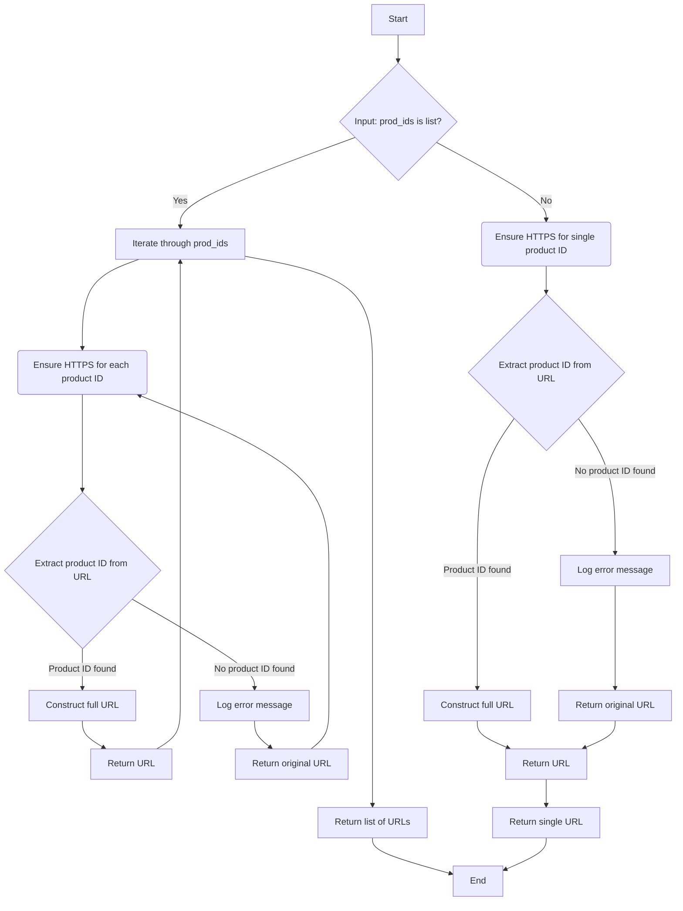

## ИНСТРУКЦИЯ:

Анализируй предоставленный код подробно и объясни его функциональность. Ответ должен включать три раздела:

1. **<алгоритм>**: Опиши рабочий процесс в виде пошаговой блок-схемы, включая примеры для каждого логического блока, и проиллюстрируй поток данных между функциями, классами или методами.
2.  **<mermaid>**: Напиши код для диаграммы в формате `mermaid`, проанализируй и объясни все зависимости,
    которые импортируются при создании диаграммы.
    **ВАЖНО!** Убедитесь, что все имена переменных, используемые в диаграмме `mermaid`,
    имеют осмысленные и описательные имена. Имена переменных вроде `A`, `B`, `C`, и т.д., не допускаются!

    **Дополнительно**: Если в коде есть импорт `import header`, добавьте блок `mermaid` flowchart, объясняющий `header.py`:
    ```mermaid
    flowchart TD
        Start --> Header[<code>header.py</code><br> Determine Project Root]

        Header --> import[Import Global Settings: <br><code>from src import gs</code>]
    ```

3.  **<объяснение>**: Предоставьте подробные объяснения:
    -   **Импорты**: Их назначение и взаимосвязь с другими пакетами `src.`.
    -   **Классы**: Их роль, атрибуты, методы и взаимодействие с другими компонентами проекта.
    -   **Функции**: Их аргументы, возвращаемые значения, назначение и примеры.
    -   **Переменные**: Их типы и использование.
    -   Выделите потенциальные ошибки или области для улучшения.

Дополнительно, постройте цепочку взаимосвязей с другими частями проекта (если применимо).

Это обеспечивает всесторонний и структурированный анализ кода.
## Формат ответа: `.md` (markdown)
**КОНЕЦ ИНСТРУКЦИИ**

## <алгоритм>



**Примеры:**

1.  **Вход:** `prod_ids = "12345"`
    *   `InputCheck`: `prod_ids` не является списком.
    *   `EnsureHttpsSingleSingle`: вызывается `ensure_https_single("12345")`.
    *   `ExtractProductID`: извлекается `12345`.
    *   `ConstructURL`: формируется "https://www.aliexpress.com/item/12345.html".
    *   **Выход:** `"https://www.aliexpress.com/item/12345.html"`
2.  **Вход:** `prod_ids = ["12345", "https://example.com/item/67890"]`
    *   `InputCheck`: `prod_ids` является списком.
    *   `ProcessList`:  итерирует по списку.
    *   **Для "12345":**
        *   `EnsureHttpsSingle`: вызывается `ensure_https_single("12345")`.
        *   `ExtractProductID`: извлекается `12345`.
        *   `ConstructURL`: формируется "https://www.aliexpress.com/item/12345.html".
    *   **Для "https://example.com/item/67890":**
        *   `EnsureHttpsSingle`: вызывается `ensure_https_single("https://example.com/item/67890")`.
         *   `ExtractProductID`: извлекается `67890`.
        *   `ConstructURL`: формируется "https://www.aliexpress.com/item/67890.html".
    *   **Выход:** `["https://www.aliexpress.com/item/12345.html", "https://www.aliexpress.com/item/67890.html"]`
3.  **Вход:** `prod_ids = "invalid_url"`
    *   `InputCheck`: `prod_ids` не является списком.
    *   `EnsureHttpsSingleSingle`: вызывается `ensure_https_single("invalid_url")`.
    *   `ExtractProductID`: Не удается извлечь `_prod_id`.
    *   `LogError`: Сообщение об ошибке.
    *   `ReturnOriginalURL`: Возвращает "invalid_url"
    *    **Выход:** `"invalid_url"`

## <mermaid>

```mermaid
flowchart TD
    Start[Start: ensure_https] --> CheckInputType{Is prod_ids a list?}
    CheckInputType -- Yes --> ProcessList[Iterate through prod_ids]
    ProcessList --> EnsureHttpsSingleCall[Call ensure_https_single(prod_id)]
    EnsureHttpsSingleCall --> ExtractID[Call extract_prod_ids(prod_id)]
    ExtractID -- Product ID Found --> ConstructFullURL[Construct full URL]
    ConstructFullURL --> ReturnModifiedURL[Return modified URL]
    ExtractID -- No Product ID --> LogError[Log Error]
    LogError --> ReturnOriginalURL[Return original prod_id]
    ReturnModifiedURL --> ProcessList
    ReturnOriginalURL --> ProcessList
    ProcessList --> ReturnListResult[Return list of modified URLs]
    CheckInputType -- No --> EnsureHttpsSingleCallSingle[Call ensure_https_single(prod_ids)]
    EnsureHttpsSingleCallSingle --> ExtractIDSingle[Call extract_prod_ids(prod_ids)]
        ExtractIDSingle -- Product ID Found --> ConstructFullURLSingle[Construct full URL]
    ConstructFullURLSingle --> ReturnModifiedURLSingle[Return modified URL]
        ExtractIDSingle -- No Product ID --> LogErrorSingle[Log Error]
        LogErrorSingle --> ReturnOriginalURLSingle[Return original prod_ids]
        ReturnModifiedURLSingle --> ReturnSingleResult[Return modified URL]
        ReturnOriginalURLSingle --> ReturnSingleResult
    ReturnListResult --> End[End]
    ReturnSingleResult --> End
    

    classDef imported fill:#f9f,stroke:#333,stroke-width:2px;
    class EnsureHttpsSingleCall,EnsureHttpsSingleCallSingle, ExtractID, ExtractIDSingle, LogError, LogErrorSingle imported
```

**Описание зависимостей:**

*   **`src.logger.logger import logger`**:  Используется для логирования ошибок, если не удается извлечь `product_id` из URL.
*   **`.extract_product_id import extract_prod_ids`**:  Используется для извлечения `product_id` из URL или строки, если это `product_id`.

## <объяснение>

**Импорты:**

*   `from src.logger.logger import logger`: импортирует объект `logger` из модуля `src.logger.logger`. Этот объект используется для записи сообщений об ошибках в лог файл. Это позволяет отслеживать проблемы с обработкой URL-адресов.
*  `from .extract_product_id import extract_prod_ids`: импортирует функцию `extract_prod_ids` из модуля `extract_product_id`, находящегося в той же директории. Эта функция используется для извлечения `product_id` из строки (URL или ID).

**Функции:**

*   `ensure_https(prod_ids: str | list[str]) -> str | list[str]`:
    *   **Аргументы**:
        *   `prod_ids`: строка или список строк, представляющих URL-адреса или `product_id`.
    *   **Возвращаемое значение**: строка или список строк, представляющих URL-адреса с добавленным префиксом `https://` или оригинальные строки, если это не `product_id`.
    *   **Назначение**: Обеспечивает наличие префикса `https://` в URL-адресах. Если входные данные являются `product_id`, формирует полный URL с `https://`. Если входные данные представляют собой список, то применяет операцию для всех элементов списка.
    *   **Пример:** `ensure_https("12345")` вернет `"https://www.aliexpress.com/item/12345.html"`. `ensure_https(["12345", "https://example.com"])` вернет `["https://www.aliexpress.com/item/12345.html", "https://example.com"]`
*   `ensure_https_single(prod_id: str) -> str`:
    *   **Аргументы**:
        *   `prod_id`: строка, представляющая URL-адрес или `product_id`.
    *   **Возвращаемое значение**: строка, представляющая URL-адрес с префиксом `https://` или оригинальная строка.
    *   **Назначение**: Обеспечивает наличие префикса `https://` для одного URL-адреса или `product_id`. Вызывает `extract_prod_ids` для проверки является ли входная строка `product_id` или `URL`, если это `product_id` формируется полная ссылка с префиксом `https://`, если нет - возвращает оригинальную строку.
    *   **Пример:** `ensure_https_single("12345")` вернет `"https://www.aliexpress.com/item/12345.html"`, `ensure_https_single("https://example.com")` вернет  `"https://example.com"`.

**Переменные:**

*   `prod_ids`: переменная, которая хранит либо URL-адрес (строка), либо список URL-адресов (список строк). Переменная используется для передачи URL в функции, и обработке в зависимости от её типа (список или нет).
*   `prod_id`: переменная, которая хранит URL-адрес (строка). Переменная используется как аргумент функции `ensure_https_single`.
*   `_prod_id`: переменная, в которую сохраняется результат вызова `extract_prod_ids`, то есть, извлеченный `product_id`.
* `logger`: экземпляр класса logger. Используется для записи сообщений об ошибках.

**Потенциальные ошибки и области для улучшения:**

*   **Обработка исключений:** Код не обрабатывает возможные исключения при обращении к `extract_prod_ids`, например, в случае если строка не является URL или `product_id`, `extract_prod_ids` может вызвать ошибку. Желательно добавить блок `try-except`, чтобы обрабатывать такие исключения.
*   **Валидация URL**: Дополнительная проверка валидности URL могла бы быть полезной, чтобы убедиться, что входные данные действительно являются `product_id` или URL-адресом. Можно добавить проверку на соответствие формату URL.
*   **Логирование:** Логирование происходит только в случае, если не удалось извлечь `product_id`. Можно добавить логирование успешной обработки.
*   **Унификация**: Если `extract_prod_ids` возвращает `None`, то можно переделать этот момент и возвращать `prod_id` сразу, без дублирования кода.

**Взаимосвязь с другими частями проекта:**

*   Этот модуль является частью `suppliers.aliexpress`, что указывает на его использование для работы с поставщиком Aliexpress.
*   Модуль использует `src.logger.logger` для логирования, что свидетельствует о наличии общей системы логирования в проекте.
*   `extract_product_id` должен быть частью модуля `utils` и его наличие, говорит о наличии концепции работы с `product_id` в данном проекте.

В целом, код выполняет свою задачу по обеспечению наличия `https://` префикса в URL-адресах или формирования полных URL из идентификаторов товаров, но с добавлением валидации и обработки исключений он станет более надежным.