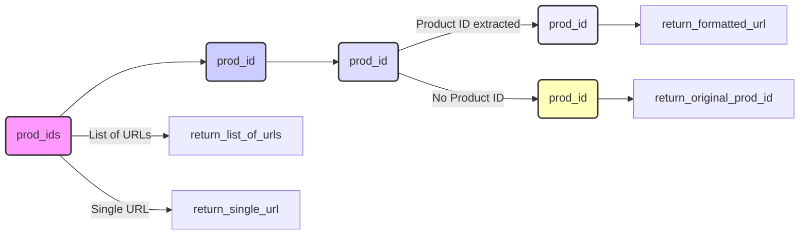

## Анализ кода `hypotez/src/suppliers/aliexpress/utils/ensure_https.py`

### 1. <алгоритм>

**Блок-схема:**

```mermaid
graph LR
    A[Начало] --> B{prod_ids - список?};
    B -- Да --> C[Итерация по prod_ids];
    C --> D{ensure_https_single(prod_id)};
    D --> E{_prod_id = extract_prod_ids(prod_id)};
    E -- _prod_id не пустой --> F[Формирование URL];
    F --> G[Возврат URL];
    E -- _prod_id пустой --> H[Логирование ошибки];
    H --> I[Возврат исходного prod_id];
    G --> J[Сборка результатов];
    I --> J;
    J --> K[Возврат списка URL];
    B -- Нет --> L{ensure_https_single(prod_ids)};
    L --> M{_prod_id = extract_prod_ids(prod_ids)};
    M -- _prod_id не пустой --> N[Формирование URL];
    N --> O[Возврат URL];
    M -- _prod_id пустой --> P[Логирование ошибки];
     P --> Q[Возврат исходного prod_ids];
     O --> R[Возврат URL];
     Q --> R
    K --> S[Конец];
    R --> S;
    
    
    style A fill:#f9f,stroke:#333,stroke-width:2px
    style S fill:#f9f,stroke:#333,stroke-width:2px
```

**Примеры:**

1.  **Вход `prod_ids` - строка (например, "12345")**:
    *   Проверка `prod_ids` на список -> нет, переходим к `ensure_https_single`
    *   `extract_prod_ids` извлекает "12345"
    *   Формируется строка "https://www.aliexpress.com/item/12345.html"
    *   Возвращается "https://www.aliexpress.com/item/12345.html"

2.  **Вход `prod_ids` - список (например, ["12345", "https://example.com/item/67890"])**:
    *   Проверка `prod_ids` на список -> да, итерируемся по списку
    *   Для "12345": `extract_prod_ids` извлекает "12345", формируется "https://www.aliexpress.com/item/12345.html"
    *   Для "https://example.com/item/67890": `extract_prod_ids` не извлекает ID, возвращается исходная строка
    *   Возвращается список ["https://www.aliexpress.com/item/12345.html", "https://example.com/item/67890"]

3.  **Вход `prod_ids` - строка с полным URL (например, "https://www.aliexpress.com/item/12345.html")**:
    *   Проверка `prod_ids` на список -> нет, переходим к `ensure_https_single`
    *    `extract_prod_ids` не извлекает ID, возвращается исходная строка
    *   Возвращается "https://www.aliexpress.com/item/12345.html"

### 2. <mermaid>



**Зависимости:**

*   `ensure_https` вызывает `ensure_https_single` для обработки URL(ов).
*   `ensure_https_single` вызывает `extract_prod_ids` для извлечения идентификатора продукта.
*   `ensure_https_single` использует `logger` для логирования ошибок.

### 3. <объяснение>

**Импорты:**

*   `from src.logger.logger import logger`: Импортирует объект `logger` из модуля `src.logger.logger` для логирования ошибок и информации. Это позволяет вести журнал работы приложения.
*   `from .extract_product_id import extract_prod_ids`: Импортирует функцию `extract_prod_ids` из модуля `extract_product_id`, который находится в той же директории. Эта функция используется для извлечения идентификатора продукта из URL или строки.

**Переменные:**

*   ``:  Глобальная переменная, которая, вероятно, используется для определения режима работы приложения. В данном коде не используется.

**Функции:**

1.  **`ensure_https(prod_ids: str | list[str]) -> str | list[str]`**:
    *   **Аргументы:**
        *   `prod_ids`: Может быть строкой (URL или идентификатор продукта) или списком строк.
    *   **Возвращаемое значение:**
        *   Строка (URL с префиксом `https://`) или список строк (URL-ов с префиксом `https://`), в зависимости от типа входных данных.
    *   **Назначение:**
        *   Основная функция, которая принимает строку или список строк, обрабатывает их и возвращает строку или список с URL-ами, гарантированно имеющими префикс `https://`. Если входная строка является идентификатором продукта, функция строит полный URL AliExpress.
    *   **Примеры:**
        *   `ensure_https("12345")` вернет "https://www.aliexpress.com/item/12345.html"
        *   `ensure_https(["12345", "https://example.com/item/67890"])` вернет ["https://www.aliexpress.com/item/12345.html", "https://example.com/item/67890"]
        *    `ensure_https("https://www.example.com/item/12345")` вернет "https://www.example.com/item/12345"
    *   **Логика:**
        *   Проверяет, является ли `prod_ids` списком.
        *   Если да, то вызывает функцию `ensure_https_single` для каждого элемента списка.
        *   Если нет, то вызывает `ensure_https_single` для самой строки.

2.  **`ensure_https_single(prod_id: str) -> str`**:
    *   **Аргументы:**
        *   `prod_id`: Строка, представляющая URL или идентификатор продукта.
    *   **Возвращаемое значение:**
        *   Строка, представляющая URL с префиксом `https://`.
    *   **Назначение:**
        *   Функция, которая обрабатывает одну строку, гарантируя, что она имеет префикс `https://`. Если строка - идентификатор продукта, она строит полный URL AliExpress.
    *  **Логика:**
        *  Вызывает `extract_prod_ids` для извлечения ID.
        *  Если ID извлечен, то формирует URL и возвращает его.
        *  Если ID не извлечен, то логирует ошибку и возвращает исходную строку.
    *   **Примеры:**
        *   `ensure_https_single("12345")` вернет "https://www.aliexpress.com/item/12345.html"
        *   `ensure_https_single("https://example.com/item/67890")` вернет "https://example.com/item/67890"

**Взаимосвязи с другими частями проекта:**

*   Модуль `src.logger.logger` используется для логирования ошибок.
*   Модуль `src.suppliers.aliexpress.utils.extract_product_id` используется для извлечения идентификаторов продуктов.

**Потенциальные ошибки и области для улучшения:**

*   В коде отсутствует обработка исключений, которые могут возникнуть при вызове `extract_prod_ids` или формировании URL.
*   В текущей реализации, если `extract_prod_ids` не находит ID в строке, то возвращается  исходная строка. Возможно, стоит возвращать `None` и далее как то обрабатывать это.
*   Код привязан к домену AliExpress. Возможно, следует сделать его более гибким для работы с разными доменами.
*  Функции не обрабатывают `WindowsPath`. Хотя ошибка и предусмотрена в документации, но в коде нет явной проверки.

**Цепочка взаимосвязей:**

1.  Входные данные поступают в функцию `ensure_https`.
2.  `ensure_https` вызывает функцию `ensure_https_single` для обработки каждого URL.
3.  `ensure_https_single` использует `extract_prod_ids` для извлечения ID продукта и `logger` для записи ошибок.
4.  Результаты возвращаются обратно в `ensure_https`.
5.  Функция `ensure_https` возвращает результирующий список или строку.

Этот код обеспечивает централизованное преобразование URL и идентификаторов продуктов, гарантируя использование HTTPS протокола и правильный формат для URL AliExpress.