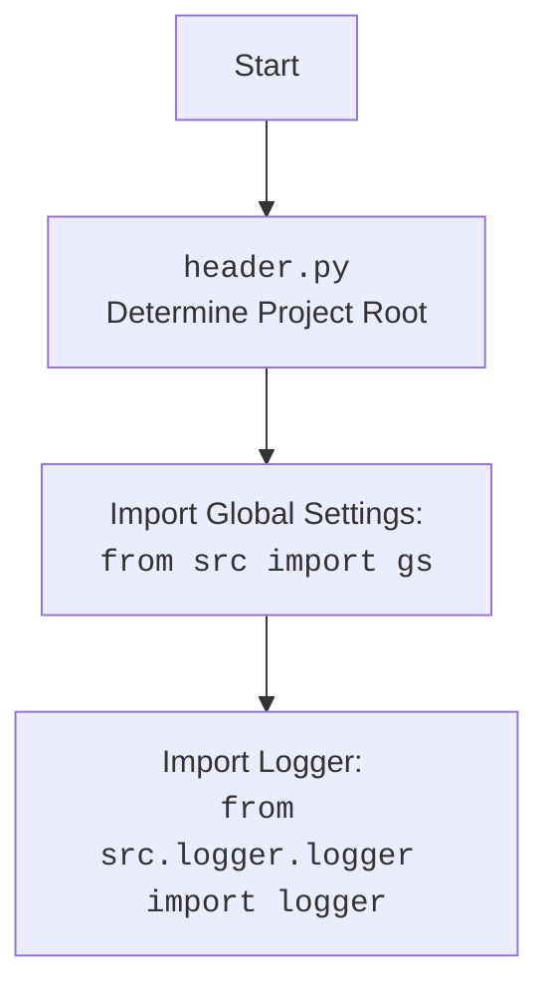

## АНАЛИЗ КОДА: `ensure_https.py`

### <алгоритм>
1. **Начало**: Функция `ensure_https` принимает на вход `prod_ids`, который может быть либо строкой (URL или ID товара), либо списком строк.
   *  _Пример:_ `prod_ids` = `"example_product_id"` или `prod_ids` = `["example_product_id1", "https://www.example.com/item/example_product_id2"]`.

2. **Проверка типа входных данных**:
   *  Если `prod_ids` является списком, переходим к шагу 3.
   *  Если `prod_ids` является строкой, переходим к шагу 4.
  
3.  **Обработка списка URL/ID**:
    *  Для каждого элемента `prod_id` в списке `prod_ids` вызывается функция `ensure_https_single`.
    *  Результат работы `ensure_https_single` для каждого элемента добавляется в новый список.
    * _Пример:_ `prod_ids` = `["example_product_id1", "https://www.example.com/item/example_product_id2"]`  -> `ensure_https_single`("example_product_id1")  и `ensure_https_single`("https://www.example.com/item/example_product_id2")

4. **Обработка единичного URL/ID**: Вызывается функция `ensure_https_single` с входным параметром `prod_ids`.
   * _Пример:_ `prod_ids` = `"example_product_id"` -> `ensure_https_single("example_product_id")`

5. **`ensure_https_single`**:
    *  Функция `ensure_https_single` принимает строку `prod_id` (URL или ID товара).
    *  Вызывается функция `extract_prod_ids` с `prod_id` в качестве аргумента для извлечения ID товара.
        * _Пример:_ `prod_id` = `"example_product_id"` -> `extract_prod_ids`("example_product_id")
        * _Пример:_ `prod_id` = `"https://www.example.com/item/example_product_id"` -> `extract_prod_ids`("https://www.example.com/item/example_product_id")

6. **Проверка извлеченного ID**:
    *  Если `extract_prod_ids` вернула непустую строку (`_prod_id`):
        *   Формируется URL-адрес с префиксом `https://www.aliexpress.com/item/` и добавляется `.html` в конце.
        *  _Пример:_ `_prod_id` = `"example_product_id"` -> `"https://www.aliexpress.com/item/example_product_id.html"`
        *  Полученный URL-адрес возвращается.
    *  Если `extract_prod_ids` вернула пустую строку:
        *  Записывается сообщение об ошибке в логгер.
        *  Возвращается исходный `prod_id`.

7. **Завершение**:
   *  `ensure_https` возвращает либо список URL, либо один URL в зависимости от исходного типа `prod_ids`.

### <mermaid>

```mermaid
flowchart TD
    Start(Start) --> InputData{Input: prod_ids: str | list[str]};
    InputData -- list --> ProcessList
    InputData -- str --> ProcessSingle

    ProcessList --> LoopStart{for prod_id in prod_ids}
    LoopStart --> ProcessSingleItem(ensure_https_single(prod_id))
    ProcessSingleItem -- returns modified URL --> LoopEnd
    LoopEnd --> ListOutput(Output: list[str])
    ListOutput --> End(End)
    
    ProcessSingle --> ProcessSingleItem2(ensure_https_single(prod_ids))
    ProcessSingleItem2 -- returns modified URL -->  SingleOutput(Output: str);
    SingleOutput --> End

    ProcessSingleItem --> ExtractID(Extract ID: extract_prod_ids(prod_id))
    ProcessSingleItem2 --> ExtractID2(Extract ID: extract_prod_ids(prod_ids))
    ExtractID -- ID found --> ConstructURL(Construct URL: "https://www.aliexpress.com/item/{_prod_id}.html")
    ExtractID2 -- ID found --> ConstructURL2(Construct URL: "https://www.aliexpress.com/item/{_prod_id}.html")
    ExtractID -- ID not found --> LogError(Log Error: Invalid ID)
    ExtractID2 -- ID not found --> LogError2(Log Error: Invalid ID)
    
    ConstructURL --> ReturnURL(Return modified URL);
    ConstructURL2 --> ReturnURL2(Return modified URL);
    LogError --> ReturnOriginal(Return original ID)
    LogError2 --> ReturnOriginal2(Return original ID)
    ReturnURL --> ProcessSingleItem
    ReturnOriginal --> ProcessSingleItem
    ReturnURL2 --> ProcessSingleItem2
    ReturnOriginal2 --> ProcessSingleItem2

```



### <объяснение>
#### Импорты:
   - `from src.logger.logger import logger`:  Импортируется объект `logger` из модуля `src.logger.logger`. Этот объект используется для записи сообщений об ошибках и предупреждениях.  Модуль `logger.py` отвечает за конфигурацию логирования в проекте, позволяя записывать информацию о работе программы в файл или на консоль.
   - `from .extract_product_id import extract_prod_ids`: Импортируется функция `extract_prod_ids` из модуля `extract_product_id.py`, находящегося в том же каталоге (`.`). Эта функция предназначена для извлечения идентификатора товара из URL-адреса или строки. Функция `extract_prod_ids` является частью логики обработки URL-адресов товаров и является зависимостью для `ensure_https`.

#### Функции:
   - `ensure_https(prod_ids: str | list[str]) -> str | list[str]`:
      - **Аргументы**:
         - `prod_ids`: Строка или список строк, представляющих собой либо идентификаторы товаров, либо URL-адреса.
      - **Возвращаемое значение**:
        -  Строка (если `prod_ids` - строка) или список строк (если `prod_ids` - список), содержащие URL-адреса с префиксом `https://`.
      - **Назначение**:
        -  Обеспечивает, что все переданные URL-адреса имеют префикс `https://`. Если входные данные являются идентификаторами товаров, функция формирует полные URL-адреса для AliExpress.
      - **Примеры**:
         - `ensure_https("example_product_id")` возвращает `"https://www.aliexpress.com/item/example_product_id.html"`.
         - `ensure_https(["example_product_id1", "https://www.example.com/item/example_product_id2"])` возвращает `['https://www.aliexpress.com/item/example_product_id1.html', 'https://www.example.com/item/example_product_id2']`.
   - `ensure_https_single(prod_id: str) -> str`:
     - **Аргументы**:
         - `prod_id`: Строка, представляющая собой идентификатор товара или URL-адрес.
     - **Возвращаемое значение**:
        - Строка, представляющая собой URL-адрес с префиксом `https://`.
     - **Назначение**:
         -  Обеспечивает, что отдельный переданный URL-адрес имеет префикс `https://`. Если входные данные являются идентификатором товара, функция формирует полный URL-адрес для AliExpress.
     - **Примеры**:
       - `ensure_https_single("example_product_id")` возвращает `"https://www.aliexpress.com/item/example_product_id.html"`.
       - `ensure_https_single("https://www.example.com/item/example_product_id")` возвращает `"https://www.example.com/item/example_product_id"`.
      
#### Переменные:
  - `prod_ids`:  Может быть строкой или списком строк. Представляет собой либо идентификаторы товаров, либо URL-адреса.
   - `_prod_id`:  Внутри `ensure_https_single` используется для хранения результата работы функции `extract_prod_ids`. Является строкой, представляющей собой ID товара.

#### Общая логика и взаимодействие:
1. Функция `ensure_https` является основной, она определяет, как обрабатывать входные данные (строку или список строк).
2. Если входные данные – список, то для каждого элемента вызывается функция `ensure_https_single`.
3. Функция `ensure_https_single` использует `extract_prod_ids` для извлечения ID товара из URL-адреса.
4. Если ID товара извлечен успешно, формируется URL-адрес с префиксом `https://`.
5. Если извлечение ID товара не удалось,  логируется ошибка, и возвращается исходная строка.

#### Потенциальные ошибки и области для улучшения:
 - **Обработка ошибок**: В случае если `extract_prod_ids` возвращает пустую строку, то выводится сообщение в лог. Но, возможно, следует реализовать более детальную обработку ошибок, например, возвращать `None` или возбуждать исключение в зависимости от контекста.
 - **Валидация URL**: Код предполагает, что если строка не является валидным ID, то она является валидным URL. Следует добавить проверку URL на валидность, прежде чем возвращать его без изменений.
 - **Производительность**: При обработке очень больших списков URL-адресов можно использовать асинхронное программирование или потоки для повышения производительности.

#### Связь с другими частями проекта:
- **`src.logger.logger`**: Используется для логирования ошибок.
- **`src.suppliers.aliexpress.utils.extract_product_id`**: Используется для извлечения идентификаторов товаров из URL или строки. Этот модуль является частью процесса обработки данных AliExpress.