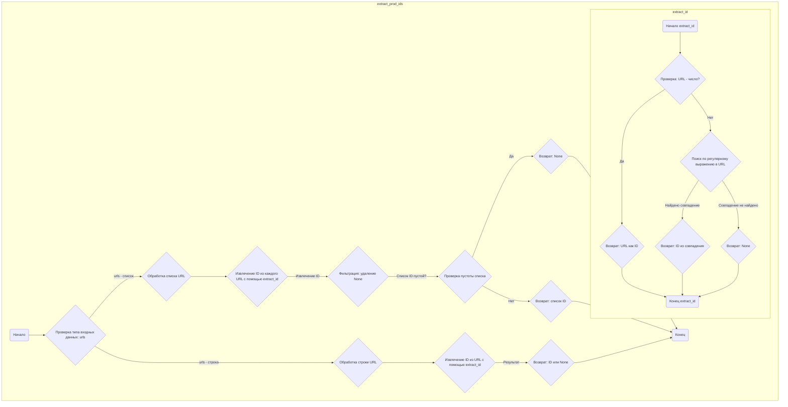
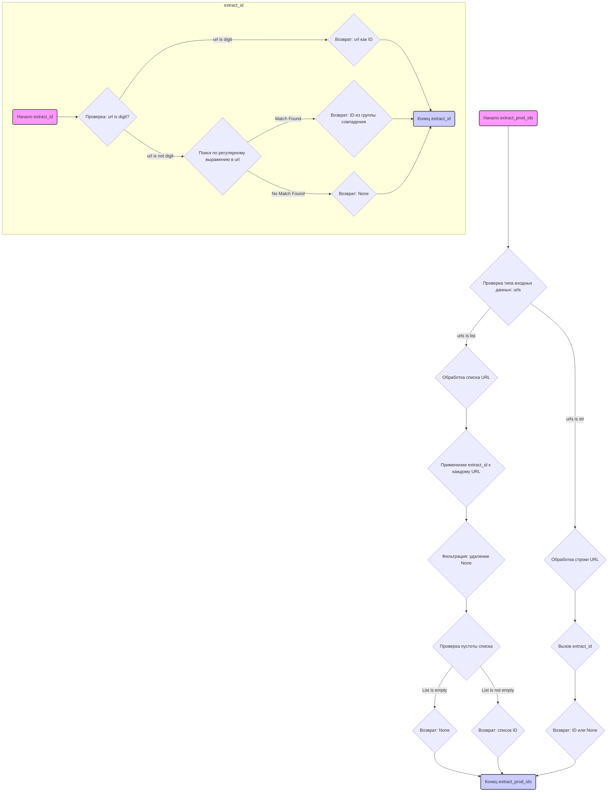

## ИНСТРУКЦИЯ:

Анализируй предоставленный код подробно и объясни его функциональность. Ответ должен включать три раздела:

1.  **<алгоритм>**: Опиши рабочий процесс в виде пошаговой блок-схемы, включая примеры для каждого логического блока, и проиллюстрируй поток данных между функциями, классами или методами.
2.  **<mermaid>**: Напиши код для диаграммы в формате `mermaid`, проанализируй и объясни все зависимости,
    которые импортируются при создании диаграммы.
    **ВАЖНО!** Убедитесь, что все имена переменных, используемые в диаграмме `mermaid`,
    имеют осмысленные и описательные имена. Имена переменных вроде `A`, `B`, `C`, и т.д., не допускаются!

    **Дополнительно**: Если в коде есть импорт `import header`, добавьте блок `mermaid` flowchart, объясняющий `header.py`:
    ```mermaid
    flowchart TD
        Start --> Header[<code>header.py</code><br> Determine Project Root]

        Header --> import[Import Global Settings: <br><code>from src import gs</code>]
    ```

3.  **<объяснение>**: Предоставьте подробные объяснения:
    -   **Импорты**: Их назначение и взаимосвязь с другими пакетами `src.`.
    -   **Классы**: Их роль, атрибуты, методы и взаимодействие с другими компонентами проекта.
    -   **Функции**: Их аргументы, возвращаемые значения, назначение и примеры.
    -   **Переменные**: Их типы и использование.
    -   Выделите потенциальные ошибки или области для улучшения.

Дополнительно, постройте цепочку взаимосвязей с другими частями проекта (если применимо).

Это обеспечивает всесторонний и структурированный анализ кода.
## Формат ответа: `.md` (markdown)
**КОНЕЦ ИНСТРУКЦИИ**

## <алгоритм>



**Примеры:**

1.  **Вход: Строка URL**: `extract_prod_ids("https://www.aliexpress.com/item/123456.html")`
    *   `Input_Check`: Определяется, что `urls` является строкой.
    *   `Process_String`: Вызывается `extract_id` с этой строкой.
    *   `extract_id`:
        *   `Check_Digit`: Проверяет, является ли URL числом - нет.
        *   `Search_Pattern`: Находит соответствие в URL по регулярному выражению: `/item/(\d+)\.html`, извлекается `123456`.
        *   `Return_Matched_ID`: Возвращает `123456`.
    *   `Return_Result`: Возвращается `"123456"`.
2.  **Вход: Список URL**: `extract_prod_ids(["https://www.aliexpress.com/item/123456.html", "7891011.html"])`
    *   `Input_Check`: Определяется, что `urls` является списком.
    *   `Process_List`: Для каждого URL в списке вызывается `extract_id`.
    *   `extract_id` вызывается для `"https://www.aliexpress.com/item/123456.html"`: возвращает `"123456"`.
    *    `extract_id` вызывается для `"7891011.html"`: возвращает `"7891011"`.
    *   `Extract_IDs`: Получает список: `["123456", "7891011"]`
    *   `Filter_IDs`:  оставляет все id (никакие значения `None` не удалены)
    *   `IsEmpty`: Список не пуст.
    *   `Return_IDs`: Возвращает `["123456", "7891011"]`.
3.  **Вход: Список URL с неверным форматом**: `extract_prod_ids(["https://www.example.com/item/123456.html", "https://www.example.com/item/abcdef.html"])`
    *   `Input_Check`: Определяется, что `urls` является списком.
    *   `Process_List`: Для каждого URL в списке вызывается `extract_id`.
    *   `extract_id` вызывается для `"https://www.example.com/item/123456.html"`: возвращает `"123456"`.
    *    `extract_id` вызывается для `"https://www.example.com/item/abcdef.html"`: возвращает `None`.
     *   `Extract_IDs`: Получает список: `["123456", None]`
    *   `Filter_IDs`:  оставляет только `"123456"` (значение `None` удалено)
     *   `IsEmpty`: Список не пуст.
    *   `Return_IDs`: Возвращает `["123456"]`.
4.   **Вход: ID как строка**: `extract_prod_ids("7891011")`
     *   `Input_Check`: Определяется, что `urls` является строкой.
    *   `Process_String`: Вызывается `extract_id` с этой строкой.
    *   `extract_id`:
         *   `Check_Digit`: Проверяет, является ли URL числом - да.
        *   `Return_Input_URL`: Возвращает `"7891011"`.
     *   `Return_Result`: Возвращается `"7891011"`.
5.   **Вход: Некорректный URL**: `extract_prod_ids("https://www.example.com/item/abcdef.html")`
     *   `Input_Check`: Определяется, что `urls` является строкой.
    *   `Process_String`: Вызывается `extract_id` с этой строкой.
    *   `extract_id`:
         *   `Check_Digit`: Проверяет, является ли URL числом - нет.
        *   `Search_Pattern`: Совпадений не найдено.
        *   `Return_None2`: Возвращает `None`.
     *    `Return_Result`: Возвращается `None`.
## <mermaid>


**Анализ зависимостей `mermaid`:**

1.  **`extract_prod_ids`**: Это главная функция, которая принимает на вход URL (строку или список строк) и возвращает либо список извлеченных ID, либо отдельный ID, либо `None`.
2.  **`Check_Input_Type`**: Определяет тип входящих данных (строка или список) и направляет поток выполнения в зависимости от типа.
3.  **`Process_Url_List`**: обрабатывает входящий список URL, применяя к каждому URL функцию `extract_id`.
4.  **`Map_Extract_Id`**: Применяет функцию `extract_id` к каждому элементу списка URL.
5.  **`Filter_None_Ids`**: Фильтрует список, удаляя `None` значения.
6.  **`Check_Empty_List`**: Проверяет, пуст ли список после фильтрации.
7.  **`Return_None1`**: Возвращает `None`, если список пуст.
8.  **`Return_Extracted_Ids`**: Возвращает список извлеченных ID.
9. **`Process_Url_String`**: обрабатывает входящую строку URL, вызывая функцию `extract_id`.
10. **`Call_Extract_Id`**: Вызывает функцию `extract_id` для извлечения ID.
11. **`Return_Extracted_Id`**: Возвращает извлеченный ID или `None`.

12. **`extract_id`**: Это внутренняя функция, предназначенная для извлечения ID из отдельного URL или проверки валидности ID.
13. **`Check_If_Digit`**: Проверяет, является ли входящий URL числом (и, следовательно, уже ID).
14. **`Return_Url_As_Id`**: Возвращает URL, если он является числом.
15. **`Search_Regex_Pattern`**: Выполняет поиск по регулярному выражению в URL.
16. **`Return_Group_Match`**: Возвращает извлеченный ID из группы совпадения.
17. **`Return_None2`**: Возвращает `None`, если регулярное выражение не нашло совпадения.

## <объяснение>

**Импорты:**

*   **`import re`**: Этот модуль используется для работы с регулярными выражениями. В данном коде он используется для поиска и извлечения идентификаторов продуктов из URL-адресов.
*   **`from src.logger.logger import logger`**: Импортирует объект `logger` из модуля `src.logger.logger`. Этот объект, вероятно, используется для логирования событий и отладки.

**Функции:**

*   **`extract_prod_ids(urls: str | list[str]) -> str | list[str] | None`**:
    *   **Аргументы**:
        *   `urls`: Строка URL или список строк URL. Может быть также идентификатором продукта (в виде строки).
    *   **Возвращаемое значение**:
        *   Список извлеченных идентификаторов (`list[str]`), строка - отдельный идентификатор (`str`), или `None`, если идентификаторы не найдены.
    *   **Назначение**: Извлекает идентификаторы продуктов из предоставленных URL или возвращает их, если предоставлены напрямую.
        *   Сначала проверяется тип входных данных: если это список, то функция применяет `extract_id` к каждому элементу списка, фильтруя `None` значения и возвращая либо список id, либо `None`, если список пустой. Если это строка, то функция вызывает `extract_id` для этой строки.
        *   Если `urls` строка, и она представляет собой число, она сразу возвращается. В противном случае, происходит попытка извлечь id из строки url с помощью регулярного выражения.

*   **`extract_id(url: str) -> str | None`**:
    *   **Аргументы**:
        *   `url`: Строка URL или идентификатор продукта.
    *   **Возвращаемое значение**:
        *   Строка, представляющая идентификатор продукта, или `None`, если идентификатор не найден.
    *   **Назначение**: Извлекает идентификатор продукта из заданного URL-адреса или проверяет валидность идентификатора продукта.
        *   Сначала проверяется, является ли строка `url` числом, если да, то она возвращается как id. В противном случае, происходит попытка извлечь id с помощью регулярного выражения.

**Переменные:**

*   **`pattern = re.compile(r"(?:item/|/)?(\d+)\.html")`**:
    *   **Тип**: `re.Pattern`.
    *   **Назначение**: Компилированное регулярное выражение. Это выражение используется для поиска числовых идентификаторов продуктов, которые обычно находятся в URL-адресах AliExpress.
        *   `(?:item/|/)?`: Незахватываемая группа, которая проверяет, есть ли в строке `/` или `item/`, которая может быть или не быть в начале.
        *   `(\d+)`: Захватывающая группа, которая соответствует одной или нескольким цифрам (это идентификатор продукта).
        *   `\.html`: Соответствует `.html` в конце URL.
*   **`urls`** : переменная для хранения входных данных в виде строки или списка строк.
*   **`extracted_ids`** : список извлеченных id.
*    **`url`** : переменная для хранения url в функциях `extract_id` или в цикле `extract_prod_ids`.
*    **`match`** : переменная для хранения результата поиска по регулярному выражению.

**Объяснения:**

1.  **Регулярное выражение**: Регулярное выражение `(?:item/|/)?(\d+)\.html` ищет числовой идентификатор товара в URL, который может быть представлен в разных форматах (`/123456.html`, `item/123456.html`).
2.  **Обработка различных типов ввода**: Функция `extract_prod_ids` корректно обрабатывает как строку URL, так и список URL. Она также проверяет, является ли входная строка уже идентификатором.
3.  **Извлечение ID**: Функция `extract_id` старается извлечь ID из URL. Если извлечение не удалось, то возвращается `None`.
4.  **Логирование**: Код импортирует и, вероятно, использует `logger` для отладки и логирования, хотя в предоставленном фрагменте кода его фактическое использование не продемонстрировано.
5.  **Примеры в docstring**: `docstring` содержат примеры использования функции.
6.  **Цепочка взаимосвязей**: Данный модуль используется для извлечения ID товаров. Скорее всего, он используется в более крупных модулях, связанных с парсингом информации об этих товарах или работе с API AliExpress.
    Например, после получения id, можно запросить информацию о товаре по API.

**Потенциальные ошибки и области для улучшения:**

1.  **Ограниченность регулярного выражения**: Регулярное выражение может не покрывать все возможные форматы URL-адресов AliExpress. Для обеспечения надежности, стоит учитывать и другие возможные структуры URL.
2.  **Обработка ошибок**: Код не обрабатывает возможные исключения, например, если при компиляции регулярного выражения произойдет ошибка.
3.  **Логирование**: В коде есть импорт `logger`, но не показано, как он используется. Логирование может помочь в отладке и анализе работы кода. Стоит добавить использование logger.
4.  **Производительность**: Если обрабатывается очень большой список URL, то можно рассмотреть возможность использования параллельной обработки для ускорения работы.

**Дополнительные замечания:**

*   В коде присутствуют shebang.
*   Docstring содержат подробные примеры.
*   Код достаточно понятен и хорошо структурирован.