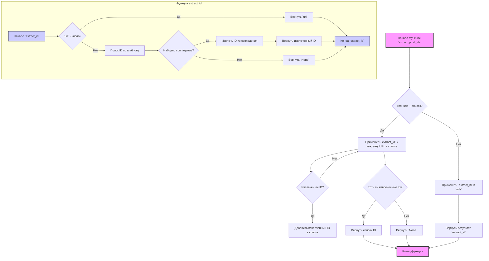

## АНАЛИЗ КОДА: `extract_product_id.py`

### 1. <алгоритм>

**Блок-схема:**



**Примеры для логических блоков:**

- **A:** `extract_prod_ids("https://www.aliexpress.com/item/123456.html")`
- **B:** `urls` - строка, ответ `Нет`.
- **I:** `extract_id("https://www.aliexpress.com/item/123456.html")` вызывает внутреннюю функцию `extract_id`
- **A1:** `extract_id("https://www.aliexpress.com/item/123456.html")`
- **B1:** Проверка `url.isdigit()` вернет `False`
- **D1:** Поиск по регулярному выражению `r"(?:item/|/)?(\d+)\.html"`, находит "123456"
- **E1:** Найдено совпадение - `Да`
- **F1:** Извлечение группы "123456"
- **G1:** Возвращает "123456"
- **I:** Функция `extract_id` вернула "123456"
- **J:**  `extract_prod_ids` возвращает "123456"

- **A:** `extract_prod_ids(["https://www.aliexpress.com/item/123456.html", "7891011.html"])`
- **B:** `urls` - список, ответ `Да`
- **C:** Применяет `extract_id` к каждому URL в списке
    - Первый вызов `extract_id`: `extract_id("https://www.aliexpress.com/item/123456.html")` вернет "123456"
    - Второй вызов `extract_id`: `extract_id("7891011.html")` вернет "7891011"
- **D:** Оба вызова `extract_id` вернули валидные ID
- **E:** ID "123456" и "7891011" добавлены в список
- **F:** Список не пустой
- **G:** Возвращает `["123456", "7891011"]`

- **A:** `extract_prod_ids(["https://www.example.com/item/abcdef.html", "https://www.example.com/item/abcdef.html"])`
- **B:** `urls` - список, ответ `Да`
- **C:** Применяет `extract_id` к каждому URL в списке
    - Первый вызов `extract_id`: `extract_id("https://www.example.com/item/abcdef.html")` вернет `None`
    - Второй вызов `extract_id`: `extract_id("https://www.example.com/item/abcdef.html")` вернет `None`
- **D:** Оба вызова `extract_id` вернули `None`
- **F:**  Список пустой
- **H:** Возвращает `None`

- **A:** `extract_prod_ids("7891011")`
- **B:** `urls` - строка, ответ `Нет`.
- **I:** `extract_id("7891011")`
- **A1:** `extract_id("7891011")`
- **B1:** Проверка `url.isdigit()` вернет `True`
- **C1:** Возвращает "7891011"
- **I:** `extract_id` вернула "7891011"
- **J:** `extract_prod_ids` возвращает "7891011"

- **A:** `extract_prod_ids("https://www.example.com/item/abcdef.html")`
- **B:** `urls` - строка, ответ `Нет`.
- **I:** `extract_id("https://www.example.com/item/abcdef.html")`
- **A1:** `extract_id("https://www.example.com/item/abcdef.html")`
- **B1:** Проверка `url.isdigit()` вернет `False`
- **D1:** Поиск по регулярному выражению, совпадений не найдено
- **E1:** Совпадений нет - `Нет`
- **H1:** Возвращает `None`
- **I:** `extract_id` вернула `None`
- **J:** `extract_prod_ids` возвращает `None`

### 2. <mermaid>

```mermaid
flowchart TD
    A[Начало функции: `extract_prod_ids`] --> B{Проверка типа `urls`: `isinstance(urls, list)`?};
    B -- Да --> C[Итерация по `urls`: `for url in urls`];
    C --> D[Вызов функции: `extract_id(url)`];
    D --> E{Результат `extract_id` не `None`?};
    E -- Да --> F[Добавление ID в список `extracted_ids`];
    E -- Нет --> C;
    F --> C;
    C --> G{Список `extracted_ids` не пустой?};
    G -- Да --> H[Возврат списка `extracted_ids`];
    G -- Нет --> I[Возврат `None`];
    B -- Нет --> J[Вызов функции: `extract_id(urls)`];
    J --> K[Возврат результата `extract_id`];
     H --> L[Конец функции: `extract_prod_ids`]
     I --> L
    K --> L
    
    subgraph "Функция extract_id"
        A1[Начало функции: `extract_id`] --> B1{Проверка: `url.isdigit()`?};
        B1 -- Да --> C1[Возврат `url`];
        B1 -- Нет --> D1[Поиск ID по шаблону: `pattern.search(url)`];
        D1 --> E1{Совпадение найдено?};
        E1 -- Да --> F1[Извлечение ID: `match.group(1)`];
        F1 --> G1[Возврат извлеченного ID];
        E1 -- Нет --> H1[Возврат `None`];
        C1 --> I1[Конец функции: `extract_id`];
        G1 --> I1;
        H1 --> I1;
    end
     style A fill:#f9f,stroke:#333,stroke-width:2px
    style L fill:#f9f,stroke:#333,stroke-width:2px
     style A1 fill:#ccf,stroke:#333,stroke-width:2px
    style I1 fill:#ccf,stroke:#333,stroke-width:2px
```

**Объяснение зависимостей `mermaid`:**
- **`extract_prod_ids`**: Основная функция, которая принимает URL(ы) и вызывает `extract_id` для извлечения ID.
- **`extract_id`**: Вспомогательная функция, которая пытается извлечь ID из одиночного URL или проверить, является ли входное значение ID.
- **`urls`**:  Входной параметр для `extract_prod_ids`, который может быть строкой или списком строк (URL-адресов или ID).
- **`extracted_ids`**:  Список, в который накапливаются извлеченные ID.
- **`pattern`**: Регулярное выражение для поиска ID в URL-адресе.
- **`match`**: Результат поиска с помощью регулярного выражения.
- **`url`**: Переменная, представляющая текущий URL (или потенциальный ID), который обрабатывается в цикле или передается в `extract_id`.

### 3. <объяснение>

**Импорты:**
- `import re`: Импортирует модуль `re` для работы с регулярными выражениями. Он используется для поиска и извлечения идентификаторов товаров из URL-адресов.
- `from src.logger.logger import logger`: Импортирует объект `logger` из модуля `src.logger.logger`. Этот объект используется для логирования сообщений внутри функций (хотя в данном коде он не используется).

**Функции:**

- **`extract_prod_ids(urls: str | list[str]) -> str | list[str] | None`:**
    - **Аргументы:**
        - `urls`:  Может быть строкой (один URL или ID) или списком строк (список URL-адресов или ID).
    - **Возвращаемое значение:**
        - `str` (строка):  Если на вход передана строка и она является ID, либо удалось извлечь ID из URL.
        - `list[str]` (список строк):  Список извлеченных ID, если на вход передан список URL-адресов и хотя бы один ID был успешно извлечен.
        - `None`: Если ни один ID не удалось извлечь.
    - **Назначение:** Основная функция для извлечения идентификаторов товаров из предоставленных URL-адресов или проверки, является ли входное значение ID.
    - **Примеры:**
       ```python
        extract_prod_ids("https://www.aliexpress.com/item/123456.html")  # Возвращает '123456'
        extract_prod_ids(["https://www.aliexpress.com/item/123456.html", "7891011.html"])  # Возвращает ['123456', '7891011']
        extract_prod_ids(["https://www.example.com/item/123456.html", "https://www.example.com/item/abcdef.html"]) # Возвращает ['123456']
        extract_prod_ids("7891011")  # Возвращает '7891011'
        extract_prod_ids("https://www.example.com/item/abcdef.html") # Возвращает None
       ```

- **`extract_id(url: str) -> str | None`:**
    - **Аргументы:**
        - `url`: Строка, представляющая URL или ID.
    - **Возвращаемое значение:**
        - `str`: Извлеченный ID или входное значение, если оно является валидным ID.
        - `None`: Если не удалось извлечь ID или входное значение не является валидным ID.
    - **Назначение:**  Вспомогательная функция для извлечения ID из конкретного URL-адреса или проверки, является ли строка валидным ID.
    - **Примеры:**
        ```python
        extract_id("https://www.aliexpress.com/item/123456.html")  # Возвращает '123456'
        extract_id("7891011")  # Возвращает '7891011'
        extract_id("https://www.example.com/item/abcdef.html") # Возвращает None
        ```
**Переменные:**

- `pattern`: Скомпилированный объект регулярного выражения `r"(?:item/|/)?(\d+)\.html"`. Используется для поиска ID в URL-адресах. Регулярное выражение ищет последовательность цифр, расположенных между `item/` или `/` и `.html`.
- `urls`: Входной параметр функции `extract_prod_ids`. Может быть строкой или списком строк.
- `extracted_ids`: Список, который используется для хранения извлеченных ID.
- `url`: Параметр функции `extract_id`, представляющий текущий URL для обработки.
- `match`: Результат поиска с использованием регулярного выражения.

**Потенциальные ошибки и области для улучшения:**

- **Логирование:** В коде импортируется `logger`, но не используется. Было бы полезно добавить логирование для отслеживания ошибок и процесса извлечения.
- **Обработка ошибок:** Код не обрабатывает исключения. Добавление блоков `try-except` может сделать код более надежным.
- **Расширение паттерна:** Регулярное выражение жестко привязано к формату URL AliExpress. Если формат URL изменится, код потребуется обновить. Можно добавить поддержку различных форматов URL.
- **Производительность:** Для обработки большого количества URL-адресов можно использовать многопоточность или асинхронное программирование.
- **Валидация ID:** В текущей реализации ID считается валидным, если он состоит только из цифр. Может потребоваться более сложная валидация.
- **Использование `match.group(1)`**: Код предполагает наличие первой захватываемой группы в регулярном выражении. Можно добавить проверку, что группа существует, перед тем как её использовать.
- **Извлечение ID из разных источников:** Код разработан специально для URL-адресов AliExpress. Можно сделать более универсальный подход, чтобы он мог работать с разными типами ссылок.

**Взаимосвязь с другими частями проекта:**

- Данный модуль `extract_product_id.py` находится в пакете `src.suppliers.aliexpress.utils`, что говорит о его специфичном назначении для работы с данными от AliExpress.
- Этот модуль может использоваться в других частях проекта для получения идентификаторов товаров перед обращением к API или для дальнейшей обработки. Например, он может использоваться в модуле для парсинга данных с сайта AliExpress или в модуле для отправки запросов к API.
- Модуль `logger` из `src.logger.logger` используется для логирования, что является общей практикой в проекте для отслеживания работы и ошибок.