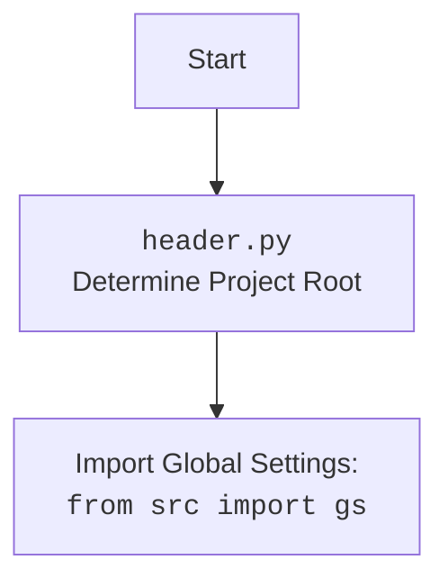

## <алгоритм>

1.  **Начало**: Программа начинается с импорта необходимых модулей: `Path` из `pathlib`, `gs` из `src` и функций `j_loads`, `j_loads_ns` из `src.utils.jjson`.
2.  **Определение функции `get_locales`**:
    *   Функция `get_locales` принимает один аргумент: `locales_path` типа `Path` или `str`, представляющий путь к JSON-файлу с данными о локалях.
    *   Функция вызывает `j_loads_ns(locales_path)` для загрузки данных из JSON-файла. `j_loads_ns` вернет объект, в котором данные будут храниться в виде атрибутов.
    *   Если загруженные данные имеют атрибут `locales`, функция возвращает его. В противном случае, функция возвращает `None`.
    *   Пример:
        *   `locales_path` = "/path/to/locales.json"
        *   JSON-файл содержит: `{"locales": [{"EN": "USD"}, {"HE": "ILS"}, {"RU": "ILS"}, {"EN": "EUR"}, {"EN": "GBR"}, {"RU": "EUR"}]}`
        *   `j_loads_ns` вернет объект, в котором атрибут `locales` будет списком словарей.
        *   Функция вернет: `[{"EN": "USD"}, {"HE": "ILS"}, {"RU": "ILS"}, {"EN": "EUR"}, {"EN": "GBR"}, {"RU": "EUR"}]`
        *   JSON-файл содержит: `{"data": [{"EN": "USD"}, {"HE": "ILS"}, {"RU": "ILS"}, {"EN": "EUR"}, {"EN": "GBR"}, {"RU": "EUR"}]}`
        *   Функция вернет: `None`.
3.  **Определение переменной `locales`**:
    *   Переменная `locales` объявляется и инициализируется вызовом функции `get_locales`.
    *   В качестве аргумента для `get_locales` передается путь к файлу `locales.json`, который формируется с использованием `gs.path.src`.  
        `gs.path.src` это путь к корню исходного кода проекта.
    *   Результат выполнения функции `get_locales` (список словарей с локалями или `None`) присваивается переменной `locales`.
4.  **Конец**: Программа завершает свою работу, переменная `locales` содержит загруженные из JSON-файла данные или `None`.

## <mermaid>

```mermaid
flowchart TD
    Start --> getLocalesFunc[get_locales(locales_path: Path | str)]
    getLocalesFunc --> jLoadsNS[j_loads_ns(locales_path)]
    jLoadsNS -- Данные JSON --> CheckLocalesAttribute{Проверка: Атрибут `locales` существует?}
    CheckLocalesAttribute -- Да --> ReturnLocales[Возврат locales]
    CheckLocalesAttribute -- Нет --> ReturnNone[Возврат None]
    ReturnLocales --> localesVariable[locales = результат]
    ReturnNone --> localesVariable
    localesVariable --> End
   
    Start --> ОпределитьПутьКФайлу[Определение пути: gs.path.src / 'suppliers' / 'aliexpress' / 'utils' / 'locales.json']
    ОпределитьПутьКФайлу --> getLocalesFunc
    
```



## <объяснение>

### Импорты:

*   **`from pathlib import Path`**: Импортирует класс `Path` из модуля `pathlib`. Этот класс используется для представления путей к файлам и директориям в кроссплатформенном стиле. Он обеспечивает удобные методы для работы с файловыми путями.
*   **`from src import gs`**: Импортирует объект `gs` (глобальные настройки) из пакета `src`. Предполагается, что `gs` содержит глобальные настройки проекта, включая пути к различным директориям, в том числе `gs.path.src` - путь к корню исходного кода проекта.
*   **`from src.utils.jjson import j_loads, j_loads_ns`**: Импортирует функции `j_loads` и `j_loads_ns` из модуля `src.utils.jjson`.  
    `j_loads` - вероятно,  функция для загрузки JSON данных и возврата их в виде словаря или списка. `j_loads_ns` - вероятно, функция для загрузки JSON данных и создания из них объекта с атрибутами.

### Функции:

*   **`get_locales(locales_path: Path | str) -> list[dict[str, str]] | None`**:
    *   **Аргументы**:
        *   `locales_path`: Путь к JSON файлу с локалями. Может быть объектом `Path` или строкой.
    *   **Возвращаемое значение**:
        *   `list[dict[str, str]]`: Список словарей, где каждый словарь представляет соответствие между локалью и валютой (например, `{'EN': 'USD'}`).
        *   `None`: Если в загруженных данных отсутствует атрибут `locales`
    *   **Назначение**: Загружает данные о локалях из JSON файла, используя `j_loads_ns` и возвращает список локалей или `None`

### Переменные:

*   **`locales: list[dict[str, str]] | None`**:
    *   **Тип**: Список словарей или None. Каждый словарь имеет вид `{"locale": "currency"}`
    *   **Назначение**: Глобальная переменная, которая хранит данные о локалях, загруженные из файла `locales.json`. Инициализируется при запуске модуля.

### Объяснения:
Код представляет собой модуль для загрузки локалей из JSON файла. Функция `get_locales` загружает данные из файла и возвращает их, если атрибут `locales` существует в загруженных данных. Переменная `locales` инициализируется при импорте модуля, считывая данные из файла `locales.json`, расположенного в директории `src/suppliers/aliexpress/utils/`.  Использует глобальные настройки проекта, чтобы динамически определить путь к файлу.

### Потенциальные ошибки и области для улучшения:

*   **Обработка ошибок**:
    *   Код не обрабатывает возможные исключения, которые могут возникнуть при загрузке JSON файла (например, если файл не существует, имеет неверный формат или недоступен).
    *   Рекомендуется добавить блок `try-except` для обработки этих ошибок и возвращать осмысленное значение или выводить сообщение об ошибке.
*   **Типизация**: 
    *   Тип `Path | str` может быть упрощен до `Path` , если всегда передается объект `Path`, но так как это не гарантируется, то лучше оставить как есть.
*  **Зависимость от `gs`**:
    *  Код зависит от глобального объекта `gs`, что может затруднить тестирование и переиспользование модуля.
*   **Обработка отсутствия данных**: Если в JSON нет ключа `locales`, возвращается `None`.  Это может привести к ошибкам в последующем коде, если он не обрабатывает `None`.
*   **Консистентность `j_loads_ns`**:  Код предполагает, что `j_loads_ns` возвращает объект с атрибутом `locales`. Но не известно, что именно эта функция возвращает, и как она работает, поэтому могут возникнуть проблемы, если она не возвращает ожидаемое.

### Взаимосвязь с другими частями проекта:
*   Этот модуль используется в проекте для получения данных о локалях, которые, вероятно, используются для определения валюты или других локализованных параметров в разных частях кода (например, для парсинга веб-сайта AliExpress или отображения данных пользователю).
*   Модуль использует глобальные настройки проекта `gs`, что означает, что он связан с конфигурацией проекта и его структурой директорий.
*   Модуль использует утилиты для работы с JSON (`j_loads`, `j_loads_ns`), которые, вероятно, используются и в других частях проекта для обработки JSON данных.