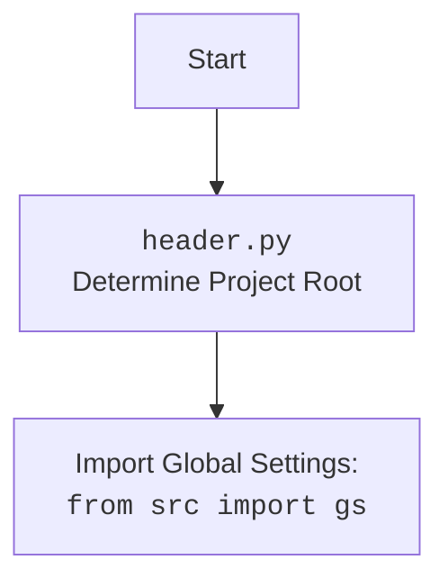

# Анализ кода `locales.py`

## <алгоритм>

1.  **Начало**: Запускается скрипт `locales.py`.

2.  **Импорт модулей**:
    *   Импортируется `Path` из модуля `pathlib` для работы с путями к файлам.
    *   Импортируется `gs` из пакета `src` (предположительно, глобальные настройки проекта).
    *   Импортируются `j_loads`, `j_loads_ns` из `src.utils.jjson` для загрузки JSON данных.

3.  **Определение функции `get_locales`**:
    *   Принимает аргумент `locales_path` типа `Path` или `str` - путь к JSON файлу с данными локалей.
    *   Вызывает `j_loads_ns(locales_path)` для загрузки данных из JSON файла, используя `j_loads_ns` для обработки, что возвращает объект Namespace.
    *   Возвращает `locales.locales` если он существует, иначе возвращает `None`.  `locales` - это атрибут Namespace.
       *   Пример: Если `locales.json` содержит `{"locales": [{"EN": "USD"}, {"HE": "ILS"}]}`, то после загрузки и извлечения вернется `[{"EN": "USD"}, {"HE": "ILS"}]`.
       *   Если `locales.json` не содержит атрибута locales, то вернётся `None`.

4.  **Определение переменной `locales`**:
    *   Вызывается функция `get_locales`, передавая путь к JSON файлу `locales.json` (`gs.path.src / 'suppliers' / 'aliexpress' / 'utils' / 'locales.json'`).
    *   Результат присваивается переменной `locales`, которая может быть `list[dict[str, str]]` или `None`.

5.  **Завершение**: Скрипт завершает работу, предоставляя список локалей (или `None`) через переменную `locales`.

## <mermaid>

```mermaid
flowchart TD
    Start[Start: <code>locales.py</code>] --> ImportModules[Import modules:\n<code>pathlib.Path</code>, <code>src.gs</code>,\n<code>src.utils.jjson.j_loads_ns</code>]
    ImportModules --> Define_get_locales[Define Function: <br><code>get_locales(locales_path)</code>]
    Define_get_locales --> J_loads_ns[Call <code>j_loads_ns(locales_path)</code><br>Load JSON data into namespace]
    J_loads_ns --> CheckLocales[Check if namespace has attribute 'locales']
    CheckLocales -- Yes --> ReturnLocales[Return: <code>namespace.locales</code>]
    CheckLocales -- No --> ReturnNone[Return: None]    
    ReturnLocales --> Define_global_locales[Define Global Variable:<br><code>locales = get_locales(...)</code>]
    ReturnNone --> Define_global_locales
    Define_global_locales --> End[End: <code>locales</code> is defined and available]

    style Start fill:#f9f,stroke:#333,stroke-width:2px
    style End fill:#f9f,stroke:#333,stroke-width:2px
```



## <объяснение>

### Импорты

*   `pathlib.Path`: Используется для создания и управления путями к файлам. Предоставляет объектно-ориентированный способ работы с путями, упрощая чтение и запись данных.
*   `src.gs`: Импортирует глобальные настройки проекта. `gs`, вероятно, содержит пути к директориям, а также другие глобальные переменные, необходимые для работы приложения. Это позволяет легко находить необходимые файлы и папки в рамках проекта.
*   `src.utils.jjson`: Модуль, содержащий функции для загрузки данных из JSON-файлов.
    *   `j_loads_ns`: Функция для загрузки JSON данных с преобразованием в Namespace. Namespace является структурой данных, позволяющей обращаться к элементам JSON через атрибуты, вместо работы со словарями.

### Функции

*   **`get_locales(locales_path: Path | str) -> list[dict[str, str]] | None`**:
    *   **Аргументы**:
        *   `locales_path`: Путь к JSON файлу, содержащему данные о локалях. Может быть представлен объектом `Path` или строкой.
    *   **Возвращаемое значение**:
        *   `list[dict[str, str]]`: Список словарей, где каждый словарь представляет пару локаль-валюта (например, `{'EN': 'USD'}`).
        *   `None`: Возвращается, если в загруженных JSON данных отсутствует атрибут `locales` или возникает ошибка при загрузке.
    *   **Назначение**: Загружает данные о локалях из JSON файла и возвращает их в виде списка словарей.
    *   **Пример**: Если `locales.json` содержит `{"locales": [{"EN": "USD"}, {"HE": "ILS"}]}`, то функция вернёт `[{"EN": "USD"}, {"HE": "ILS"}]`.

### Переменные

*   **`locales: list[dict[str, str]] | None`**: Глобальная переменная, которая инициализируется результатом вызова функции `get_locales`. Используется для хранения списка локалей, полученных из JSON файла. Если файл отсутствует или имеет неправильную структуру, `locales` будет присвоено значение `None`.

### Взаимодействие с другими частями проекта

1.  **`src.gs`**: Используется для получения пути к файлу `locales.json`. Это обеспечивает гибкость и централизованное управление конфигурацией путей проекта.
2.  **`src.utils.jjson`**:  Модуль предоставляет функции для загрузки данных из JSON файлов, что делает код более модульным и понятным.
3.   Файл `locales.json` должен содержать структуру с ключом `locales`, значением которого является список словарей, где каждый словарь - это пара locale: currency. Например:
    ```json
    {
      "locales": [
        {"EN": "USD"},
        {"HE": "ILS"},
        {"RU": "ILS"},
        {"EN": "EUR"},
        {"EN": "GBR"},
        {"RU": "EUR"}
      ]
    }
    ```

### Потенциальные ошибки и области для улучшения

1.  **Обработка ошибок**:  Код не содержит явной обработки ошибок при загрузке JSON данных или если файл не существует. Добавление блоков `try-except` для обработки исключений при загрузке JSON и проверке наличия ключа `locales` сделает код более надежным.
2.  **Логирование**:  Не хватает логирования для отслеживания процесса загрузки и ошибок. Добавление логирования позволит более эффективно отлаживать и мониторить работу модуля.
3.  **Проверка данных**: Не производится проверка корректности структуры данных. Например, убедиться, что каждый словарь имеет только одну пару ключ-значение, и что ключи и значения являются строками.
4.  **Обработка путей**: Использование `os.path.join` или аналогичных методов для формирования путей может быть более переносимым между различными ОС.

### Цепочка взаимосвязей

1.  `locales.py` зависит от `src.gs` для получения путей к файлам, и от `src.utils.jjson` для загрузки JSON данных.
2.  `locales.py` предоставляет глобальную переменную `locales`, которая, предположительно, используется другими модулями для получения информации о поддерживаемых локалях и их валютах.
3.  `locales.json` выступает в качестве источника данных и его структура влияет на корректную работу кода в `locales.py`.

В целом, код выполняет свою задачу по загрузке данных о локалях, но требует доработки в плане обработки ошибок, логирования, проверки данных и переносимости путей.