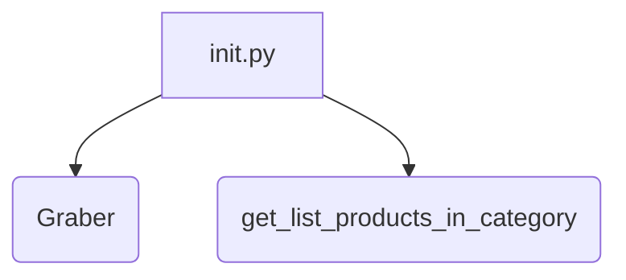
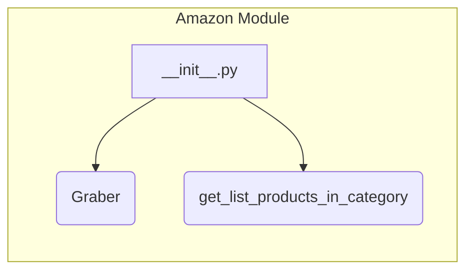

```MD
# <input code>

```python
## \file hypotez/src/suppliers/amazon/__init__.py
# -*- coding: utf-8 -*-
#! venv/Scripts/python.exe
#! venv/bin/python/python3.12

"""
.. module: src.suppliers.amazon 
	:platform: Windows, Unix
	:synopsis:

"""
MODE = 'dev'

from .graber import Graber
from .scenario import get_list_products_in_category
```

# <algorithm>

Этот код представляет собой инициализирующий модуль для пакета `amazon` внутри проекта `hypotez`.  Он содержит импорты, константу и не содержит функциональности по загрузке или обработке данных.  Алгоритм работы заключается только в импортировании необходимых модулей.




Пример: При запуске какого-либо другого модуля, который зависит от этого, происходит импорт необходимых функций.


# <mermaid>



# <explanation>

**Импорты**:

- `from .graber import Graber`: Импортирует класс `Graber` из модуля `graber.py`, который, скорее всего, находится в том же каталоге (`.`) относительно текущего файла (`__init__.py`). Это указывает на то, что `graber.py` содержит функционал для сбора данных с Amazon.
- `from .scenario import get_list_products_in_category`: Импортирует функцию `get_list_products_in_category` из модуля `scenario.py`. Вероятно, эта функция отвечает за создание сценариев сбора данных, например, получения списка продуктов в определенной категории.


**Классы**:

- `Graber`:  Этот класс (определён в `graber.py`) отвечает за непосредственный сбор данных с сайта Amazon.  Подробная информация о его атрибутах и методах отсутствует в данном файле.


**Функции**:

- `get_list_products_in_category`: Эта функция, скорее всего, определена в `scenario.py`, и её задача – получить список продуктов по заданной категории на Amazon.  Подробные аргументы, возвращаемые значения и реализация неизвестны из данного фрагмента.


**Переменные**:

- `MODE = 'dev'`:  Переменная, вероятно, определяет режим работы системы (например, 'dev', 'prod').  В данном случае, она устанавливается в 'dev'.


**Возможные ошибки или улучшения**:

- Нет явной обработки ошибок (try...except). При сбоях в подключении к Amazon или выполнении других задач, проект не будет иметь надежного механизма обработки ошибок.
- Отсутствие документации для класса `Graber` и функции `get_list_products_in_category` затрудняет понимание их работы и взаимодействия.

**Взаимосвязь с другими частями проекта**:

Этот `__init__.py` является точкой входа для модуля `amazon`.  `Graber` и `get_list_products_in_category`  вероятно используются другими частями проекта для работы с данными Amazon.  Следующим шагом будет изучение `graber.py` и `scenario.py` для более глубокого анализа функциональности и архитектуры.


**Цепочка взаимосвязей**:

`__init__.py` -> `graber.py` (содержит `Graber`) -> Зависимости, связанные с сбором данных с Amazon.

`__init__.py` -> `scenario.py` (содержит `get_list_products_in_category`) -> Зависимости, связанные с определением логики сценариев сбора.