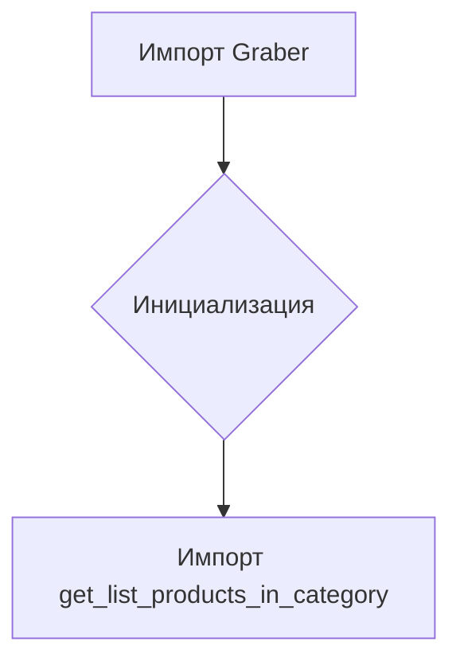

```MD
# Анализ кода hypotez/src/suppliers/amazon/__init__.py

1. **<input code>**

```python
## \file hypotez/src/suppliers/amazon/__init__.py
# -*- coding: utf-8 -*-
#! venv/Scripts/python.exe
#! venv/bin/python/python3.12

"""
.. module: src.suppliers.amazon 
	:platform: Windows, Unix
	:synopsis:

"""
MODE = 'dev'

from .graber import Graber
from .scenario import get_list_products_in_category
```

2. **<algorithm>**

Код представляет собой модуль инициализации для пакета `amazon` внутри проекта `hypotez`.  Алгоритм состоит из импорта необходимых модулей.  Он не выполняет какой-либо значимой работы, в нем нет циклов или ветвлений.  Данные не перемещаются, так как нет явного использования переменных.

Блок-схема (простая, так как код крайне минималистичен):



3. **<mermaid>**


4. **<explanation>**

* **Импорты:**
    * `from .graber import Graber`: Импортирует класс `Graber` из модуля `graber.py`, который находится в подпапке `amazon`.  `.` означает, что импортируется модуль из текущего (`amazon`) пакета. Это указывает на то, что `graber.py` и  `get_list_products_in_category.py` также находятся в директории `amazon`.
    * `from .scenario import get_list_products_in_category`: Импортирует функцию `get_list_products_in_category` из модуля `scenario.py` из того же подпакета `amazon`.

* **Классы (явный только Graber):**  
   * `Graber`:  Этот класс находится в `graber.py` и, вероятно, отвечает за извлечение данных с Amazon.  Без просмотра `graber.py` сложно сказать больше об этом.

* **Функции:**
   * `get_list_products_in_category`:  Функция, вероятно, отвечает за получение списка продуктов из определённой категории на Amazon.  Точный функционал неясен без анализа `scenario.py`.

* **Переменные:**
   * `MODE = 'dev'`:  Строковая константа, вероятно, задает режим работы (например, "development", "production").  Эта переменная глобальная для модуля `__init__.py`.

* **Возможные ошибки/улучшения:**
    * Не указан путь к файлам python.  `#! venv/Scripts/python.exe` и `#! venv/bin/python/python3.12`  являются директивами для интерпретатора,  но в коде не содержат никаких важных ссылок.
    * Отсутствует документация внутри кода. Непонятно предназначение `MODE` без дополнительных комментариев.  Не хватает подробного описания `Graber` и `get_list_products_in_category` для понимания функционала.
    *  Отсутствует импорт каких-либо библиотек, как-то `requests`, `time`, или аналогичных. Предполагается, что необходимые зависимости (например, для работы с Amazon API) импортируются в `graber.py` или `scenario.py`  и не видны в данном `__init__.py`.

* **Взаимосвязи с другими частями проекта:**
    * Модули `graber.py` и `scenario.py` находятся в папке `amazon`, являющейся частью пакета `suppliers`.  Это указывает на то, что этот пакет `suppliers`  отвечает за взаимодействие с различными поставщиками данных, как Amazon. Предполагается, что другие модули будут импортировать функции/классы из пакета `suppliers`.


**Вывод:**  Модуль `__init__.py`  выполняет роль точки входа для модулей `graber.py` и `scenario.py` внутри пакета `amazon`.  Он импортирует необходимые классы и функции, подготавливая их для использования другими частями проекта,  но без детальной реализации, сложно понять точный функционал.  Необходим анализ файлов `graber.py` и `scenario.py` для более полного понимания.