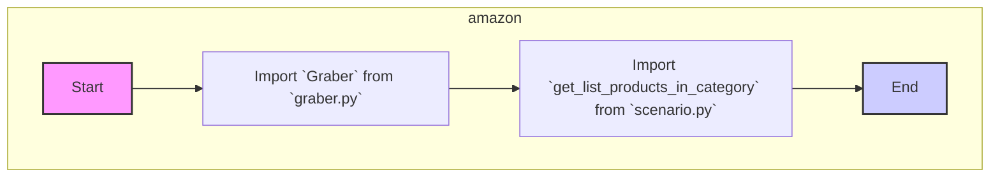

# Анализ кода `hypotez/src/suppliers/amazon/__init__.py`

## <алгоритм>

1. **Импорт `Graber`:** 
   -  Импортируется класс `Graber` из модуля `graber.py`, расположенного в той же директории.
   -  `Graber` предположительно отвечает за сбор данных (парсинг) с веб-сайта Amazon.
   -  *Пример*: `from .graber import Graber` - импортирует класс `Graber`.

2. **Импорт `get_list_products_in_category`:**
   - Импортируется функция `get_list_products_in_category` из модуля `scenario.py`, также расположенного в той же директории.
   - `get_list_products_in_category` предположительно является функцией, которая реализует сценарий сбора списка продуктов из определенной категории Amazon.
   - *Пример*: `from .scenario import get_list_products_in_category` - импортирует функцию `get_list_products_in_category`.

## <mermaid>



**Анализ зависимостей:**

- **`graber.py`**: Модуль, содержащий класс `Graber`, который, вероятно, отвечает за парсинг веб-страниц Amazon.
- **`scenario.py`**: Модуль, содержащий функцию `get_list_products_in_category`, которая, вероятно, реализует сценарий для сбора данных о товарах в определенной категории.

## <объяснение>

**Импорты:**

-   `from .graber import Graber`: Импортирует класс `Graber` из модуля `graber.py`, расположенного в той же директории. Это означает, что класс `Graber` будет доступен в контексте пакета `src.suppliers.amazon`. `Graber` отвечает за извлечение данных со страниц Amazon. `.graber` означает, что модуль `graber.py` находится в том же каталоге, что и текущий файл `__init__.py`.
-   `from .scenario import get_list_products_in_category`: Импортирует функцию `get_list_products_in_category` из модуля `scenario.py`, находящегося в той же директории. Эта функция, вероятно, реализует логику для сбора списка продуктов из определенной категории. `.scenario` означает, что модуль `scenario.py` находится в том же каталоге, что и текущий файл `__init__.py`.

**Роль файла `__init__.py`:**

Файл `__init__.py` в Python играет важную роль. Он:

1.  **Обозначает директорию как пакет:**  Наличие `__init__.py` в директории `src/suppliers/amazon` говорит Python, что эта директория должна рассматриваться как пакет. Это позволяет импортировать модули и классы из этой директории, как если бы они были частью пакета.
2.  **Инициализирует пакет:** `__init__.py` может содержать код инициализации, который выполняется при импорте пакета. В данном случае, он импортирует `Graber` и `get_list_products_in_category`, делая их доступными для использования при импорте пакета `src.suppliers.amazon`.

**Взаимосвязь с другими частями проекта:**
    
- Этот пакет `src.suppliers.amazon` вероятно является частью более крупной системы сбора данных (парсинга) и представляет собой конкретного поставщика - Amazon.
- Зависит от модулей `graber.py` и `scenario.py` в той же директории.
- Предположительно, может использоваться в других частях проекта для сбора данных с Amazon, например, в модулях, которые анализируют собранные данные или управляют процессом сбора данных.
    
**Потенциальные улучшения:**
   
- В текущем коде нет явного описания или документации о том, как именно используются `Graber` и `get_list_products_in_category`. Добавление docstring к функциям и классам сделает код более понятным.
- Нет обработки ошибок или исключений. Добавление try-except блоков может сделать код более надежным.

**Пример использования (гипотетический):**
    
```python
from src.suppliers.amazon import Graber, get_list_products_in_category

# Пример использования Graber
graber = Graber()
# ...использование grabber

# Пример использования get_list_products_in_category
category_url = "https://www.amazon.com/some_category_url"
products_list = get_list_products_in_category(category_url)
# ... обработка списка продуктов
```