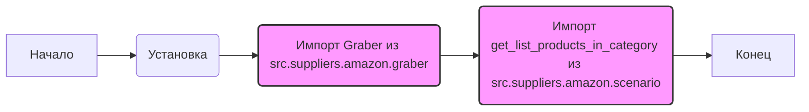

## <алгоритм>

1.  **Начало:** Инициализация модуля `src.suppliers.amazon`.
2.  **Установка режима:** Переменная `MODE` устанавливается в значение `'dev'`. Это может влиять на поведение программы, например, использование разных настроек для разработки и продакшена.
3.  **Импорт `Graber`:** Импортируется класс `Graber` из модуля `src.suppliers.amazon.graber`. Этот класс, вероятно, отвечает за извлечение данных с веб-страниц Amazon.
4.  **Импорт `get_list_products_in_category`:** Импортируется функция `get_list_products_in_category` из модуля `src.suppliers.amazon.scenario`. Эта функция, скорее всего, предназначена для получения списка товаров из определенной категории на Amazon.
5.  **Конец:** Модуль готов к использованию.

**Пример:**
   -   `` - используется для разработки и тестирования.
   -   `Graber` - класс для сбора данных, возможно, с использованием таких методов, как `get_page`, `parse_data`, и т.д.
   -   `get_list_products_in_category` - функция, принимающая, например, URL категории и возвращающая список товаров.

**Поток данных:**

```
Начало --> Установка режима MODE --> Импорт Graber --> Импорт get_list_products_in_category --> Конец
```

## <mermaid>



**Объяснение зависимостей:**

1.  `A[Начало]`: Начальная точка выполнения модуля.
2.  `B(Установка )`: Устанавливает режим работы модуля.
3.  `C(Импорт Graber из src.suppliers.amazon.graber)`: Импортирует класс `Graber` для парсинга веб-страниц. Зависит от модуля `src.suppliers.amazon.graber`.
4.  `D(Импорт get_list_products_in_category из src.suppliers.amazon.scenario)`: Импортирует функцию `get_list_products_in_category` для получения списка товаров. Зависит от модуля `src.suppliers.amazon.scenario`.
5.  `E[Конец]`: Конечная точка выполнения модуля.
   
`classDef import fill:#f9f,stroke:#333,stroke-width:2px;`: Определяет стиль для классов импорта.
`class C,D import;`: Применяет определенный стиль к элементам диаграммы, представляющим импорты.

## <объяснение>

**Импорты:**

-   `from .graber import Graber`:
    -   Импортирует класс `Graber` из модуля `graber.py`, находящегося в той же директории (`src.suppliers.amazon`).
    -   `Graber`, вероятно, используется для непосредственного получения HTML-кода страниц Amazon и последующего извлечения из него нужной информации (например, списка продуктов).
    -   Этот импорт обеспечивает взаимодействие между текущим модулем и модулем `graber`, позволяя использовать функциональность `Graber`.
-   `from .scenario import get_list_products_in_category`:
    -   Импортирует функцию `get_list_products_in_category` из модуля `scenario.py` в той же директории (`src.suppliers.amazon`).
    -   Эта функция, скорее всего, реализует сценарий сбора данных для конкретной категории товаров, используя `Graber` или другой подобный механизм.
    -   Этот импорт устанавливает связь между текущим модулем и модулем `scenario`, позволяя использовать логику работы с категориями товаров.

**Переменные:**

-   ``:
    -   Глобальная переменная, определяющая режим работы модуля.
    -   В данном случае установлена в `'dev'` (разработка).
    -   Эта переменная может использоваться для определения того, какие функции или настройки использовать при выполнении программы (например, различные параметры для разработки и продакшена).
    -   Тип переменной: `str`.

**Цепочка взаимосвязей:**

1.  `src.suppliers.amazon.__init__.py` импортирует `Graber` из `src.suppliers.amazon.graber` и `get_list_products_in_category` из `src.suppliers.amazon.scenario`.
2.  `Graber` может использовать библиотеки `requests` или `BeautifulSoup4` для получения и разбора HTML-страниц Amazon (внутри `src.suppliers.amazon.graber`).
3.  `get_list_products_in_category` может использовать `Graber` для получения HTML и обработки его для извлечения списка продуктов (внутри `src.suppliers.amazon.scenario`).
4.  Эти компоненты, вероятно, работают вместе для получения данных о продуктах с Amazon.
5.  Весь этот модуль `src.suppliers.amazon` является частью более крупной системы `hypotez`. Он обеспечивает механизм для сбора данных от поставщика (Amazon). Эти данные могут использоваться в дальнейших процессах.

**Потенциальные ошибки и области для улучшения:**

1.  **Отсутствие комментариев**: Код не содержит комментариев, поясняющих назначение каждого модуля, класса, функции, аргументов и т.п., что затрудняет его понимание.
2.  **Жёстко заданный режим**: Режим `dev` установлен статически, что может не подойти для различных сред. Возможно, следует предусмотреть возможность настройки режима через переменные окружения или аргументы командной строки.
3.  **Магические строки**: В коде есть магическая строка ``, которая может вызывать проблемы при изменении режима. Следует рассмотреть вариант использования констант или переменных окружения.
4.  **Обработка ошибок:**  Не ясно, как обрабатываются потенциальные ошибки при импорте или работе с внешними ресурсами (например, сетевые ошибки при запросе страниц Amazon). Необходимо добавить обработку исключений.
5.  **Модульность**: Модуль имеет минимальную структуру. Следует рассмотреть возможность добавления дополнительных модулей для управления ошибками, сбора статистики, логирования и т.д.

В целом, код представляет собой базовую структуру для модуля, взаимодействующего с Amazon. Для улучшения его надежности и удобства использования необходимо добавить более подробные комментарии, гибкость настроек, обработку ошибок и расширить функциональность.