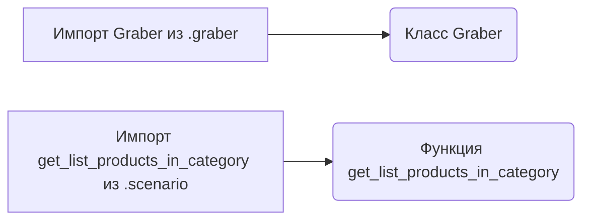
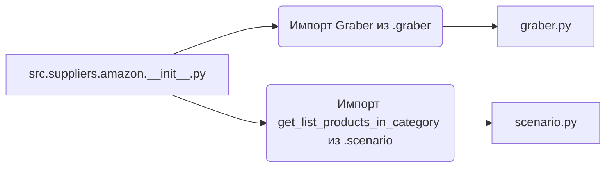

### **Анализ кода `hypotez/src/suppliers/amazon/__init__.py`**

#### **1. <алгоритм>**:

1.  **Импорт `Graber`**: Импортируется класс `Graber` из модуля `.graber`. Класс, вероятно, используется для сбора данных с Amazon.
2.  **Импорт `get_list_products_in_category`**: Импортируется функция `get_list_products_in_category` из модуля `.scenario`. Эта функция, вероятно, используется для получения списка продуктов в определенной категории Amazon.

#### **2. <mermaid>**:

**Объяснение зависимостей в `mermaid`**:

*   `src.suppliers.amazon.__init__.py`:  Основной файл, который импортирует модули и функции для работы с Amazon.
*   `Импорт Graber из .graber`:  Указывает на импорт класса `Graber` из модуля `graber.py`. Класс `Graber`, вероятно, отвечает за парсинг и сбор данных с Amazon.
*   `Импорт get_list_products_in_category из .scenario`:  Указывает на импорт функции `get_list_products_in_category` из модуля `scenario.py`.  Функция, вероятно, используется для определения сценариев получения данных о продуктах в категориях.
*   `graber.py`: Модуль, содержащий класс `Graber`.
*   `scenario.py`: Модуль, содержащий функцию `get_list_products_in_category`.

#### **3. <объяснение>**:

**Импорты**:

*   `.graber`:
    *   `Graber`: Класс, предназначенный для сбора данных с веб-сайта Amazon. Он, вероятно, содержит методы для отправки HTTP-запросов, парсинга HTML-ответов и извлечения необходимой информации о продуктах.
*   `.scenario`:
    *   `get_list_products_in_category`:  Функция, которая определяет сценарий для получения списка продуктов в определенной категории на Amazon. Она может принимать параметры, такие как категория, количество продуктов и другие фильтры.

**Переменные**:

В данном коде отсутствуют явно объявленные переменные на уровне модуля.

**Потенциальные ошибки и области для улучшения**:

1.  **Обработка исключений**: В классах и функциях, которые будут использовать `Graber` и `get_list_products_in_category`, необходимо предусмотреть обработку исключений, таких как ошибки сети, проблемы с парсингом HTML и т. д.
2.  **Логирование**: Добавить логирование для отслеживания работы `Graber` и `get_list_products_in_category`, чтобы облегчить отладку и мониторинг.
3.  **Документация**: Добавить документацию к функциям и классам, чтобы объяснить их назначение, аргументы и возвращаемые значения.
4.  **Конфигурация**: Рассмотреть возможность вынесения параметров конфигурации (например, URL Amazon, параметры запросов) в отдельные файлы конфигурации, чтобы упростить их изменение.

**Взаимосвязи с другими частями проекта**:

*   `src.suppliers`: Этот модуль, вероятно, является частью более крупной системы, которая собирает данные из различных источников (поставщиков). `amazon` — один из таких поставщиков.
*   `src.`: Остальная часть `src.` пакета, вероятно, содержит общую логику, такую как хранилище данных, обработка данных и т. д. `Graber` может использовать эти общие компоненты для хранения извлеченных данных.