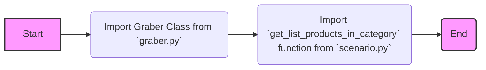
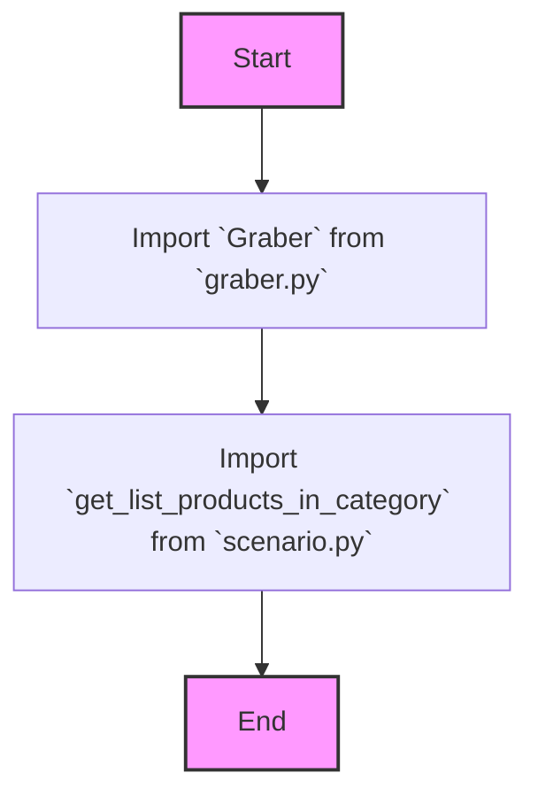

## Анализ кода `src/suppliers/amazon/__init__.py`

### 1. <алгоритм>

**Описание:**
Файл `__init__.py` в пакете `src.suppliers.amazon` служит точкой входа для этого пакета. Он импортирует классы и функции, делая их доступными при импорте пакета. В данном случае импортируются класс `Graber` из модуля `graber.py` и функция `get_list_products_in_category` из модуля `scenario.py`.

**Блок-схема:**

**Примеры:**

1.  **Импорт `Graber`:**
    -   После импорта `from .graber import Graber`, можно создать экземпляр класса `Graber` из `src/suppliers/amazon/graber.py`, используя `amazon.Graber()`, где `amazon` - это импортированный пакет.
2.  **Импорт `get_list_products_in_category`:**
    -   После импорта `from .scenario import get_list_products_in_category`, можно использовать функцию `get_list_products_in_category` из `src/suppliers/amazon/scenario.py`, вызывая ее как `amazon.get_list_products_in_category()`.

### 2. <mermaid>

**Анализ зависимостей `mermaid`:**

1.  **`Start`**: Начало процесса импорта.
2.  **`ImportGraber`**: Импортирует класс `Graber` из модуля `graber.py`, который, предположительно, отвечает за сбор данных с веб-сайта Amazon.
3.  **`ImportGetListProducts`**: Импортирует функцию `get_list_products_in_category` из модуля `scenario.py`, которая, предположительно, используется для получения списка продуктов в определенной категории.
4.  **`End`**: Конец процесса импорта.

### 3. <объяснение>

**Импорты:**

-   `from .graber import Graber`:
    -   `from .graber`: Импортирует модуль `graber` из текущего пакета `src/suppliers/amazon`.
    -   `import Graber`: Импортирует класс `Graber` из модуля `graber.py`.
    -   **Назначение:** Класс `Graber`, вероятно, предназначен для извлечения данных с сайта Amazon, таких как информация о продуктах. Он может содержать методы для отправки HTTP-запросов, парсинга HTML и т. д.
    -   **Связь с другими пакетами:** Класс `Graber` может использовать общие функции из `src` (например, функции логирования, HTTP-запросов, доступа к базе данных), хотя явно в коде это не прописано.
-   `from .scenario import get_list_products_in_category`:
    -   `from .scenario`: Импортирует модуль `scenario` из текущего пакета `src/suppliers/amazon`.
    -   `import get_list_products_in_category`: Импортирует функцию `get_list_products_in_category` из `scenario.py`.
    -   **Назначение:** Функция `get_list_products_in_category`, вероятно, реализует конкретный сценарий использования, например получение списка товаров из заданной категории на Amazon.
    -   **Связь с другими пакетами:**  Эта функция, вероятно, использует `Graber` или другие инструменты из этого же пакета, для извлечения данных.

**Классы:**

-   `Graber`:
    -   **Роль:**  Предназначен для сбора и обработки данных с веб-сайта Amazon.
    -   **Атрибуты и методы**: Могут включать методы для отправки запросов, парсинга ответов, обработки данных и сохранения их в нужный формат.
    -   **Взаимодействие:**  Может взаимодействовать с функциями для работы с файлами, базами данных.

**Функции:**

-   `get_list_products_in_category`:
    -   **Аргументы:**  Скорее всего принимает аргументы, определяющие категорию товаров.
    -   **Возвращаемое значение:** Вероятно возвращает список товаров или данных о товарах в требуемом формате.
    -   **Назначение:** Выполняет конкретный сценарий сбора данных для категории товаров на Amazon.
    -   **Пример:** `get_list_products_in_category(category_name="electronics", pages_to_scrape=2)`

**Переменные:**

-   В данном файле нет переменных.

**Потенциальные ошибки и области для улучшения:**

-   Отсутствует явное документирование. Необходимо добавить docstring в модули и функции, чтобы улучшить читаемость и понимание.
-   Отсутствует обработка исключений (ошибок).

**Цепочка взаимосвязей с другими частями проекта:**

1.  Пакет `src/suppliers/amazon` вероятно является частью более крупной системы, которая обрабатывает данные от разных поставщиков.
2.  Этот пакет использует модули из `src`, такие как:
    -   Логгер из `src.utils`
    -   HTTP-клиент из `src.net`.
    -   Функции для работы с базами данных из `src.db`.
3.  Собранные данные могут использоваться модулями из `src/services` или `src/business_logic`.