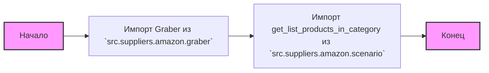
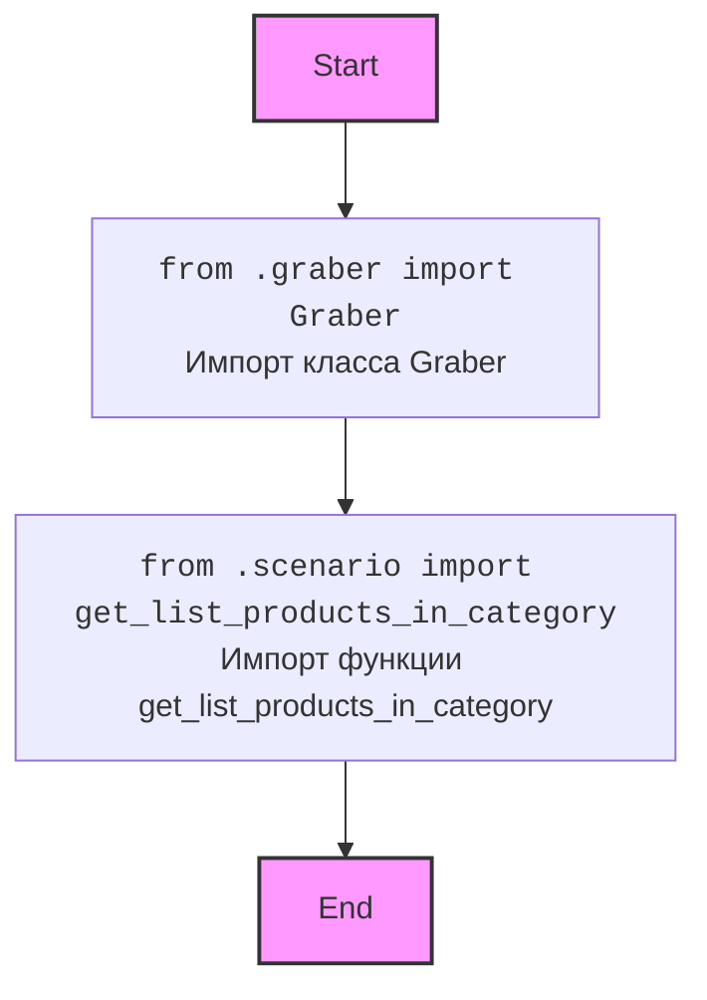

## АНАЛИЗ КОДА `hypotez/src/suppliers/amazon/__init__.py`

### 1. <алгоритм>

**Блок-схема:**


**Пример:**

1.  **Импорт Graber**:  `from .graber import Graber` - импортирует класс `Graber`, который, вероятно, отвечает за получение данных (например, HTML-страниц) с Amazon.
2.  **Импорт get_list_products_in_category**: `from .scenario import get_list_products_in_category` - импортирует функцию `get_list_products_in_category`, которая, вероятно, отвечает за получение списка товаров в определенной категории на Amazon, используя `Graber` или другие компоненты.
### 2. <mermaid>


**Объяснение:**

Диаграмма `mermaid` показывает зависимости импорта внутри `__init__.py`.
*   `Start`: Начало выполнения скрипта.
*   `ImportGraber`: Импортируется класс `Graber` из модуля `graber.py` в текущем пакете (`.`). Этот класс, вероятно, отвечает за получение данных с веб-страниц Amazon.
*   `ImportGetListProducts`: Импортируется функция `get_list_products_in_category` из модуля `scenario.py` в текущем пакете (`.`). Эта функция, вероятно, отвечает за формирование списка товаров в заданной категории на Amazon.
*   `End`: Конец импорта и выполнения скрипта.

### 3. <объяснение>
#### Импорты:
*   `from .graber import Graber`:
    *   Импортирует класс `Graber` из модуля `graber.py`, находящегося в той же директории (`.`).
    *   `Graber`, вероятно, является классом, который занимается непосредственно сбором данных со страниц Amazon (например, через HTTP-запросы).
    *   Этот импорт устанавливает зависимость от функциональности, предоставляемой модулем `graber`.
*   `from .scenario import get_list_products_in_category`:
    *   Импортирует функцию `get_list_products_in_category` из модуля `scenario.py`, находящегося в той же директории (`.`).
    *   `get_list_products_in_category` скорее всего является высокоуровневой функцией, которая использует `Graber` или другие компоненты для извлечения списка товаров из заданной категории на Amazon.
    *   Этот импорт устанавливает зависимость от логики сбора данных из категории товаров на Amazon.
#### Классы:
*   `Graber`:
    *   Класс, импортированный из модуля `graber.py`.
    *   Предположительно имеет методы для выполнения HTTP-запросов к Amazon, парсинга HTML и извлечения необходимых данных.
    *   Скорее всего, это основной класс для сбора сырых данных.

#### Функции:
*   `get_list_products_in_category`:
    *   Функция, импортированная из модуля `scenario.py`.
    *   Предположительно принимает аргументы, определяющие категорию товаров (например, URL-адрес категории или идентификатор).
    *   Возвращает список товаров, извлеченных из указанной категории.
    *   Пример использования:
        ```python
        from src.suppliers.amazon import get_list_products_in_category
        
        category_url = "https://www.amazon.com/s?k=headphones"
        products = get_list_products_in_category(category_url)
        print(products) # Вывод списка товаров в категории наушники
        ```

#### Переменные:
*   В предоставленном коде нет явных переменных, которые определяются в `__init__.py`, но будут доступны после импорта `from src.suppliers.amazon import Graber, get_list_products_in_category`.

#### Взаимосвязи с другими частями проекта:
*   `src.suppliers.amazon`  является пакетом,  предоставляющим функциональность для работы с Amazon.
*   Он зависит от модулей `graber.py` и `scenario.py` внутри пакета.
*   Может использоваться другими частями проекта, которые требуют сбора данных с Amazon.

#### Потенциальные ошибки и улучшения:
*   Код является декларативным,  и не содержит обработки исключений. В `graber.py` и `scenario.py` должны быть обработки возможных ошибок (ошибки сети, отсутствие данных на страницах Amazon).
*   Необходимо более детальное документирование кода, особенно классов и функций в `graber.py` и `scenario.py`, чтобы понять их внутреннюю логику.
*   Реализация может страдать от жёсткой привязки к структуре HTML Amazon, что может привести к проблемам в случае изменения структуры сайта. Необходимо применять более гибкие способы парсинга.