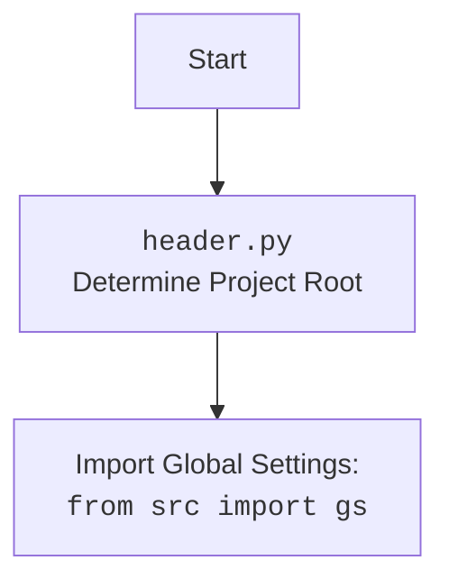

## <алгоритм>

1. **Инициализация `Graber`:**
   - Создается экземпляр класса `Graber`, принимая на вход объект `Driver` (веб-драйвер).
   - Устанавливается префикс поставщика `supplier_prefix` равным "amazon".
   - Вызывается конструктор родительского класса `Graber` (`src.suppliers.graber.Graber`), передавая префикс и драйвер.
   - Устанавливается `Context.locator_for_decorator` в `None`.

2. **Наследование от `src.suppliers.graber.Graber`:**
    - Класс `Graber` наследуется от класса `Graber` из модуля `src.suppliers.graber`.
    - Это позволяет использовать методы родительского класса.

3. **Установка префикса поставщика:**
    - При инициализации устанавливается `supplier_prefix` в `amazon`.

4. **Декоратор (закомментирован):**
   - В коде присутствует закомментированный пример декоратора `close_pop_up`.
   - Этот декоратор предназначен для закрытия всплывающих окон перед выполнением основной логики функции, на которую он навешивается.
   - Декоратор принимает необязательное значение `value`.
   - Внутри декоратора находится функция `wrapper`, которая перехватывает вызов декорируемой функции.
   -  В `wrapper` происходит попытка выполнить локатор, заданный в `Context.locator` для закрытия всплывающего окна
   -   Если `Context.locator_for_decorator` будет установлен в `True`, то декоратор вызовется перед основным методом.
   -  В случае ошибки при выполнении локатора, в логгер отправляется отладочное сообщение.

5. **Контекст `Context`:**
    -  Используется для хранения глобальных параметров, таких как `Context.locator_for_decorator`.
    -  `Context.locator` (не явно определен в этом коде) хранит данные локатора для выполнения в декораторе `close_pop_up`.
    - Значение `Context.locator_for_decorator` сбрасывается в `None` при инициализации, что означает, что декоратор не будет срабатывать по умолчанию.

6. **Вызов метода родительского класса:**
    - При инициализации вызывается метод `super().__init__(supplier_prefix=self.supplier_prefix, driver=driver)`
    - Это обеспечивает выполнение инициализации родительского класса и передачу параметров.

**Пример:**
```python
# Создание экземпляра класса Graber
driver_instance = Driver()  # Предполагается, что Driver создан
graber_instance = Graber(driver=driver_instance)

# Теперь graber_instance готов к выполнению операций захвата данных с Amazon
#  Если `Context.locator_for_decorator` установлен, то при вызове методов класса, будет запускаться декоратор.
```

## <mermaid>
```mermaid
flowchart TD
    Start --> GraberInit[<code>Graber.__init__</code><br>Инициализация класса Graber]
    GraberInit --> SetSupplierPrefix[Установка <code>supplier_prefix</code> = 'amazon']
    SetSupplierPrefix --> SuperInit[Вызов <code>super().__init__</code> родительского класса <br><code>src.suppliers.graber.Graber</code>]
    SuperInit --> SetContextLocatorNone[Установка <code>Context.locator_for_decorator</code> = None]
     SetContextLocatorNone --> End
    
    
    
    classDef imported fill:#f9f,stroke:#333,stroke-width:2px
    class GraberInit, SetSupplierPrefix, SuperInit, SetContextLocatorNone  imported
```


## <объяснение>

**Импорты:**

- `from typing import Any`: Импортирует `Any` для аннотации типов, позволяя переменным быть любого типа.
- `import header`: Импортирует модуль `header`, вероятно, для определения корневого каталога проекта и загрузки глобальных настроек.
- `from src.suppliers.graber import Graber as Grbr, Context, close_pop_up`:
    -   Импортирует класс `Graber` (переименованный в `Grbr` для краткости), класс `Context` и функцию `close_pop_up` из модуля `src.suppliers.graber`.
    -  `Graber` - это родительский класс для парсинга, `Context` - класс для хранения глобальных переменных, `close_pop_up` - декоратор.
- `from src.webdriver.driver import Driver`: Импортирует класс `Driver` из модуля `src.webdriver.driver` для управления веб-драйвером.
- `from src.logger.logger import logger`: Импортирует объект `logger` для логирования.

**Классы:**

- **`Graber(Grbr)`:**
    -   Это класс для сбора данных со страниц товаров Amazon. Он наследует класс `Graber` из модуля `src.suppliers.graber`.
    -   `supplier_prefix`: Атрибут класса, хранит префикс поставщика ("amazon").
    -   `__init__(self, driver: Driver)`: Конструктор класса.
        -   Принимает объект `Driver` для управления веб-драйвером.
        -   Устанавливает `supplier_prefix` в "amazon".
        -   Вызывает конструктор родительского класса с префиксом поставщика и драйвером.
        -   Устанавливает  `Context.locator_for_decorator` в `None`.

**Функции:**

-  **`close_pop_up(value: Any = None) -> Callable` (закомментирована):**
    -   Декоратор для закрытия всплывающих окон.
    -   Принимает необязательное значение `value`.
    -   Возвращает декоратор `decorator`.
    -   Внутри декоратора `wrapper`:
        -   Пытается выполнить локатор для закрытия всплывающего окна.
        -   В случае ошибки записывает отладочное сообщение в лог.
        -   Вызывает декорируемую функцию и возвращает результат.

**Переменные:**

-  `supplier_prefix`: Строка, хранящая префикс поставщика, "amazon".

**Взаимосвязи с другими частями проекта:**

-   `src.suppliers.graber`: Родительский класс `Graber` и класс `Context`  используются для общей логики сбора данных.
-   `src.webdriver.driver`: Класс `Driver` используется для взаимодействия с веб-драйвером.
-   `src.logger.logger`: Логгер используется для записи отладочных сообщений.
-   `header.py`: Используется для определения корневого каталога проекта и загрузки глобальных настроек.

**Потенциальные ошибки и области для улучшения:**

-   Декоратор `close_pop_up` закомментирован и не используется по умолчанию. Для использования декоратора, его нужно раскомментировать, реализовать логику закрытия всплывающих окон  и установить `Context.locator_for_decorator` в значение, отличное от `None` .
-   В коде неявно используется `Context.locator`, что может вызвать ошибки при неправильной настройке.
-   Нет обработки исключений при вызове родительского класса.
-   Отсутствуют методы сбора конкретных полей товара, которые, вероятно, определены в родительском классе `src.suppliers.graber.Graber`.
-  Стоит добавить проверки типов аргументов для обеспечения корректной работы.
-  Отсутствует асинхронная обработка, декоратор с async/await закомментирован.

**Цепочка взаимосвязей:**
1.  `header.py` ->  загружает глобальные настройки из `src.gs`.
2.  `src.suppliers.graber.Graber` -> базовый класс для граббинга, предоставляет общую логику.
3.  `src.webdriver.driver.Driver` -> управляет веб-драйвером.
4.  `src.logger.logger` ->  предоставляет инструменты для логирования.
5.  `src.suppliers.amazon.graber.Graber` -> конкретный грабер для amazon.com, использующий общую логику и драйвер.

Этот анализ обеспечивает всестороннее понимание функциональности кода, его зависимостей и потенциальных областей для улучшения.