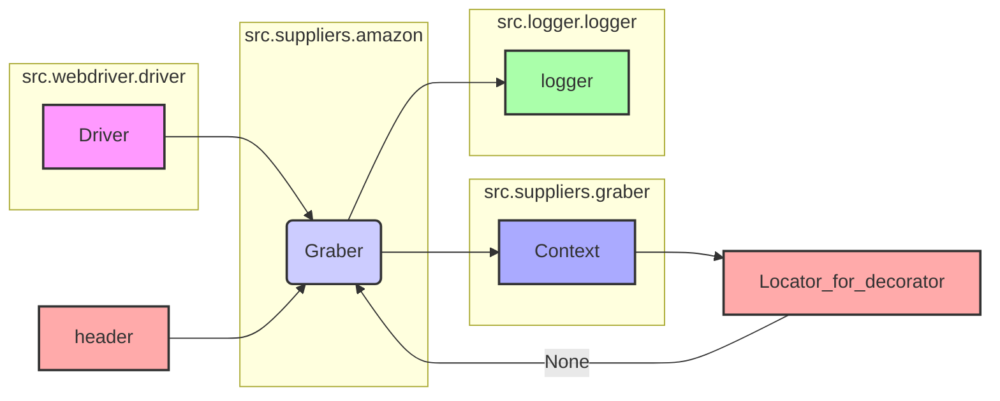

## Анализ кода `hypotez/src/suppliers/amazon/graber.py`

### 1. <алгоритм>

**Общий рабочий процесс:**

1.  **Инициализация:**
    *   Создается экземпляр класса `Graber`.
    *   В конструкторе устанавливается префикс поставщика (`amazon`) и вызывается конструктор родительского класса `Graber` (из `src.suppliers.graber`).
    *   Также в конструкторе устанавливается `Context.locator_for_decorator = None`, что отключает выполнение стандартного декоратора `close_pop_up`.
2.  **Сбор данных (не показан в этом фрагменте):**
    *   Предполагается, что методы класса `Graber` (унаследованные от родителя или переопределенные) будут вызывать `Context.driver` для взаимодействия с веб-страницей.
    *   Методы будут использовать локаторы для поиска элементов на странице и извлечения данных.
    *   Возможно выполнение предварительных действий с помощью декоратора `@close_pop_up`, если `Context.locator` будет установлено в не `None` значение.
    *   В случае ошибки выполнения локатора в декораторе, она будет перехвачена и записана в лог.

**Примеры:**

*   **Инициализация:** `graber = Graber(driver=my_driver)`. Создается экземпляр `Graber`, устанавливается префикс поставщика и выполняется инициализация родительского класса. `Context.locator_for_decorator` устанавливается в `None`.
*   **Сбор данных:** (не показан в фрагменте, но может быть, например)
    ```python
    # @close_pop_up #<- если Context.locator_for_decorator не None
    async def get_title(self):
        title_element = await self.driver.execute_locator(self.locator.title)
        return title_element.text
    ```

**Поток данных:**

1.  `Driver` (из `src.webdriver.driver`) передается в конструктор `Graber`.
2.  `Graber` использует `Driver` для взаимодействия с веб-страницей.
3.  `Context` (из `src.suppliers.graber`) используется для хранения глобальных настроек.
4.  `logger` (из `src.logger.logger`) используется для логирования ошибок.
5.  `header` (из `header`) используется для определения заголовков запросов к сайту

### 2. <mermaid>



**Анализ зависимостей:**

*   `Driver` (из `src.webdriver.driver`): Обеспечивает взаимодействие с веб-браузером. Класс `Graber` использует его для навигации по страницам, поиска элементов и извлечения данных.
*   `Graber` (из `src.suppliers.graber`): Родительский класс, предоставляющий базовую функциональность для сбора данных о товарах, включая логику декоратора и настройки.
*   `Context` (из `src.suppliers.graber`): Используется для хранения глобального контекста, включая объект драйвера и настройки, такие как `locator_for_decorator`, который управляет поведением декоратора `close_pop_up`.
*   `logger` (из `src.logger.logger`): Используется для логирования ошибок и отладочной информации.
*   `header` (из `header`): Используется для определения заголовков запросов к сайту.

### 3. <объяснение>

#### Импорты:

*   `typing.Any`:  Используется для аннотации типов, где тип может быть любым.
*    `header`: импортируется для использования в запросах
*   `src.suppliers.graber.Graber as Grbr, Context, close_pop_up`: Импортирует родительский класс `Graber`, класс `Context` для управления глобальным состоянием и функцию `close_pop_up` для декоратора.
*   `src.webdriver.driver.Driver`: Импортирует класс `Driver` для взаимодействия с веб-браузером.
*   `src.logger.logger.logger`:  Импортирует объект `logger` для логирования.

**Взаимосвязь импортов:**

*   `Graber` из `src.suppliers.graber` - базовый класс для данного класса, определяет основные методы для работы с сайтами.
*   `Driver` из `src.webdriver.driver` -  необходим для управления браузером и получения данных с веб-страниц.
*   `Context` используется для хранения состояния драйвера и других глобальных параметров, а также для управления декораторами.
*   `logger` используется для записи ошибок и отладочной информации, предоставляя механизм для отслеживания проблем.
*   `header` используется для формирования заголовков http запросов.

#### Классы:

*   **`Graber(Grbr)`**:
    *   **Роль:** Класс-наследник от `src.suppliers.graber.Graber` для сбора данных с сайта Amazon.
    *   **Атрибуты:**
        *   `supplier_prefix` (str): Префикс поставщика (`amazon`).
    *   **Методы:**
        *   `__init__(self, driver: Driver)`: Конструктор класса, инициализирует префикс поставщика и вызывает конструктор родительского класса. Также устанавливает  `Context.locator_for_decorator` в `None`, отключая стандартный декоратор.
    *   **Взаимодействие:**
        *   Использует `Driver` для взаимодействия с веб-браузером.
        *   Наследует функциональность от `src.suppliers.graber.Graber`.
        *   Управляет декоратором `close_pop_up` через `Context.locator_for_decorator`.

#### Функции:

*   `close_pop_up(value: Any = None)` (закомментирована):
    *   **Аргументы:** `value` (Any, по умолчанию None) - дополнительное значение для декоратора.
    *   **Возвращаемое значение:** Декоратор, который обертывает функцию.
    *   **Назначение:** Создает декоратор для закрытия всплывающих окон.
    *   **Пример:** (в коде закомментирован)
        ```python
        # @close_pop_up()
        # async def get_title(self):
        #     ...
        ```

#### Переменные:

*   `MODE`: Строка `'dev'`. Указывает режим работы. Может использоваться для переключения между разными конфигурациями или функциональностью.
*  `supplier_prefix`: Строка `'amazon'`. Используется для идентификации поставщика, у которого собираются данные.

#### Потенциальные ошибки и области для улучшения:

*   **Зависимость от родительского класса:** Класс сильно зависит от реализации родительского класса `src.suppliers.graber.Graber`. Изменения в родительском классе могут повлиять на работу этого класса.
*   **Обработка ошибок:** Ошибка `ExecuteLocatorException` обрабатывается, но дальнейшая обработка не реализована. В дальнейшем можно добавить логику для повторных попыток или оповещения об ошибке.
*   **Декоратор `close_pop_up`:** В коде закомментирован. Не используется по умолчанию. Возможно стоит убрать совсем, или доделать функционал.
*   **Отсутствие логики сбора данных:** В предоставленном фрагменте кода не показана логика сбора данных. Вероятно, она реализована в родительском классе или в переопределенных методах.

#### Цепочка взаимосвязей:

1.  **Вход:** Экземпляр `Driver` передается в конструктор `Graber`.
2.  `Graber` использует `Driver` для взаимодействия с сайтом `amazon.com`.
3.  `Graber` наследуется от `src.suppliers.graber.Graber`, что позволяет использовать общую логику и настройки.
4.  `Graber` использует `Context` для управления состоянием.
5.  `Graber` использует `logger` для логирования ошибок.
6.   `Graber` использует `header` для формирования заголовков http запросов.
7.  **Выход:** Предполагается, что методы `Graber` возвращают собранные данные, которые затем будут использоваться в других частях проекта (например, для сохранения в БД или для дальнейшей обработки).