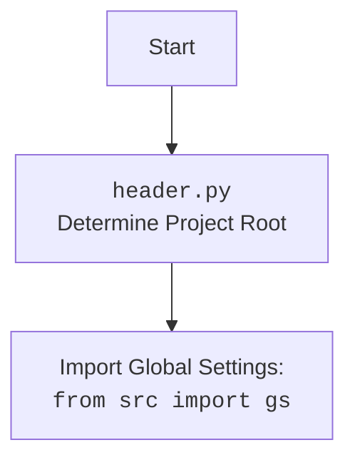

## АНАЛИЗ КОДА `src/suppliers/amazon/graber.py`

### 1. <алгоритм>

**Общая схема работы:**

1.  **Инициализация (`__init__`)**:
    *   Создается экземпляр класса `Graber`.
    *   Устанавливается префикс поставщика `supplier_prefix` как `'amazon'`.
    *   Вызывается конструктор родительского класса `Graber` (`src.suppliers.graber.Graber`).
    *   Инициализируется `Context.locator_for_decorator` в значение `None`.  
        *   **Пример**: `amazon_graber = Graber(driver=my_driver)`. Здесь `my_driver` - это экземпляр класса `Driver`.

2.  **Декоратор (раскомментированный шаблон)**:
    *   Функция `close_pop_up` предназначена для создания декоратора.  
    *   Декоратор оборачивает функцию, перед вызовом которой он должен выполнится.
    *   Внутри декоратора происходит попытка выполнить локатор (выбрать элемент) на веб-странице для закрытия всплывающего окна, используя `Context.driver.execute_locator(Context.locator.close_pop_up)`.
    *   Если выполнение локатора завершается с ошибкой, она логируется.
    *   В конце, выполняется декорируемая функция.
        *   **Пример**: Функция `get_product_title` может быть декорирована, чтобы сначала попытаться закрыть всплывающее окно, и только потом считать заголовок товара.

3.  **Наследование от `src.suppliers.graber.Graber`:**
    *   Класс `Graber` наследует от `src.suppliers.graber.Graber`.
    *   Это означает, что он может использовать все методы и свойства, определенные в родительском классе.
    *   Класс `Graber` предназначен для переопределения или расширения функциональности родительского класса для конкретного поставщика - `amazon`.

**Пример потока данных**:

1.  Создается объект `amazon_graber` класса `Graber`, которому передается драйвер браузера.
2.  `amazon_graber` инициализирует `self.supplier_prefix` и вызывает конструктор родительского класса `Graber` с этим префиксом.
3.  При вызове метода для сбора данных (например, `get_product_title`) происходит проверка, установлен ли `Context.locator_for_decorator`. Если установлен, то применяется декоратор `close_pop_up` перед вызовом метода.
4.  Если декоратор сработал, он сначала пытается закрыть всплывающее окно.
5.  После этого выполняется метод сбора данных.
6.  Данные возвращаются в место вызова.

### 2. <mermaid>

```mermaid
flowchart TD
    Start[Start] --> Init_Graber[<code>Graber.__init__</code><br> Initialize Amazon Graber];
    Init_Graber --> Set_Supplier_Prefix[Set <code>self.supplier_prefix</code> = 'amazon']
     Set_Supplier_Prefix --> Call_Super_Init[Call <code>super().__init__(...)</code>];
      Call_Super_Init --> Set_Locator_For_Decorator[Set <code>Context.locator_for_decorator</code> = None];
      Set_Locator_For_Decorator --> End[End of Initialization];
      
     
    
    subgraph Decorator  
      Decorator_Start[Start of Decorator] --> Execute_Locator[<code>Context.driver.execute_locator(Context.locator.close_pop_up)</code><br> Attempt to Close Popup];
      Execute_Locator --> Handle_Error{Error Handling}
      Handle_Error -- Yes --> Log_Error[Log Error]
      Log_Error --> Execute_Function[Execute Decorated Function]
       Handle_Error -- No --> Execute_Function
      Execute_Function --> Decorator_End[End of Decorator]
    end
    
     Start_Function[Start of Function Call] --> Check_Decorator{Is <code>Context.locator_for_decorator</code> set?}
      Check_Decorator -- Yes --> Decorator
      Check_Decorator -- No --> Execute_Function_Directly[Execute Function Directly];
      Execute_Function_Directly --> End_Function[End of Function Call]
      Decorator_End --> Execute_Function_Directly
```

**Анализ диаграммы:**

*   `Start` - начало выполнения кода при создании объекта `Graber`.
*   `Init_Graber` - вызывает метод `__init__`, который инициализирует объект класса `Graber`.
*   `Set_Supplier_Prefix` - устанавливает префикс поставщика `supplier_prefix` в значение "amazon".
*   `Call_Super_Init` - вызывает конструктор родительского класса `Graber`.
*   `Set_Locator_For_Decorator` - устанавливает `Context.locator_for_decorator` в значение `None`.
*    `End` - конец этапа инициализации.
*  `Decorator_Start` -  начало работы декоратора
*   `Execute_Locator` - попытка закрыть всплывающее окно с использованием `Context.driver.execute_locator`.
*    `Handle_Error` - проверка на ошибки при работе с локатором
*   `Log_Error` - логирование ошибки в случае неудачного выполнения локатора.
*   `Execute_Function` - вызов декорируемой функции.
*   `Decorator_End` - конец работы декоратора
*   `Start_Function` - начало вызова метода сбора данных.
*   `Check_Decorator` - проверка установлен ли `Context.locator_for_decorator`.
*   `Execute_Function_Directly` - выполнение функции напрямую, если декоратор не нужен.
*   `End_Function` - конец выполнения функции сбора данных.



**Анализ диаграммы для `header.py`:**

*   `Start` - начало процесса импорта `header.py`.
*   `Header` - определяет корень проекта (`project_root`).
*  `import` - импортирует глобальные настройки проекта из `src.gs`.

### 3. <объяснение>

**Импорты:**

*   `from typing import Any`: Импортирует `Any` для обозначения любого типа данных. Используется в декораторе для гибкости, позволяя передавать значения любого типа.
*   `import header`: Импортирует модуль `header`, который, вероятно, отвечает за установку корня проекта и импорт глобальных настроек. Это позволяет коду находить необходимые ресурсы и настройки.
*   `from src.suppliers.graber import Graber as Grbr, Context, close_pop_up`: Импортирует класс `Graber` (переименованный в `Grbr`), `Context` (для хранения контекстной информации) и `close_pop_up` (декоратор) из модуля `src.suppliers.graber`. Это указывает на то, что данный класс наследует поведение от общего класса `Graber` и использует общие контекстные данные.
*   `from src.webdriver.driver import Driver`: Импортирует класс `Driver` из модуля `src.webdriver.driver`. Это класс, который предоставляет интерфейс для управления веб-браузером, необходимый для сбора данных с веб-страниц.
*   `from src.logger.logger import logger`: Импортирует объект `logger` из модуля `src.logger.logger`. Это объект для логирования событий, что помогает отлаживать и мониторить работу кода.

**Классы:**

*   **`Graber(Grbr)`:**
    *   **Роль:** Класс для сбора данных с веб-страниц Amazon. Наследует от базового класса `Graber` (`src.suppliers.graber.Graber`), обеспечивая тем самым общую логику сбора данных, которую можно переопределить для каждого поставщика.
    *   **Атрибуты:**
        *   `supplier_prefix: str`: Строка, обозначающая префикс поставщика (в данном случае `"amazon"`).
    *   **Методы:**
        *   `__init__(self, driver: Driver)`:
            *   Инициализирует экземпляр класса, устанавливает префикс поставщика и вызывает конструктор родительского класса.
            *   Принимает объект `driver` класса `Driver`, который используется для взаимодействия с веб-браузером.
            *   Устанавливает `Context.locator_for_decorator = None`, тем самым отключает декоратор по умолчанию, пока не установили нужное значение.

**Функции:**

*   **`close_pop_up(value: Any = None)` (раскомментированный шаблон)**:
    *   **Назначение:** Создает декоратор для закрытия всплывающих окон перед выполнением функции.
    *   **Аргументы:**
        *   `value: Any = None`: Дополнительное значение, которое может быть передано декоратору.
    *   **Возвращаемое значение:**
        *   Возвращает декоратор, который оборачивает декорируемую функцию.
    *   **Пример использования:**
        *   Декоратор можно применить к функциям, которые собирают данные с веб-страницы, где часто появляются всплывающие окна. Например, `@close_pop_up()` перед функцией, которая получает заголовок товара.

**Переменные:**

*   `supplier_prefix: str = 'amazon'`: Строка, хранящая префикс поставщика. Используется для идентификации и настройки сбора данных для конкретного поставщика.
*   `Context.locator_for_decorator`: Атрибут класса `Context`, который используется для установки локатора, с помощью которого будет работать декоратор.

**Цепочка взаимосвязей:**

1.  `header.py` → `src.gs` (глобальные настройки проекта).
2.  `src.suppliers.graber.Graber` → `src.webdriver.driver.Driver` (для взаимодействия с браузером).
3.  `src.suppliers.amazon.Graber` → `src.suppliers.graber.Graber` (наследование и расширение функциональности).
4.  `src.suppliers.amazon.Graber` → `src.logger.logger.logger` (для логирования).

**Потенциальные ошибки и области для улучшения:**

*   **Не обработаны все исключения:** В декораторе есть `ExecuteLocatorException`, но, возможно, стоит добавить обработку других исключений.
*   **Жесткая привязка к `close_pop_up`:** Декоратор `close_pop_up` жестко привязан к определенному локатору и действию. Для большей гибкости можно сделать декоратор более универсальным.
*   **Отсутствие документации**: Нет документации в виде докстрингов для методов.
*   **Отсутствие примеров**: Нет примеров использования в виде doc-тестов.
*   **Конфигурация декоратора**: Не понятно где задаётся `Context.locator.close_pop_up`, и что это за локатор, по которому он пытается закрыть окно.

**Дополнительные замечания:**

*   Использование `Context` для передачи данных между компонентами может быть удобным, но следует следить за его состоянием и возможными побочными эффектами.
*   Шаблон декоратора показывает общую структуру, но его конкретное поведение определяется содержимым `Context.locator.close_pop_up` и обработкой исключений.
*   Код подразумевает асинхронное выполнение, так как используются ключевые слова `async` и `await`.

Этот анализ предоставляет подробное понимание структуры и функциональности кода `src/suppliers/amazon/graber.py`, а также его связей с другими частями проекта.