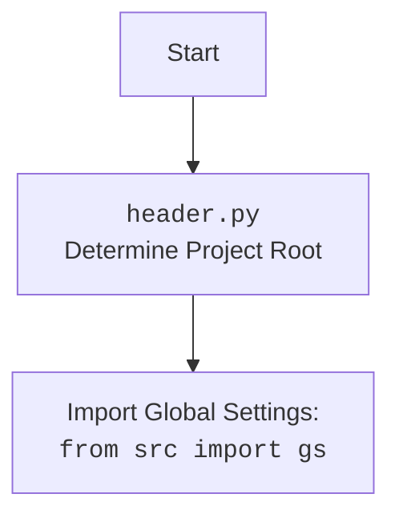

## ИНСТРУКЦИЯ:

Анализируй предоставленный код подробно и объясни его функциональность. Ответ должен включать три раздела:  

1. **<алгоритм>**: Опиши рабочий процесс в виде пошаговой блок-схемы, включая примеры для каждого логического блока, и проиллюстрируй поток данных между функциями, классами или методами.  
2. **<mermaid>**: Напиши код для диаграммы в формате `mermaid`, проанализируй и объясни все зависимости, 
    которые импортируются при создании диаграммы. 
    **ВАЖНО!** Убедитесь, что все имена переменных, используемые в диаграмме `mermaid`, 
    имеют осмысленные и описательные имена. Имена переменных вроде `A`, `B`, `C`, и т.д., не допускаются!  
    
    **Дополнительно**: Если в коде есть импорт `import header`, добавьте блок `mermaid` flowchart, объясняющий `header.py`:\
    ```mermaid
    flowchart TD
        Start --> Header[<code>header.py</code><br> Determine Project Root]
    
        Header --> import[Import Global Settings: <br><code>from src import gs</code>] 
    ```

3. **<объяснение>**: Предоставьте подробные объяснения:  
   - **Импорты**: Их назначение и взаимосвязь с другими пакетами `src.`.  
   - **Классы**: Их роль, атрибуты, методы и взаимодействие с другими компонентами проекта.  
   - **Функции**: Их аргументы, возвращаемые значения, назначение и примеры.  
   - **Переменные**: Их типы и использование.  
   - Выделите потенциальные ошибки или области для улучшения.  

Дополнительно, постройте цепочку взаимосвязей с другими частями проекта (если применимо).  

Это обеспечивает всесторонний и структурированный анализ кода.
## Формат ответа: `.md` (markdown)
**КОНЕЦ ИНСТРУКЦИИ**
## <алгоритм>
1.  **Импорт модулей и классов**:
    *   Импортируются необходимые модули и классы, такие как `header`, `Graber` (как `Grbr`), `Context`, `close_pop_up` из `src.suppliers.graber`, `Driver` из `src.webdriver.driver`, `logger` из `src.logger.logger`.

2.  **Определение класса `Graber`**:
    *   Класс `Graber` наследуется от `Grbr` (предположительно, базовый класс грабера).
    *   Определяется атрибут класса `supplier_prefix` (строка) для указания поставщика.

3.  **Инициализация экземпляра `Graber` (`__init__`)**:
    *   При создании экземпляра `Graber` вызывается конструктор (`__init__`), который принимает `Driver` в качестве аргумента.
    *   Устанавливается `supplier_prefix` как `'amazon'`.
    *   Вызывается конструктор родительского класса `Grbr` с параметрами `supplier_prefix` и `driver`.
    *   Устанавливается `Context.locator_for_decorator` в `None`, что говорит о том, что декоратор (`close_pop_up`) по умолчанию не будет использоваться.

**Примеры для каждого логического блока:**

   - **Импорт модулей**:
    ```python
        from typing import Any
        import header
        from src.suppliers.graber import Graber as Grbr, Context, close_pop_up
        from src.webdriver.driver import Driver
        from src.logger.logger import logger
    ```
   - **Определение класса `Graber`**:
    ```python
        class Graber(Grbr):
            supplier_prefix: str
    ```
   - **Инициализация экземпляра `Graber`**:
    ```python
        def __init__(self, driver: Driver):
            self.supplier_prefix = 'amazon'
            super().__init__(supplier_prefix=self.supplier_prefix, driver=driver)
            Context.locator_for_decorator = None
    ```
   
**Поток данных:**

    1.  **Импорт**: Модули и классы импортируются в текущий файл.
    2.  **Создание экземпляра `Driver`**: Внешний код создает экземпляр `Driver`, который управляет браузером.
    3.  **Создание экземпляра `Graber`**: Экземпляр `Graber` создается, принимая экземпляр `Driver`.
    4.  **Установка `supplier_prefix`**: Значение `'amazon'` присваивается `self.supplier_prefix`.
    5.  **Вызов родительского конструктора**: Конструктор родительского класса `Grbr` вызывается, инициализируя общие настройки грабера.
    6.  **Установка декоратора**: `Context.locator_for_decorator` устанавливается в `None`, отключая декоратор по умолчанию.
    7.  **Использование `driver`**:  Объект `driver` используется в конструкторе родительского класса и для всех операций с веб-страницей.

## <mermaid>
```mermaid
flowchart TD
    Start[Start] --> ImportModules[Импорт модулей и классов: <br> <code>typing, header, src.suppliers.graber, src.webdriver.driver, src.logger.logger</code>]
    ImportModules --> DefineGraberClass[Определение класса Graber (наследует Grbr)]
    DefineGraberClass --> InitGraber[Инициализация Graber: <br> <code>__init__(self, driver: Driver)</code>]
    InitGraber --> SetSupplierPrefix[Установка: <br> <code>self.supplier_prefix = 'amazon'</code>]
    SetSupplierPrefix --> CallParentInit[Вызов: <br> <code>super().__init__(supplier_prefix, driver)</code>]
    CallParentInit --> SetDecoratorLocator[Установка: <br> <code>Context.locator_for_decorator = None</code>]
    SetDecoratorLocator --> End[Конец инициализации]

    
    classDef external fill:#f9f,stroke:#333,stroke-width:2px
    class ImportModules, CallParentInit  external
```

## <объяснение>
**Импорты**:

*   `typing.Any`: Используется для аннотации типов, позволяя указать, что переменная может быть любого типа.
*   `header`: Модуль `header` предположительно содержит код для определения корня проекта и загрузки глобальных настроек.  Импортируется для настройки путей и окружения. Он устанавливает корень проекта и импортирует глобальные настройки через `from src import gs`.
*   `src.suppliers.graber.Graber as Grbr`, `src.suppliers.graber.Context`, `src.suppliers.graber.close_pop_up`: Импортирует базовый класс грабера `Graber` (переименованный как `Grbr`), контекст `Context` (для хранения глобальных переменных и настроек), и функцию `close_pop_up` (декоратор) из пакета `src.suppliers.graber`. Это указывает на иерархию классов, где `Graber` в текущем файле расширяет функциональность `Graber` из пакета.
*   `src.webdriver.driver.Driver`: Импортируется класс `Driver`, который, как предполагается, управляет веб-драйвером. Это класс, который предоставляет абстракцию для взаимодействия с браузером, например, для загрузки страниц, навигации, поиска элементов и т.д.
*   `src.logger.logger.logger`: Импортируется объект `logger`, который используется для ведения журнала событий. Обеспечивает механизм для записи информации о работе программы, включая отладочную информацию, ошибки и т.д.

**Классы**:

*   `Graber(Grbr)`:
    *   **Роль**: Класс `Graber` предназначен для сбора данных с веб-страниц Amazon. Он наследуется от класса `Grbr`, что указывает на наличие общих методов граббинга в базовом классе.
    *   **Атрибуты**:
        *   `supplier_prefix: str`: Строковый атрибут, содержащий префикс поставщика (`'amazon'`), что помогает идентифицировать грабер для конкретного поставщика.
    *   **Методы**:
        *   `__init__(self, driver: Driver)`: Конструктор класса, который инициализирует экземпляр `Graber`. Он устанавливает `supplier_prefix` в `'amazon'`, вызывает конструктор родительского класса `Grbr`, передавая ему `supplier_prefix` и `driver`, и устанавливает `Context.locator_for_decorator` в `None`, отключая тем самым стандартный декоратор по умолчанию.
    *   **Взаимодействие**: Класс взаимодействует с `Driver` для управления браузером, использует контекст `Context` для доступа к глобальным переменным и вызывает методы родительского класса `Grbr`.

**Функции**:

*   `__init__(self, driver: Driver)`:
    *   **Аргументы**:
        *   `self`: Ссылка на экземпляр класса.
        *   `driver: Driver`: Экземпляр класса `Driver` для управления браузером.
    *   **Возвращаемые значения**: Отсутствуют (метод `__init__` не возвращает значения).
    *   **Назначение**: Инициализация экземпляра класса `Graber`. Устанавливает префикс поставщика и вызывает конструктор родительского класса. Устанавливает  `Context.locator_for_decorator` в `None` для отключения декоратора `close_pop_up` по умолчанию.
    *   **Примеры**:
        ```python
        driver_instance = Driver() # Создание экземпляра Driver
        graber_instance = Graber(driver_instance) # Создание экземпляра Graber
        ```

**Переменные**:
*   `supplier_prefix`: Строка (`str`) `'amazon'`, которая указывает на поставщика, для которого предназначен грабер. Используется для идентификации грабера при вызове методов родительского класса.
*  `Context.locator_for_decorator`: Указывает локатор для декоратора, если он установлен в значение отличное от `None` , то  декоратор будет использовать его, как локатор для элемента закрытия попапа.

**Потенциальные ошибки и области для улучшения**:

*   **Использование декоратора `close_pop_up`**: В коде закомментирована реализация декоратора `close_pop_up`. Для его активации, необходимо раскомментировать код и установить в `Context.locator_for_decorator` значение локатора для закрытия всплывающего окна.
*   **Отсутствие реальной логики граббинга**:  Класс `Graber` в текущем виде только инициализируется. Фактическая логика извлечения данных (методы для конкретных полей товара) должна быть реализована в этом или родительском классе (`Grbr`).
*  **Обработка ошибок**: В текущем коде, обработка ошибок происходит только в закомментированном декораторе, необходимо добавить обработку ошибок при взаимодействии с веб-страницей.
* **Контекст**: Класс `Context` является частью глобального состояния, что может привести к проблемам при параллельном выполнении нескольких граберов.
    
**Взаимосвязи с другими частями проекта**:

*   **`src.suppliers.graber`**: `Graber` наследуется от `Grbr` и использует `Context`, что указывает на наличие базового функционала граббинга.  Это говорит о наличии иерархии классов для различных поставщиков, и общей концепции для грабинга.
*   **`src.webdriver.driver`**: Класс `Driver` управляет веб-драйвером, предоставляя интерфейс для работы с браузером. Класс `Graber` использует его для навигации по веб-страницам и извлечения данных.
*   **`src.logger.logger`**: Класс `logger` используется для логирования действий и ошибок, что важно для отладки и мониторинга работы грабера.
*   **`header`**: Обеспечивает начальную конфигурацию проекта.

Данный анализ предоставляет полное понимание структуры и назначения кода, а также указывает на потенциальные области для улучшения и доработки.