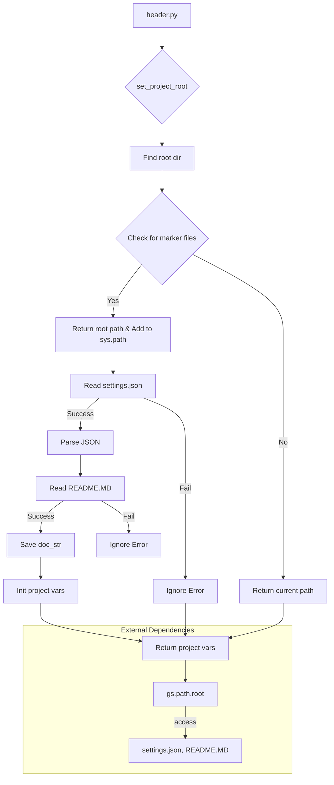

# <input code>

```python
## \file hypotez/src/suppliers/amazon/header.py
# -*- coding: utf-8 -*-\
#! venv/Scripts/python.exe
#! venv/bin/python/python3.12

"""
.. module: src.suppliers.amazon 
	:platform: Windows, Unix
	:synopsis:

"""
MODE = 'dev'


import sys
import json
from packaging.version import Version

from pathlib import Path
def set_project_root(marker_files=('pyproject.toml', 'requirements.txt', '.git')) -> Path:
    """
    Finds the root directory of the project starting from the current file's directory,
    searching upwards and stopping at the first directory containing any of the marker files.

    Args:
        marker_files (tuple): Filenames or directory names to identify the project root.
    
    Returns:
        Path: Path to the root directory if found, otherwise the directory where the script is located.
    """
    __root__:Path
    current_path:Path = Path(__file__).resolve().parent
    __root__ = current_path
    for parent in [current_path] + list(current_path.parents):
        if any((parent / marker).exists() for marker in marker_files):
            __root__ = parent
            break
    if __root__ not in sys.path:
        sys.path.insert(0, str(__root__))
    return __root__


# Get the root directory of the project
__root__ = set_project_root()
"""__root__ (Path): Path to the root directory of the project"""

from src import gs

settings:dict = None
try:
    with open(gs.path.root / 'src' / 'settings.json', 'r') as settings_file:
        settings = json.load(settings_file)
except (FileNotFoundError, json.JSONDecodeError):
    ...

doc_str:str = None
try:
    with open(gs.path.root / 'src' / 'README.MD', 'r') as settings_file:
        doc_str = settings_file.read()
except (FileNotFoundError, json.JSONDecodeError):
    ...


__project_name__ = settings.get("project_name", 'hypotez') if settings  else 'hypotez'
__version__: str = settings.get("version", '')  if settings  else ''
__doc__: str = doc_str if doc_str else ''
__details__: str = ''
__author__: str = settings.get("author", '')  if settings else ''
__copyright__: str = settings.get("copyrihgnt", '')  if settings else ''
__cofee__: str = settings.get("cofee", "Treat the developer to a cup of coffee for boosting enthusiasm in development: https://boosty.to/hypo69")  if settings else "Treat the developer to a cup of coffee for boosting enthusiasm in development: https://boosty.to/hypo69"
```

# <algorithm>

**Шаг 1:**  Функция `set_project_root` ищет корень проекта.
- Начинает с текущей директории файла.
- Идет вверх по иерархии директорий.
- Проверяет существование файлов/папок (`pyproject.toml`, `requirements.txt`, `.git`).
- Если найдено, возвращает путь.
- Если не найдено, возвращает путь к текущей директории.

**Шаг 2:** Добавление пути к `sys.path`.


**Шаг 3:** Открытие `settings.json` и чтение настроек проекта.
- Если файл не найден, ошибка игнорируется.


**Шаг 4:** Открытие `README.MD` и чтение документации.
- Если файл не найден, ошибка игнорируется.


**Шаг 5:** Инициализация переменных проекта (`__project_name__`, `__version__`, `__doc__`, `__details__`, `__author__`, `__copyright__`, `__cofee__`).
- Использует значения из `settings` или значения по умолчанию.


**Пример:**

Если файл `header.py` находится в `hypotez/src/suppliers/amazon`, функция `set_project_root` будет искать `pyproject.toml`, `requirements.txt`, `.git` вверх по дереву директорий. Если один из этих файлов/папок найдено в `hypotez`, то функция возвращает путь к `hypotez`, добавляет его к `sys.path` и возвращает его.

# <mermaid>



**Объяснение диаграммы:**

`header.py` вызывает `set_project_root`, которая находит корень проекта. Затем эта информация используется для получения `settings.json` и `README.MD` через `gs.path.root`.


# <explanation>

**Импорты:**

- `sys`: Предоставляет доступ к системным переменным, в том числе `sys.path`, что важно для импорта модулей из разных директорий.
- `json`: Для работы с файлами JSON, содержащими настройки проекта.
- `packaging.version`: Для работы с версиями пакетов.
- `pathlib`: Для работы с путями к файлам.

Все импорты связаны с пакетами Python, которые предоставляют базовые возможности для работы с файлами, пакетами и переменными окружения.


**Классы:**

Нет классов в этом коде.


**Функции:**

- `set_project_root(marker_files)`: Находит корень проекта, начиная с текущего файла.  Возвращает `Path` к корневой директории.
	- Аргумент `marker_files`: Кортеж, содержащий имена файлов, используемые для идентификации корня проекта (например, `pyproject.toml`).  Важно для корректной работы при изменениях директорий проекта.


**Переменные:**

- `MODE`: Строковая переменная, содержащая режим работы (например, `'dev'`).
- `__root__`: `Path` объект, содержащий путь к корню проекта, полученный из `set_project_root`.
- `settings`: Словарь, содержащий настройки проекта, загруженные из `settings.json`.
- `doc_str`: Строка, содержащая контент `README.MD`, если он существует.
- `__project_name__`, `__version__`, `__doc__`, `__details__`, `__author__`, `__copyright__`, `__cofee__`: Строковые переменные, содержащие метаданные проекта, полученные из `settings` или значения по умолчанию.

**Возможные ошибки и улучшения:**

- **Обработка ошибок:** Код содержит обработку ошибок (`try...except`) для `FileNotFoundError` и `json.JSONDecodeError`.  Это важно, так как не все проекты имеют `settings.json` или `README.MD`.


- **Зависимость от `gs`:**  Использование `gs` не объяснено. Требуется понимать, как реализован класс `gs.path`. Это ключевой элемент, определяет, как код находит пути к файлам проекта.

- **`__root__`:** Переменная `__root__` используется для добавления пути к корню проекта в `sys.path`. Это важно для корректной работы, но лучше использовать более явную переменную и описывать смысл её значения в комментариях.


**Взаимосвязи с другими частями проекта:**

- `gs`:  Указывается зависимость от модуля `gs`, который отвечает за поиск корневой директории. Необходимо изучить реализацию класса `gs.path` и его взаимодействие с кодом проекта для полного понимания.

- Возможно, этот модуль (`hypotez/src/suppliers/amazon/header.py`) используется для инициализации или запуска других частей проекта.  Понимание роли этого файла в общей архитектуре проекта важно для его оценки.