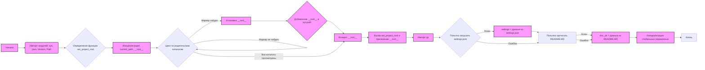

## <алгоритм>

1.  **Начало:**
    *   Устанавливается `MODE = 'dev'`.
    *   Импортируются модули `sys`, `json`, `Version` из `packaging.version`, и `Path` из `pathlib`.

2.  **Определение функции `set_project_root`:**
    *   Функция `set_project_root` принимает кортеж `marker_files` (по умолчанию `('pyproject.toml', 'requirements.txt', '.git')`) для поиска корневого каталога проекта.
    *   Инициализирует `__root__` как `Path` и `current_path` как родительский каталог текущего файла.
    *   Проходит по текущему каталогу и его родительским каталогам.
    *   Проверяет наличие любого файла-маркера в текущем родительском каталоге. Если маркер найден, устанавливает `__root__` и выходит из цикла.
    *   Добавляет `__root__` в `sys.path`, если он там еще не присутствует.
    *   Возвращает `__root__` (путь к корневому каталогу проекта).

    *Пример:* Если скрипт находится в `/home/user/project/src/suppliers/amazon/header.py`, и файл `pyproject.toml` находится в `/home/user/project`, то `__root__` станет `/home/user/project`.
    
3.  **Вызов `set_project_root`:**
    *   Вызывает функцию `set_project_root` для определения корневого каталога проекта.
    *   Результат сохраняется в переменной `__root__`.
  
4. **Импорт `gs`:**
    *   Импортируется модуль `gs` из пакета `src`.
    
5.  **Загрузка `settings.json`:**
    *   Пытается открыть и загрузить `settings.json` из `gs.path.root / 'src' / 'settings.json'`.
    *   Если файл не найден или содержит ошибку JSON, `settings` устанавливается в `None`.

    *Пример:* Если `__root__` это `/home/user/project`, то будет предпринята попытка прочитать `/home/user/project/src/settings.json`.
  
6. **Загрузка `README.MD`:**
    * Пытается открыть и прочитать `README.MD` из `gs.path.root / 'src' / 'README.MD'`.
    * Если файл не найден или возникает ошибка при чтении, `doc_str` устанавливается в `None`.

    *Пример:* Если `__root__` это `/home/user/project`, то будет предпринята попытка прочитать `/home/user/project/src/README.MD`.

7.  **Инициализация глобальных переменных:**
    *   `__project_name__` извлекается из `settings`, если `settings` доступен, или устанавливается в `hypotez` по умолчанию.
    *   `__version__` извлекается из `settings`, если `settings` доступен, или устанавливается в пустую строку по умолчанию.
    *   `__doc__` устанавливается в `doc_str`, если `doc_str` доступен, или в пустую строку по умолчанию.
    *   `__details__` инициализируется пустой строкой.
    *   `__author__` извлекается из `settings`, если `settings` доступен, или устанавливается в пустую строку по умолчанию.
    *   `__copyright__` извлекается из `settings`, если `settings` доступен, или устанавливается в пустую строку по умолчанию.
    *   `__cofee__` извлекается из `settings`, если `settings` доступен, или устанавливается в строку с предложением угостить разработчика кофе по умолчанию.

## <mermaid>

**Объяснение зависимостей:**

*   `sys`: Модуль `sys` используется для взаимодействия с интерпретатором Python, в частности для модификации `sys.path`, чтобы добавить путь к корневой директории проекта и обеспечить возможность импорта модулей из проекта.
*   `json`: Модуль `json` используется для загрузки данных из файла `settings.json`.
*   `packaging.version.Version`:  Используется для работы с версиями, но в данном коде он не используется напрямую, а импортируется для возможного использования в будущем.
*   `pathlib.Path`: Модуль `pathlib` используется для работы с путями к файлам и каталогам, позволяя работать с ними как с объектами.
*   `src.gs`: Модуль `gs` импортируется из пакета `src`, предположительно, для доступа к переменным или функциям, связанным с глобальными настройками проекта, включая доступ к корневому пути проекта через `gs.path.root`.

## <объяснение>

**Импорты:**

*   `sys`: Предоставляет доступ к некоторым переменным и функциям, взаимодействующим с интерпретатором Python. Здесь используется для добавления корневой директории проекта в `sys.path`, что позволяет импортировать модули из других частей проекта.
*   `json`: Используется для работы с данными в формате JSON, в частности для загрузки файла `settings.json`.
*   `packaging.version`: Содержит класс `Version`, предназначенный для работы с версиями программного обеспечения. Однако в данном коде этот класс не используется, что может свидетельствовать о его будущем применении.
*   `pathlib`: Предоставляет класс `Path` для более удобной работы с файловыми путями. Это позволяет создавать, проверять и манипулировать путями к файлам и директориям.

**Функция `set_project_root`:**

*   **Аргументы:** Принимает `marker_files` (кортеж строк) для идентификации корневого каталога проекта. По умолчанию `('pyproject.toml', 'requirements.txt', '.git')`.
*   **Возвращаемое значение:** Возвращает объект `Path`, представляющий путь к корневому каталогу проекта. Если корневой каталог не найден, возвращается путь к каталогу, где находится скрипт.
*   **Назначение:** Определяет корневой каталог проекта, начиная с каталога, где находится текущий файл, поднимаясь вверх по иерархии каталогов, пока не найдет маркерный файл (или директорию). Затем добавляет этот каталог в `sys.path`, что обеспечивает импорт модулей из любой части проекта.
*   **Пример:** Если скрипт находится в `/home/user/project/src/suppliers/amazon/header.py`, и файл `pyproject.toml` находится в `/home/user/project`, то функция вернёт `/home/user/project`.

**Переменные:**

*   `MODE`: Строковая переменная, установленная в `'dev'`, предположительно, указывает на режим работы скрипта (разработка).
*   `__root__`: Объект `Path`, хранящий путь к корневому каталогу проекта, полученный из `set_project_root`.
*  `settings`: Словарь, содержащий настройки, загруженные из `settings.json`. Если файл не найден или не может быть прочитан, то `settings` будет `None`.
*  `doc_str`: Строка, содержащая текст из файла `README.MD`. Если файл не найден или не может быть прочитан, то `doc_str` будет `None`.
*   `__project_name__`: Строка, представляющая имя проекта, извлеченное из `settings`, или `hypotez` по умолчанию.
*   `__version__`: Строка, представляющая версию проекта, извлеченную из `settings`, или пустая строка по умолчанию.
*   `__doc__`: Строка, содержащая описание проекта, взятое из `README.MD`, или пустая строка по умолчанию.
*   `__details__`: Строка, которая в данный момент пуста и, возможно, предназначена для хранения более подробной информации о проекте.
*   `__author__`: Строка, представляющая автора проекта, извлеченная из `settings`, или пустая строка по умолчанию.
*   `__copyright__`: Строка, представляющая авторские права проекта, извлеченная из `settings`, или пустая строка по умолчанию.
*   `__cofee__`: Строка, представляющая сообщение о том, как можно поддержать разработчиков, извлеченная из `settings`, или строка по умолчанию.

**Потенциальные ошибки и области для улучшения:**

*   **Обработка ошибок:**
    *   Код использует пустой блок `...` для обработки исключений `FileNotFoundError` и `json.JSONDecodeError`, что затрудняет отладку. Следует использовать логирование или другие способы информирования об ошибках.
    *   Попытка открыть `README.MD` также не имеет логирования.
*   **Использование `packaging.version`:**
    *   Импорт `Version` из `packaging.version` не используется напрямую. Стоит или использовать, или удалить его.
*   **Неиспользуемые переменные:**
    *   `__details__` инициализируется пустой строкой и никак не используется, стоит  использовать или удалить.
*   **Конфигурация:**
     *   Зависимость от `settings.json` и `README.MD` в папке `src` делает код менее гибким. Возможно, стоит предусмотреть возможность их переопределения.
*   **Именование:**
    *   Переменные с двойным подчеркиванием могут наводить на мысль о магических переменных. Возможно, стоит пересмотреть их именование для лучшей читаемости.

**Взаимосвязь с другими частями проекта:**

*   Код полагается на наличие `settings.json` и `README.MD` в каталоге `src`.
*   Использует модуль `gs` из `src`, предполагая наличие `gs.path.root`.
*   Корневой каталог проекта, найденный `set_project_root`, используется для добавления в `sys.path`, что обеспечивает импорт других частей проекта.

В целом, код выполняет важную функцию инициализации проекта, определения корневого каталога и загрузки основных настроек. Однако, его можно улучшить с точки зрения обработки ошибок, читаемости и гибкости.