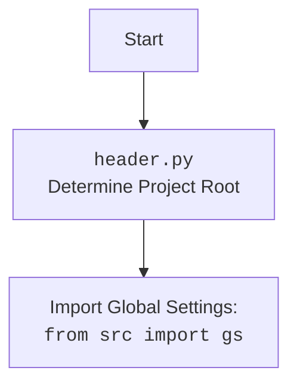

## Анализ кода `hypotez/src/suppliers/amazon/header.py`

### 1. **<алгоритм>**

**Блок-схема:**

```mermaid
graph TD
    A[Начало: `header.py`] --> B{Определение корня проекта};
    B --> C{Установка корня проекта: `set_project_root()`};
    C --> D[Определение текущего пути файла];
    D --> E{Перебор родительских каталогов};
    E -- "найден маркерный файл" --> F[Установить корень проекта];
    E -- "не найден маркерный файл" --> G[Корень проекта = путь файла];
    F --> H[Добавить корень проекта в sys.path];
    G --> H;
    H --> I[Возвратить корень проекта];
    I --> J{Чтение settings.json};
    J -- "успешно" --> K[Загрузка настроек];
    J -- "ошибка" --> L[Игнорировать ошибку];
    K --> M{Чтение README.MD};
    M -- "успешно" --> N[Загрузка README];
    M -- "ошибка" --> O[Игнорировать ошибку];
    N --> P[Задать глобальные переменные];
     O --> P;
    L --> P;
    P --> Q[Конец: `header.py`];
```

**Примеры:**

*   **Блок C:** `set_project_root()` вызывается без аргументов, что означает поиск маркеров по умолчанию (`__root__`).
*   **Блок D:** Если текущий путь файла `hypotez/src/suppliers/amazon/header.py`, то текущий путь будет `hypotez/src/suppliers/amazon/`.
*   **Блок E:** Итерация по родительским директориям: `hypotez/src/suppliers/amazon/`, `hypotez/src/suppliers/`, `hypotez/src/`, `hypotez/`.
*   **Блок F:** Предположим, маркерный файл `__root__` найден в `hypotez/`, тогда корневой путь будет `hypotez/`.
*    **Блок H:**  Если `hypotez/` отсутствует в `sys.path`, то он будет добавлен в начало списка.
*   **Блок J:** Если `settings.json` существует в `hypotez/src`, его содержимое загружается в переменную `settings`.
*    **Блок M:** Если `README.MD` существует в `hypotez/src`, его содержимое загружается в переменную `doc_str`.
*   **Блок P:** Глобальные переменные, такие как `__project_name__` и `__version__`, устанавливаются на основе `settings` или по умолчанию.

### 2. **<mermaid>**

```mermaid
flowchart TD
    Start[Начало: `header.py`] --> SetProjectRootFunctionCall[Вызов функции <br> `set_project_root()`];
     SetProjectRootFunctionCall --> DetermineCurrentPath[Определение текущего пути файла];
     DetermineCurrentPath --> LoopThroughParents[Цикл по родительским каталогам];
    LoopThroughParents -- "Найден маркер" --> SetRootPath[Установка корня проекта];
     LoopThroughParents -- "Маркер не найден" --> SetRootPathToCurrent[Корень проекта = текущий каталог];
       SetRootPath --> AddRootToSysPath[Добавление корня проекта в <br> `sys.path`];
       SetRootPathToCurrent -->AddRootToSysPath;
    AddRootToSysPath --> LoadSettings[Загрузка `settings.json`];
    LoadSettings -- "Успешно" --> LoadReadme[Загрузка `README.md`];
    LoadSettings -- "Ошибка" --> IgnoreSettingsError[Игнорирование ошибки];
   LoadReadme -- "Успешно" --> SetGlobalVariables[Установка глобальных переменных];
    LoadReadme -- "Ошибка" --> IgnoreReadmeError[Игнорирование ошибки];
  IgnoreSettingsError -->  SetGlobalVariables;
    IgnoreReadmeError --> SetGlobalVariables;

    SetGlobalVariables --> End[Конец: `header.py`];
    
```

**Объяснение зависимостей `mermaid`:**

*   **`Start`**: Начало выполнения скрипта `header.py`.
*   **`SetProjectRootFunctionCall`**: Вызов функции `set_project_root()`, которая определяет корень проекта.
*    **`DetermineCurrentPath`**: Определение текущего пути файла.
*   **`LoopThroughParents`**: Цикл по родительским каталогам для поиска маркера.
*    **`SetRootPath`**: Установка корня проекта, если маркерный файл найден.
*    **`SetRootPathToCurrent`**: Установка корня проекта как текущий каталог, если маркерный файл не найден.
*   **`AddRootToSysPath`**: Добавление пути к корню проекта в `sys.path`.
*   **`LoadSettings`**: Попытка загрузить `settings.json`.
*   **`LoadReadme`**: Попытка загрузить `README.md`.
*   **`IgnoreSettingsError`**: Игнорирование ошибки при загрузке `settings.json`.
*    **`IgnoreReadmeError`**: Игнорирование ошибки при загрузке `README.md`.
*   **`SetGlobalVariables`**: Установка глобальных переменных на основе загруженных данных или значений по умолчанию.
*   **`End`**: Конец выполнения скрипта `header.py`.

**Дополнительный `mermaid` flowchart для `header.py`**


### 3. **<объяснение>**

**Импорты:**

*   **`import sys`**: Используется для доступа к переменным и функциям, связанным с интерпретатором Python, в частности, для добавления пути к корню проекта в `sys.path`.
*   **`import json`**: Используется для работы с файлами JSON, в частности, для загрузки настроек из `settings.json`.
*   **`from packaging.version import Version`**: Импортирует класс `Version` из библиотеки `packaging` для работы с версиями, хотя в коде напрямую не используется.
*   **`from pathlib import Path`**: Используется для работы с путями файловой системы.
*    **`from src import gs`**: Импортирует модуль `gs` из пакета `src`, что, вероятно, предоставляет доступ к глобальным настройкам проекта.

**Функции:**

*   **`set_project_root(marker_files: tuple = ('__root__')) -> Path`**:
    *   **Аргументы**:
        *   `marker_files`: Кортеж строк, содержащий имена файлов или директорий, используемых для идентификации корня проекта (по умолчанию `('__root__')`).
    *   **Возвращаемое значение**:
        *   `Path`: Объект `pathlib.Path`, представляющий путь к корневой директории проекта.
    *   **Назначение**:
        *   Находит корень проекта, начиная с текущей директории файла, двигаясь вверх по дереву директорий, пока не найдет файл-маркер из `marker_files`.
        *   Добавляет найденный путь в начало `sys.path`, чтобы обеспечить правильную работу импортов.
        *   Если корень проекта не найден, то возвращает путь к текущей директории.
    *   **Пример:**
        ```python
        root_path = set_project_root(marker_files=("__root__", ".git"))
        print(root_path) # /path/to/hypotez
        ```

**Переменные:**

*   `__root__` (`Path`): Путь к корневой директории проекта, устанавливается путем вызова функции `set_project_root()`.
*   `settings` (`dict`): Словарь, содержащий настройки проекта, загруженные из файла `settings.json`. Инициализируется как `None`, а потом пытаются загрузить настройки
*   `doc_str` (`str`): Строка, содержащая содержимое файла `README.MD`. Инициализируется как `None`, а потом пытаются загрузить readme
*   `__project_name__` (`str`): Название проекта, берется из `settings`, по умолчанию 'hypotez'.
*   `__version__` (`str`): Версия проекта, берется из `settings`, по умолчанию ''.
*  `__doc__` (`str`):  Содержание  `README.MD` или ''.
*  `__details__` (`str`):  Описание проекта,  всегда ''
*   `__author__` (`str`): Автор проекта, берется из `settings`, по умолчанию ''.
*   `__copyright__` (`str`): Информация о копирайте, берется из `settings`, по умолчанию ''.
*   `__cofee__` (`str`): Сообщение для пожертвований, берется из `settings`, по умолчанию "Treat the developer to a cup of coffee for boosting enthusiasm in development: https://boosty.to/hypo69".

**Цепочка взаимосвязей:**

1.  `header.py` определяет корень проекта и добавляет его в `sys.path`, обеспечивая корректную работу импортов внутри проекта.
2.  Он загружает настройки из `settings.json`, что может влиять на поведение других частей проекта.
3.  Глобальные переменные, определенные в `header.py`,  используются  других модулях проекта.
4.   `header.py`  использует модуль `gs`  из пакета `src`.

**Потенциальные ошибки и области для улучшения:**

*   **Обработка ошибок:** Код использует `try...except` для обработки ошибок загрузки `settings.json` и `README.MD`, но просто игнорирует их. Возможно, стоит добавить логирование ошибок или использовать значения по умолчанию для более надежной работы.
*   **Жестко заданные пути:** Пути к `settings.json` и `README.MD` жестко заданы и требуют, чтобы файлы находились в директории `src`. Это может ограничить гибкость проекта.
*   **Зависимость от `__root__`:**  Все другие модули пакета  `suppliers`, неявно зависят от того, что  `__root__`  будет правильно  инициализирован и добавлен в  `sys.path`
*  **Версия пакета** - в коде не используется, но импортируется

**В заключение:**

Файл `header.py` выполняет важную функцию: он определяет корень проекта, загружает настройки, и обеспечивает корректную работу импортов. Он также задает глобальные переменные проекта,  которые используются другими модулями. Однако, есть некоторые области, которые можно улучшить для повышения надежности и гибкости.