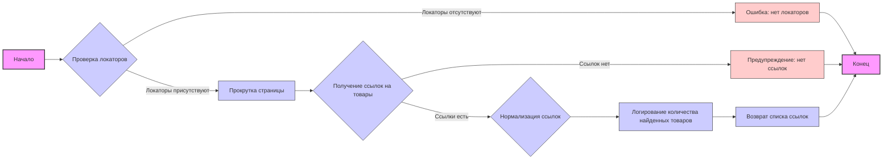
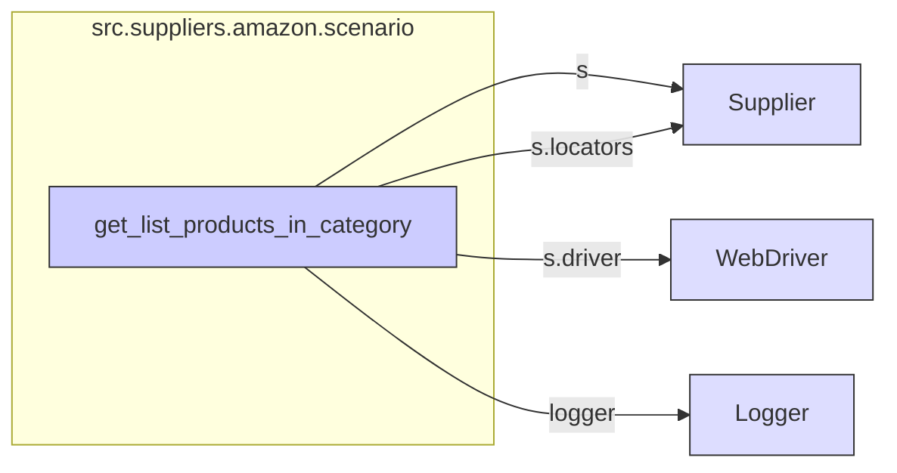

## Анализ кода `hypotez/src/suppliers/amazon/scenario.py`

### 1. <алгоритм>

**Блок-схема:**


**Примеры:**
*   **Начало:** Функция `get_list_products_in_category` вызывается для объекта `Supplier`.
*   **Проверка локаторов:** Если `s.locators['category']` возвращает пустой словарь, то происходит переход к блоку "Ошибка: нет локаторов". Иначе, происходит переход к блоку "Прокрутка страницы".
*   **Прокрутка страницы:** Вызывается метод `d.scroll()` для прокрутки страницы.
*   **Получение ссылок на товары:** Вызывается метод `d.execute_locator(l['product_links'])` для получения списка ссылок на товары. Если список пуст, то происходит переход к блоку "Предупреждение: нет ссылок".
*   **Нормализация ссылок:** Если `list_products_in_category` - строка, то её преобразуют в список из одного элемента.
*   **Логирование количества найденных товаров:** Выводится информационное сообщение с количеством найденных ссылок.
*   **Возврат списка ссылок:** Функция возвращает список найденных ссылок.
*   **Конец:** Завершение работы функции.

### 2. <mermaid>



**Описание зависимостей `mermaid`:**
   - `get_list_products_in_category` зависит от:
      -  `Supplier` для доступа к драйверу (`s.driver`) и локаторам (`s.locators`).
      -  `WebDriver` для выполнения действий на странице (прокрутка, поиск элементов).
      -  `Logger` для логирования событий и ошибок.
    
### 3. <объяснение>

**Импорты:**

*   `typing.Union`: Используется для указания, что переменная может иметь несколько типов. В данном коде не используется, но импортируется.
*   `pathlib.Path`: Используется для работы с путями к файлам и директориям. В данном коде не используется, но импортируется.
*   `src.gs`: Импортируется, вероятно, для доступа к глобальным настройкам или утилитам. Использование в коде не наблюдается, но упоминается в docstring. 
*   `src.logger.logger`: Модуль для логирования событий, используется для записи ошибок, предупреждений и информации о работе программы.

**Переменные:**
*   `MODE`: Строковая константа, установлена в значение `dev` (вероятно, для режима разработки).

**Функции:**

*   `get_list_products_in_category(s) -> list[str,str,None]`:
    *   **Аргументы:**
        *   `s`: Экземпляр класса `Supplier`, содержащий информацию о поставщике, включая веб-драйвер и локаторы.
    *   **Возвращаемое значение:**
        *   Список URL-адресов товаров (`list[str]`), найденных на странице категории, или `None`, если ссылки не найдены или возникла ошибка.
    *   **Назначение:**
        *   Собирает ссылки на товары со страницы категории поставщика.
        *   Проверяет наличие локаторов, прокручивает страницу, выполняет поиск элементов по локаторам и возвращает список URL-адресов товаров.
    *   **Пример:**
        ```python
        supplier = Supplier(driver=webdriver.Chrome(), locators={'category': {'product_links': 'xpath://div[@class="product"]/a'}})
        product_urls = get_list_products_in_category(supplier)
        if product_urls:
            for url in product_urls:
                print(url)
        else:
            print("Не удалось получить список товаров")

        ```

**Классы:**
    *   Класс `Supplier` не показан в данном коде, но из контекста понятно, что он содержит атрибуты `driver` (веб-драйвер) и `locators` (словарь с локаторами).

**Объяснение работы кода:**

Функция `get_list_products_in_category` принимает экземпляр класса `Supplier` в качестве аргумента.
1. **Проверка локаторов:**
   - Проверяет, есть ли локаторы для категории. Если их нет, логирует ошибку и возвращает `None`.
2. **Прокрутка страницы:**
   - Использует метод `scroll()` объекта веб-драйвера для прокрутки страницы.
3. **Получение ссылок на товары:**
    - Извлекает ссылки на товары, используя локатор `product_links`.
    - Если ссылки не найдены, логирует предупреждение и возвращает `None`.
4. **Нормализация списка:**
   - Если `list_products_in_category` строка, преобразует её в список, содержащий эту строку.
5. **Логирование количества товаров:**
   - Логирует количество найденных ссылок.
6. **Возврат списка ссылок:**
   - Возвращает список ссылок.

**Потенциальные ошибки и области для улучшения:**
*   **Отсутствие листалки:** В коде указан комментарий `TODO: Нет листалки`, что означает, что не реализована логика перелистывания страниц категорий. Это может привести к тому, что будут собраны не все товары.
*   **Отсутствие проверок на наличие товара в базе:** Закомментированный код, который проверяет наличие товара в базе данных, необходимо реализовать.
*   **Обработка ошибок:** Код можно улучшить, добавив более подробную обработку исключений.
*   **Комментарии:** В коде много лишних комментариев.

**Взаимосвязи с другими частями проекта:**
*   Этот модуль взаимодействует с модулем `src.logger.logger` для логирования.
*   Модуль, вероятно, является частью системы сбора данных с веб-сайтов поставщиков. Он взаимодействует с другими модулями для обработки данных, полученных с сайтов.
*   Функция `get_list_products_in_category` является частью сценария для конкретного поставщика (Amazon). Она используется совместно с другими функциями для обработки данных, полученных с сайтов.
*   В коде упоминается класс `PrestaShopProduct`. Вероятно, этот класс является частью другого модуля, предназначенного для работы с базой данных PrestaShop.