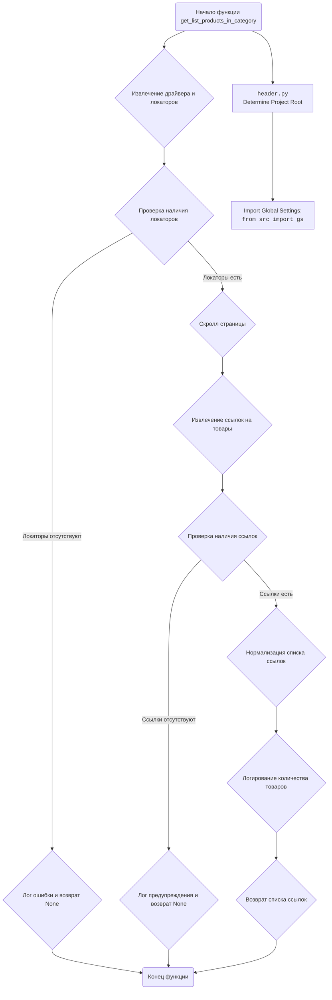

## ИНСТРУКЦИЯ:

Анализируй предоставленный код подробно и объясни его функциональность. Ответ должен включать три раздела:  

1. **<алгоритм>**: Опиши рабочий процесс в виде пошаговой блок-схемы, включая примеры для каждого логического блока, и проиллюстрируй поток данных между функциями, классами или методами.  
2. **<mermaid>**: Напиши код для диаграммы в формате `mermaid`, проанализируй и объясни все зависимости, 
    которые импортируются при создании диаграммы. 
    **ВАЖНО!** Убедитесь, что все имена переменных, используемые в диаграмме `mermaid`, 
    имеют осмысленные и описательные имена. Имена переменных вроде `A`, `B`, `C`, и т.д., не допускаются!  
    
    **Дополнительно**: Если в коде есть импорт `import header`, добавьте блок `mermaid` flowchart, объясняющий `header.py`:\
    ```mermaid
    flowchart TD
        Start --> Header[<code>header.py</code><br> Determine Project Root]
    
        Header --> import[Import Global Settings: <br><code>from src import gs</code>] 
    ```

3. **<объяснение>**: Предоставьте подробные объяснения:  
   - **Импорты**: Их назначение и взаимосвязь с другими пакетами `src.`.  
   - **Классы**: Их роль, атрибуты, методы и взаимодействие с другими компонентами проекта.  
   - **Функции**: Их аргументы, возвращаемые значения, назначение и примеры.  
   - **Переменные**: Их типы и использование.  
   - Выделите потенциальные ошибки или области для улучшения.  

Дополнительно, постройте цепочку взаимосвязей с другими частями проекта (если применимо).  

Это обеспечивает всесторонний и структурированный анализ кода.
## Формат ответа: `.md` (markdown)
**КОНЕЦ ИНСТРУКЦИИ**
```
## <алгоритм>

**Функция `get_list_products_in_category(s)`**

1.  **Начало**: Функция принимает объект `s` (предположительно, экземпляр класса `Supplier`) в качестве аргумента.
    *   Пример: `s` может быть объектом, представляющим поставщика "Amazon" с атрибутами, такими как `driver` (веб-драйвер) и `locators` (словарь локаторов элементов на странице).
2.  **Извлечение драйвера и локаторов**: Из объекта `s` извлекаются веб-драйвер (`s.driver`, присваивается переменной `d`) и локаторы элементов для категории (`s.locators['category']`, присваивается переменной `l`).
    *   Пример: `d` - объект webdriver, с помощью которого браузер будет взаимодействовать с сайтом. `l` - словарь, содержащий локаторы для элементов на странице (например, `{'product_links': "xpath://div[contains(@class,'product')]//a"}`).
3.  **Проверка наличия локаторов**: Проверяется, если `l` пустой. Если это так, записывается сообщение об ошибке в лог и функция завершается, возвращая `None`.
    *   Пример: Если `s.locators['category']` пустой словарь, то выводится ошибка `logger.error(f"А где локаторы? {l}")`, и функция вернёт `None`.
4.  **Скролл страницы**:  Выполняется скролл страницы с помощью `d.scroll()`.
    *   Пример: Веб-драйвер скроллит страницу вниз, чтобы подгрузить больше элементов, если это необходимо.
5.  **Извлечение ссылок на товары**: Используя локатор `l['product_links']`, извлекаются ссылки на товары с помощью `d.execute_locator()` и результат сохраняется в `list_products_in_category`.
    *   Пример:  Если `l['product_links']` это `'//div[@class="products"]/a'`,  `d.execute_locator()` вернет список всех ссылок `<a href="...">` соответствующих данному xpath.
6.  **Проверка наличия ссылок**: Проверяется, если `list_products_in_category` пустой. Если это так, записывается предупреждение в лог и функция завершается, возвращая `None`.
    *   Пример: Если на странице нет элементов, удовлетворяющих локатору `l['product_links']`, то выводится предупреждение `logger.warning('Нет ссылок на товары')` и функция вернет `None`.
7.  **Нормализация списка ссылок**: Если `list_products_in_category` является строкой (одиночная ссылка), преобразуется в список, чтобы обеспечить единообразие.
    *   Пример: Если `list_products_in_category` изначально был равен строке `'https://example.com/product1'`, он будет преобразован в список `['https://example.com/product1']`.
8.  **Логирование количества найденных товаров**: Записывается информационное сообщение в лог с указанием количества найденных ссылок на товары.
    *   Пример: `logger.info(f" Найдено {len(list_products_in_category)} товаров ")`.
9.  **Возврат списка ссылок**: Функция возвращает список ссылок на товары (`list_products_in_category`).
    *   Пример: Функция может вернуть `['https://example.com/product1', 'https://example.com/product2', ...]`.

## <mermaid>



## <объяснение>

**Импорты:**

*   `from typing import Union`: Импортируется `Union` для указания типа, который может принимать несколько различных типов.
*   `from pathlib import Path`: Импортируется `Path` для работы с путями файлов. Этот импорт не используется в предоставленном коде, но, вероятно, используется в других частях проекта.
*   `from src import gs`: Импортируется `gs` из пакета `src`. `gs`, вероятно, содержит глобальные настройки и параметры для всего проекта.
*   `from src.logger.logger import logger`: Импортируется объект `logger` из модуля `logger` пакета `src.logger`. Используется для ведения журнала событий, ошибок и предупреждений.

**Функции:**

*   `get_list_products_in_category(s) -> list[str,str,None]`:
    *   **Аргументы**:
        *   `s`: Объект поставщика (вероятно, экземпляр класса `Supplier`), содержащий атрибуты `driver` (веб-драйвер) и `locators` (словарь локаторов).
    *   **Возвращаемое значение**:
        *   `list[str,str,None]`: Список строк, представляющих URL-адреса товаров, или `None`, если не удалось получить список.
    *   **Назначение**:
        *   Извлекает список URL-адресов товаров со страницы категории поставщика.
        *   Использует веб-драйвер для взаимодействия с веб-страницей и извлечения данных.
        *   Выполняет прокрутку страницы для загрузки всех товаров.
        *   Проверяет наличие локаторов и ссылок на товары, логируя соответствующие сообщения.

**Переменные:**

*   `d`:  Веб-драйвер (`s.driver`). Используется для управления браузером.
*   `l`: Словарь локаторов (`s.locators['category']`). Определяет, как находить элементы на веб-странице.
*   `list_products_in_category`: Список, содержащий строки (URL-адреса товаров), или строка, если найден всего один товар. Этот список возвращается функцией.

**Объяснения:**

*   **Логика работы**: Функция `get_list_products_in_category` является частью системы, которая собирает данные о товарах с веб-сайтов поставщиков. Функция принимает объект поставщика, извлекает веб-драйвер и локаторы, необходимые для взаимодействия с веб-страницей, и возвращает список URL-адресов товаров, найденных на странице категории.
*  **`header.py`**: `header.py` - это скрипт, который определяет корень проекта, подключает глобальные переменные и настройки.
*   **Использование `logger`**: Логгер используется для записи информации о процессе выполнения функции, что полезно для отладки и мониторинга.
*   **Обработка ошибок**: Функция проверяет наличие локаторов и ссылок на товары, что делает ее более надежной и устойчивой к ошибкам. В случае отсутствия локаторов или ссылок, записывается сообщение в лог и функция возвращает `None`.
*   **Нормализация данных**: Функция преобразует строку URL в список, чтобы обеспечить единообразие формата данных.
*   **Взаимодействие с другими частями проекта**: Функция, вероятно, используется в связке с другими модулями для обработки списка полученных URL, перехода на страницы товаров и сбора информации о товарах (например, `grab_product_page()`, упомянутый в docstring).
*   **Потенциальные ошибки и области для улучшения**:
    *   Отсутствует логика пагинации (пролистывания страниц категорий, если товаров много).
    *   Проверка наличия товаров в базе данных закомментирована.
    *   Логика проверки товара в базе данных не полная и требует реализации.
    *  Не хватает проверки на тип данных, возвращаемый методом `d.execute_locator()`.
    *   Отсутствуют  проверки на существование ключа `category` в словаре `s.locators`.

**Цепочка взаимосвязей с другими частями проекта:**

1.  **Вызов `get_list_products_in_category`**: Функция вызывается из другого модуля (например, `scenario.py`) для сбора URL-ов товаров.
2.  **Использование веб-драйвера**: Функция использует веб-драйвер для взаимодействия с веб-страницей, что подразумевает использование других модулей, отвечающих за настройку и управление веб-драйвером.
3.  **Обработка URL**: Возвращенный список URL-ов товаров передается в другие модули, которые занимаются сбором информации со страниц товаров (например, модуль, содержащий функцию `grab_product_page()`).
4.  **Взаимодействие с БД**: Предполагается взаимодействие с базой данных для проверки наличия товаров (это закомментированный код, который нужно доработать).
5.  **Логирование**: Информация о выполнении функции логируется, что может использоваться для мониторинга и анализа работы системы.
6.  **Глобальные настройки `gs`**: Функция использует глобальные настройки, импортированные из `src.gs`, что подразумевает зависимость от этого модуля.