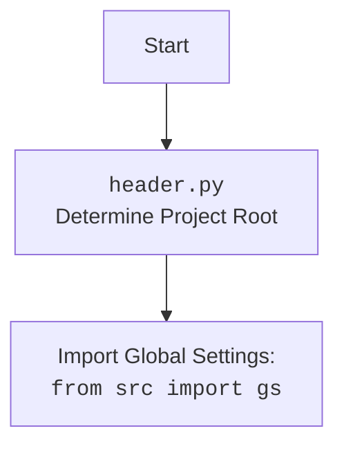

## АНАЛИЗ КОДА

### <алгоритм>

1.  **Начало**: Функция `get_list_products_in_category(s)` принимает объект поставщика `s` в качестве аргумента. Этот объект содержит информацию о поставщике, включая веб-драйвер и локаторы элементов на веб-странице.
    *   _Пример_: `s` - экземпляр класса `Supplier` с настроенными драйвером и локаторами для Amazon.

2.  **Инициализация**:
    *   Из объекта поставщика `s` извлекаются веб-драйвер `d` (например, Chrome WebDriver) и локаторы `l` для категории.
    *   _Пример_: `d` - веб-драйвер, готовый к взаимодействию с веб-страницей; `l` - словарь, содержащий локаторы для элементов (например, `l['product_links']` - CSS-селектор ссылок на товары).
    *   Проверяется наличие локаторов, если их нет, то выводится ошибка в лог и функция завершается.

3.  **Скроллинг**: Выполняется прокрутка страницы веб-драйвером `d`, для загрузки всех динамически подгружаемых элементов.

    *   _Пример_: Веб-страница прокручивается вниз, чтобы загрузить все товары.
    *   **TODO**: Добавить проверку на динамическую прогрузку товаров.

4.  **Извлечение ссылок на товары**:  Используя метод `execute_locator`  веб-драйвера, извлекаются все ссылки на товары, соответствующие локатору `l['product_links']`.

    *   _Пример_: `d.execute_locator(l['product_links'])` - возвращает список строк, содержащих URL-адреса товаров, или строку с одним URL-адресом, если найден один товар.

5.  **Проверка полученных ссылок**:
    *   Если список ссылок на товары пуст, то выводится предупреждение в лог и функция завершается.

6.  **Преобразование списка ссылок**:
    *   Если результат `execute_locator` — это одна строка, она преобразуется в список, содержащий эту строку. Если результат уже является списком, то никаких действий не происходит.

    *   _Пример_: Если найдена только одна ссылка на товар, например `'https://www.amazon.com/product1'`, то она преобразуется в список `['https://www.amazon.com/product1']`. Если найдено несколько ссылок, например `['https://www.amazon.com/product1', 'https://www.amazon.com/product2']`, то список остается без изменений.

7.  **Лог**: Выводится сообщение в лог о количестве найденных товаров.

8.  **Возврат**: Возвращается список ссылок на товары.

### <mermaid>

```mermaid
flowchart TD
    Start[Начало: get_list_products_in_category(s)] --> Init[Инициализация: d, l = s.driver, s.locators['category']];
    Init --> CheckLocators{Проверка: l is not None?};
    CheckLocators -- No --> ErrorLog[Лог ошибки: "А где локаторы?"];
    ErrorLog --> End[Конец: return None];
    CheckLocators -- Yes --> Scroll[Прокрутка страницы: d.scroll()];
    Scroll --> ExtractLinks[Извлечение ссылок: list_products_in_category = d.execute_locator(l['product_links'])];
    ExtractLinks --> CheckLinks{Проверка: list_products_in_category is not None?};
    CheckLinks -- No --> WarningLog[Лог предупреждения: "Нет ссылок на товары"];
    WarningLog --> End;
    CheckLinks -- Yes --> TransformLinks{Преобразование списка: list_products_in_category = [list_products_in_category] if isinstance(list_products_in_category, str) else list_products_in_category};
     TransformLinks --> LogInfo[Лог: Найдено {len(list_products_in_category)} товаров];
    LogInfo --> ReturnLinks[Возврат: list_products_in_category];
    ReturnLinks --> End
```



### <объяснение>

*   **Импорты:**
    *   `from typing import Union`: Импортируется `Union` из модуля `typing` для определения типов, которые могут принимать переменные, например `Union[str, None]`.
    *   `from pathlib import Path`: Импортируется `Path` из модуля `pathlib` для работы с путями файлов в операционной системе.
    *   `from src import gs`: Импортируется модуль глобальных настроек `gs` из директории `src`. Этот модуль, скорее всего, содержит общие настройки и конфигурации для всего проекта.
    *   `from src.logger.logger import logger`: Импортируется объект `logger` из модуля `src.logger.logger`. Этот объект используется для логирования событий и ошибок в приложении.

*   **Функции:**
    *   `get_list_products_in_category(s) -> list[str, str, None]`
        *   **Аргументы:**
            *   `s`: Объект поставщика (экземпляр класса `Supplier`), содержащий необходимые данные, такие как веб-драйвер и локаторы.
        *   **Возвращаемое значение:**
            *   `list[str, str, None]`: Список строк, представляющих собой URL-адреса товаров, или `None`, если список товаров не найден.
        *   **Назначение:**
            *   Извлекает список URL-адресов товаров со страницы категории.
        *   **Примеры:**
            *   `get_list_products_in_category(amazon_supplier)`: возвращает список URL-адресов товаров с категории Amazon.
            *   `get_list_products_in_category(aliexpress_supplier)`: возвращает список URL-адресов товаров с категории AliExpress.
        *   **Логика:**
            1.  Получает веб-драйвер и локаторы из объекта поставщика `s`.
            2.  Проверяет наличие локаторов, если их нет, выводит ошибку и возвращает `None`.
            3.  Выполняет прокрутку страницы для загрузки всех элементов.
            4.  Использует локаторы для извлечения всех ссылок на товары.
            5.  Проверяет, были ли найдены ссылки. Если нет, выводит предупреждение в лог и возвращает `None`.
            6.  Если найдена только одна ссылка, преобразует ее в список.
            7.  Выводит сообщение в лог о количестве найденных товаров.
            8.  Возвращает список URL-адресов товаров.

*   **Переменные:**
    *   `s`: Объект поставщика, передаваемый в функцию. Содержит информацию о поставщике, веб-драйвер, локаторы.
    *   `d`: Веб-драйвер, полученный из объекта поставщика. Используется для взаимодействия с веб-страницей.
    *   `l`: Локаторы элементов на странице, полученные из объекта поставщика.
    *   `list_products_in_category`: Список URL-адресов товаров, полученный с веб-страницы.

*   **Потенциальные ошибки и области для улучшения:**
    *   **Отсутствует пагинация**: В коде не реализована логика для работы со страницами, если товаров больше, чем отображается на одной странице.
    *   **Отсутствует проверка на наличие товара в базе данных**: Закомментированный код подразумевает проверку наличия товара в базе данных, но он не используется.
    *   **Нет обработки ошибок**: Не хватает обработки исключений при работе с веб-драйвером и локаторами.
    *   **Жестко заданные локаторы**: Локаторы заданы в объекте поставщика, но не обрабатываются возможные изменения структуры сайта поставщика, что может привести к ошибкам.
    *   **TODO комментарии**: Присутствуют комментарии с TODO, которые указывают на недоработки.

*   **Взаимосвязи с другими частями проекта:**
    *   Функция `get_list_products_in_category` является частью модуля `src.suppliers.amazon`, который, в свою очередь, является частью общего проекта по сбору данных о товарах.
    *   Функция зависит от глобальных настроек `gs` (например, для определения путей файлов или доступа к БД).
    *   Логирование выполняется через `src.logger.logger`, что позволяет отслеживать выполнение программы.
    *   Функция использует веб-драйвер, который, вероятно, настраивается в другом модуле проекта.
    *   Функция возвращает список URL-адресов, которые, вероятно, используются в других модулях для сбора информации о товарах.