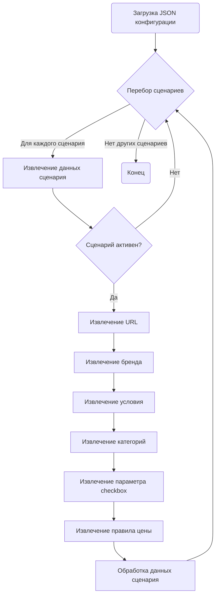

## АНАЛИЗ JSON КОНФИГУРАЦИИ

### 1. <алгоритм>

Данный JSON файл представляет собой конфигурацию для сценариев сбора данных (вероятно, парсинга) с сайта Amazon.  Каждый сценарий (`REF DELL DESKTOP INTEL I5`, `REF DELL DESKTOP INTEL I7`) описывает определенные критерии поиска и параметры для обработки. 

**Блок-схема:**

```mermaid
flowchart TD
    Start[Начало] --> LoadConfig[Загрузка JSON файла]
    LoadConfig --> LoopScenarios[Перебор сценариев]
    LoopScenarios -- "Для каждого сценария" --> ExtractData[Извлечение данных сценария]
    ExtractData --> CheckActive{Активен?}
    CheckActive -- "Да" --> ExtractURL[Извлечение URL]
    ExtractURL --> ExtractBrand[Извлечение бренда]
     ExtractBrand --> ExtractCondition[Извлечение условия (condition)]
    ExtractCondition --> ExtractCategories[Извлечение категорий (presta_categories)]
    ExtractCategories --> ExtractCheckbox[Извлечение checkbox]
    ExtractCheckbox --> ExtractPriceRule[Извлечение правила цены (price_rule)]
    ExtractPriceRule --> ProcessData[Обработка данных]
    ProcessData --> NextScenario[Следующий сценарий]
    CheckActive -- "Нет" --> NextScenario
    NextScenario -- "Есть еще сценарии?" --> LoopScenarios
    LoopScenarios -- "Нет сценариев" --> End[Конец]
```

**Примеры:**

* **Начало**: Загружается JSON файл `amazon_categories_desktops_dell_ref.json`.
* **Перебор сценариев**: Начинается итерация по ключам "REF DELL DESKTOP INTEL I5" и "REF DELL DESKTOP INTEL I7" в объекте `scenarios`.
* **Извлечение данных сценария**:  Для "REF DELL DESKTOP INTEL I5":
    * `brand`: "DELL"
    * `url`: "https://www.amazon.com/s?i=computers&bbn=565098&rh=n%3A172282%2Cn%3A541966%2Cn%3A13896617011%2Cn%3A565098%2Cp_n_is_free_shipping%3A10236242011%2Cp_89%3ADell%7Cdell%2Cp_n_condition-type%3A16907720011%2Cp_n_feature_four_browse-bin%3A2289793011&dc&qid=1674227826&rnid=676578011&ref=sr_nr_p_n_feature_four_browse-bin_1&ds=v1%3AGHb6ggzdg4a79qBrHf0QqFtS9KCyTTvDn6S94VyrUQU"
    * `active`: true
    * `condition`: "ref"
    * `presta_categories`:  `{"template": { "dell": "DESKTOPS INTEL I5" }}`
    * `checkbox`: false
    * `price_rule`: 1
* **Проверка активности**: Сценарий активен (`active: true`).
* **Обработка данных**: Извлеченные данные используются для дальнейшей обработки (например, парсинга страниц Amazon и категоризации товаров).
* **Следующий сценарий**: Переход к "REF DELL DESKTOP INTEL I7" и повторение процесса.
* **Конец**: После обработки всех сценариев процесс завершается.

### 2. <mermaid>



**Объяснение зависимостей в `mermaid`:**

Диаграмма показывает поток управления при обработке конфигурационного файла. 

1.  **Загрузка JSON конфигурации:** Начальный этап, где данные из файла загружаются в память.
2.  **Перебор сценариев:** Цикл, который итерирует по всем сценариям, определенным в JSON.
3.  **Извлечение данных сценария:** Из каждого сценария извлекаются все параметры.
4.  **Сценарий активен?:** Проверка, активен ли сценарий. Если нет, то сценарий пропускается.
5.  **Извлечение URL, бренда, условия, категорий, параметра checkbox, правила цены**: Извлечение соответствующих полей данных из сценария.
6.  **Обработка данных сценария**: Выполнение действий на основе извлеченных данных.
7.  **Конец:** Конец процесса обработки.

### 3. <объяснение>

**Общая структура:**
Файл представляет собой JSON-объект, содержащий объект `scenarios`, внутри которого каждый ключ является уникальным идентификатором сценария (например, `"REF DELL DESKTOP INTEL I5"`). Каждый сценарий представляет собой JSON-объект с набором параметров:

**Параметры сценария:**

*   **`brand` (String)**: Название бренда товара, в данном случае `"DELL"`. Используется для фильтрации результатов поиска.
*   **`url` (String)**: URL-адрес страницы поиска на Amazon, с которой будут собираться данные. Включает в себя параметры фильтрации по бренду, условию (condition) и другим параметрам.
*   **`active` (Boolean)**:  Флаг, указывающий, активен ли данный сценарий. Если `true`, то сценарий должен быть обработан.
*   **`condition` (String)**: Условие товара, в данном случае `"ref"`, что означает "восстановленный".
*   **`presta_categories` (Object)**: Объект, описывающий сопоставление категорий для системы PrestaShop, в данном случае категория "DESKTOPS INTEL I5" .
*  **`checkbox` (Boolean)**: Флаг, используемый для какого-то параметра (название требует уточнения).
*   **`price_rule` (Integer)**: Целое число, представляющее правило ценообразования (требуется уточнение).

**Функциональность:**
Файл используется для настройки автоматизированных процессов сбора данных о товарах с Amazon. Каждый сценарий определяет параметры поиска и фильтрации, которые будут использоваться для сбора информации о конкретных категориях товаров.  Это позволяет автоматизировать процесс мониторинга цен, наличия товаров, а также для последующей публикации на платформе PrestaShop.

**Потенциальные области для улучшения:**

*   **Обработка ошибок**: Отсутствует явная обработка ошибок. Например, если URL некорректен или Amazon изменил структуру страницы, то парсинг может сломаться.
*   **Описание параметров**:  `checkbox` и `price_rule` не имеют очевидного назначения. Необходимо добавить более четкое описание их функциональности и допустимых значений.
*   **Расширяемость**:  Структура `presta_categories` выглядит простой, но может потребовать расширения в будущем, если понадобится более сложное сопоставление категорий.
*   **Динамическая конфигурация**:  Хранение конфигурации в JSON-файле позволяет легко редактировать настройки, но может быть полезна возможность загружать конфигурацию из базы данных.
*   **Описание формата URL**: Необходимо формализовать формат URL, чтобы понимать, как именно Amazon обрабатывает запросы.
*   **Логирование**:  Необходимо добавить логирование, чтобы отслеживать выполнение процесса и находить ошибки.

**Взаимосвязь с другими частями проекта:**

Данный файл является частью системы сбора и обработки данных. Взаимодействие с другими частями проекта будет следующим:

1.  **Парсер:**  Программа, которая считывает данный JSON файл, анализирует URL-адреса и собирает данные со страниц Amazon.
2.  **Система управления PrestaShop:**  Собранные данные о товарах и их категориях используются для импорта в PrestaShop.
3. **Система фильтрации и формирования запросов:** Файл является настройкой, которая определяет, какие товары парсить и как их фильтровать.

Таким образом, этот JSON-файл является ключевым элементом системы, предоставляющим гибкую настройку для сбора данных с Amazon и их интеграции с PrestaShop.