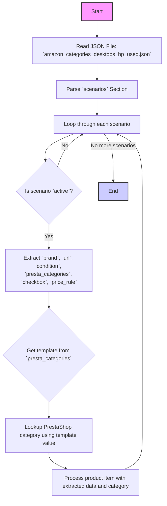

## АНАЛИЗ JSON КОДА

### <алгоритм>
1. **Начало:** Исходный код представляет собой JSON-объект, содержащий структуру данных о сценариях парсинга товаров с Amazon.
2. **Раздел "scenarios":** Внутри JSON есть раздел "scenarios", который содержит в себе два сценария:
    -   `"USED HP DESKTOP INTEL I5"`: описывает сценарий для использованных настольных компьютеров HP с процессором Intel i5.
    -   `"USED HP DESKTOP AMD RYZEN 5"`: описывает сценарий для использованных настольных компьютеров HP с процессором AMD Ryzen 5.
3. **Структура каждого сценария:** Каждый сценарий представлен объектом с ключами:
    -   `brand`: (пример: `"HP"`) -  строка, представляющая бренд товара.
    -   `url`: (пример: `"https://www.amazon.com/s?...&ds=v1%3A3opKFvNsBrAlTma48Fhm9Z15nWOKHypDzbdHeg0IvUI"`) - строка, URL для поиска товаров на Amazon, с параметрами фильтрации по условиям поиска.
    -   `active`: (пример: `true`) - логическое значение, указывающее, активен ли сценарий.
    -    `condition`: (пример: `"new"`) - строка, указывающая условие для товаров.
    -   `presta_categories`: (пример: `{"template": {"hp": "DESKTOPS INTEL I3"}}`) -  объект, содержащий информацию о соответствии категорий PrestaShop. Вложенный `template`  содержит пары `ключ:значение`, где ключ `hp`  указывает на тип шаблона, а значение `"DESKTOPS INTEL I3"` - категория в PrestaShop.
    -   `checkbox`: (пример: `false`) - логическое значение, указывающее на использование чекбокса.
    -   `price_rule`: (пример: `1`) - целое число, представляющее правило ценообразования.
4.  **Обработка сценариев:** Программа должна читать этот JSON файл. При парсинге каждого сценария программа:
    -   Считывает `url` для парсинга товаров.
    -   Проверяет значение `active` и в случае `true` продолжает обработку.
    -   Берет из  `presta_categories` нужный `template` и его значение (например: `"DESKTOPS INTEL I3"`) для определения категории в PrestaShop.
    -   Использует `brand`, `condition` и `price_rule` для дальнейшей обработки или сохранения информации о товаре.
    -   Значение  `checkbox` может влиять на UI, либо использоваться для дальнейшей логики программы.

### <mermaid>

### <объяснение>

**Импорты:**
- В данном коде нет импортов. Код представляет собой JSON файл, который используется для конфигурации.

**Структура JSON:**
- JSON-файл предназначен для хранения данных о сценариях парсинга товаров на Amazon. Эти сценарии описывают, как программа должна искать и обрабатывать товары определенного типа (например, использованные настольные компьютеры HP).
-   **`scenarios`**: Это корневой объект, который содержит в себе различные сценарии.
-   **`USED HP DESKTOP INTEL I5`**, **`USED HP DESKTOP AMD RYZEN 5`**: Это названия конкретных сценариев, где каждый ключ представляет собой уникальное имя сценария.
-   **`brand`**: Строка, представляющая бренд товара (например, "HP").
-   **`url`**: Строка, содержащая URL-адрес страницы Amazon, с которого будут извлекаться данные о товарах, с параметрами фильтрации.
-   **`active`**: Булево значение, указывающее, активен ли данный сценарий. Если `true`, сценарий будет использоваться.
-   **`condition`**: Строка, указывающая условие для товара (например, "new").
-   **`presta_categories`**: Объект, определяющий соответствие категорий Amazon и PrestaShop. Ключ "template" содержит объект, в котором ключ "hp" соответствует шаблону категории PrestaShop. Значение ключа "hp" определяет категорию PrestaShop.
-   **`checkbox`**: Булево значение, указывающее на использование чекбокса для товара. Может быть использовано для UI.
-   **`price_rule`**: Число, представляющее правило ценообразования.

**Функциональность и назначение:**
-   Файл представляет собой конфигурацию для парсинга товаров с Amazon, позволяя задать различные условия для поиска, бренды, и категории.
-   `url` содержит параметры поиска товаров на Amazon, включая фильтры по условию товара, бренду и процессору.
-   `active` позволяет включать и выключать сценарии без удаления из файла.
-   `presta_categories` позволяет сопоставить категории товаров Amazon с категориями PrestaShop, что важно для автоматического размещения товаров в правильных категориях.
-   `price_rule` может использоваться для автоматической настройки цен на товары при их добавлении в PrestaShop.

**Пример использования:**
- Программа читает этот JSON файл. Для каждого сценария:
    -   Если `active` равен `true`, то программа обрабатывает URL.
    -   Парсит данные по `url` с Amazon.
    -   По `presta_categories`, находит соответствие в PrestaShop.
    -   Настраивает параметры товара, как `brand`, `condition` и ценообразование `price_rule`
-   Такая настройка позволяет гибко управлять процессом парсинга и автоматизировать добавление товаров в PrestaShop.

**Потенциальные ошибки или области для улучшения:**
-   **Отсутствие обработки ошибок:** Не предусмотрена обработка ошибок при чтении и парсинге файла.
-   **Жесткая привязка категорий:** Категории PrestaShop жестко заданы в файле, что может затруднить их изменение. Можно сделать гибче, например вынести в отдельный файл конфигурации.
-   **Зависимость от структуры Amazon:** Парсинг зависит от конкретной структуры страниц Amazon, которая может измениться.
-   **Отсутствие обработки исключений:** Не обрабатываются возможные ошибки при парсинге URL (например, отсутствие товара).
-   **Нет валидации**: Не происходит валидация данных.
-   **Имена переменных**: Имена переменных не соответствуют типам данных. `checkbox` должен быть `bool` (да/нет), а `price_rule` - `integer`.

**Взаимосвязь с другими частями проекта:**
-  Этот файл используется как часть системы парсинга для Amazon.
-  Полученные данные можно использовать для обновления каталога товаров в PrestaShop.
-  `url`  используется для динамического сбора данных.
-  `presta_categories` привязывает данные к категориям PrestaShop.

**Дополнительная цепочка взаимосвязей:**
1. **Чтение JSON:** Программа читает `amazon_categories_desktops_hp_used.json`.
2. **Разбор JSON:** Парсит JSON в объекты Python.
3. **Обработка сценариев:**
  - Для каждого сценария проверяется  `active`.
  - Используется  `url` для получения данных с Amazon.
  - Берется  `presta_categories` для определения категории товара в PrestaShop.
  - Используются `brand`, `condition` и `price_rule` для обработки данных и формирования товарной позиции.
4. **Обновление PrestaShop:** Информация о товаре передается для создания или обновления продукта в PrestaShop.

Таким образом, файл `amazon_categories_desktops_hp_used.json` является частью цепочки, обеспечивающей автоматическое получение данных о товарах и их интеграцию с PrestaShop.