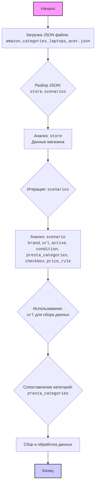

## ИНСТРУКЦИЯ:

Анализируй предоставленный код подробно и объясни его функциональность. Ответ должен включать три раздела:  

1.  **<алгоритм>**: Опиши рабочий процесс в виде пошаговой блок-схемы, включая примеры для каждого логического блока, и проиллюстрируй поток данных между функциями, классами или методами.  
2.  **<mermaid>**: Напиши код для диаграммы в формате `mermaid`, проанализируй и объясни все зависимости, 
    которые импортируются при создании диаграммы. 
    **ВАЖНО!** Убедитесь, что все имена переменных, используемые в диаграмме `mermaid`, 
    имеют осмысленные и описательные имена. Имена переменных вроде `A`, `B`, `C`, и т.д., не допускаются!  
    
    **Дополнительно**: Если в коде есть импорт `import header`, добавьте блок `mermaid` flowchart, объясняющий `header.py`:\
    ```mermaid
    flowchart TD
        Start --> Header[<code>header.py</code><br> Determine Project Root]
    
        Header --> import[Import Global Settings: <br><code>from src import gs</code>] 
    ```

3.  **<объяснение>**: Предоставьте подробные объяснения:  
    - **Импорты**: Их назначение и взаимосвязь с другими пакетами `src.`.  
    - **Классы**: Их роль, атрибуты, методы и взаимодействие с другими компонентами проекта.  
    - **Функции**: Их аргументы, возвращаемые значения, назначение и примеры.  
    - **Переменные**: Их типы и использование.  
    - Выделите потенциальные ошибки или области для улучшения.  

Дополнительно, постройте цепочку взаимосвязей с другими частями проекта (если применимо).  

Это обеспечивает всесторонний и структурированный анализ кода.
## Формат ответа: `.md` (markdown)
**КОНЕЦ ИНСТРУКЦИИ**

## <алгоритм>

1.  **Чтение JSON файла**: Сначала файл JSON, содержащий конфигурацию для сбора данных о ноутбуках Acer на Amazon, загружается.
    *   _Пример_: Загружается файл `amazon_categories_laptops_acer.json`.
2.  **Разбор структуры JSON**: JSON файл разбирается на две основные части: `store` и `scenarios`.
    *   _Пример_: `store` содержит информацию о магазине Amazon, а `scenarios` — о конкретных категориях ноутбуков Acer.
3.  **Анализ `store`**: Секция `store` содержит метаданные магазина, такие как ID, URL, описание.
    *   _Пример_: `store.url` содержит URL для поиска ноутбуков Acer на Amazon.
4.  **Итерация по `scenarios`**:  Происходит итерация по каждому сценарию в секции `scenarios`.
    *   _Пример_: Сценарии включают "LAPTOP ACER INTEL CELERON 11", "LAPTOP ACER INTEL I3 15" и т.д.
5.  **Анализ каждого `scenario`**: Для каждого сценария анализируется его содержимое:
    *   `brand`: Бренд ноутбука.
        *   _Пример_: `brand` всегда "ACER".
    *   `url`: URL для поиска конкретной модели ноутбука на Amazon.
        *   _Пример_: `url` для "LAPTOP ACER INTEL CELERON 11" содержит фильтры для процессора Celeron и размера 11 дюймов.
    *   `active`: Флаг активности сценария.
        *   _Пример_: `active` всегда `true`.
    *   `condition`: Состояние продукта.
        *   _Пример_: `condition` всегда "new".
    *   `presta_categories`: Информация о категориях PrestaShop, куда должны быть отнесены товары.
        *   _Пример_: `presta_categories.template.acer` для "LAPTOP ACER INTEL CELERON 11" равно `[ "LAPTOPS INTEL CELERON", "11" ]`.
    *   `checkbox`: Флаг чекбокса.
         *   _Пример_: `checkbox` всегда `false`.
    *   `price_rule`: Правило цены.
        *   _Пример_: `price_rule` всегда `1`.
6. **Использование данных для сбора**: Информация из каждого сценария используется для формирования запросов и извлечения данных с Amazon.
    * _Пример_: URL'ы из `scenarios` будут использоваться для выполнения HTTP-запросов и последующего извлечения информации о товарах с помощью парсинга.
7.  **Сопоставление категорий**:  Данные из `presta_categories` используются для сопоставления товаров с категориями в PrestaShop.
    *   _Пример_: Товары, найденные по URL "LAPTOP ACER INTEL CELERON 11", будут отнесены к категории "LAPTOPS INTEL CELERON" и подкатегории "11".
8.  **Сбор и обработка данных**: После сбора данных товары будут обработаны (например, цены, описания) и импортированы в PrestaShop.

## <mermaid>



### Объяснение `mermaid` диаграммы:

1.  **Начало (A)**: Начальная точка процесса.
2.  **Загрузка JSON файла (B)**: Загружается JSON файл с конфигурацией.
3.  **Разбор JSON (C)**: JSON файл разбирается на две основные секции: `store` и `scenarios`.
4.  **Анализ `store` (D)**: Анализируется секция `store`, которая содержит общие сведения о магазине.
5.  **Итерация `scenarios` (E)**: Запускается цикл итераций по всем сценариям.
6.  **Анализ `scenario` (F)**: Для каждого сценария анализируются поля: `brand`, `url`, `active`, `condition`, `presta_categories`, `checkbox` и `price_rule`.
7.  **Использование `url` (G)**: URL-адрес из сценария используется для сбора данных с Amazon.
8.  **Сопоставление категорий (H)**:  Данные из `presta_categories` используются для сопоставления товаров с категориями PrestaShop.
9. **Сбор и обработка данных (I)**:  После сбора данные обрабатываются и подготавливаются к импорту.
10. **Конец (J)**: Конечная точка процесса.

## <объяснение>

### Импорты:

В предоставленном коде нет импортов, так как это JSON-файл, который является конфигурационным файлом, а не скриптом. В данном случае,  этот файл будет использоваться внутри других частей проекта (которые могут импортировать модули).

### Классы:
В данном JSON файле не используются классы. Он содержит только структуру данных, которая будет использоваться в классах или функциях в других файлах проекта.

### Функции:
В данном JSON файле не используются функции. Он содержит только структуру данных, которая будет использоваться в функциях в других файлах проекта.

### Переменные:

1.  `store`: Объект (словарь), содержащий общую информацию о магазине.
    *   `store_id`: Идентификатор магазина (строка, может быть пустой).
    *   `supplier_id`: Идентификатор поставщика (строка, может быть пустой).
    *   `get store banners`: Флаг, указывающий, нужно ли получать баннеры магазина (логическое значение, `true`).
    *   `description`: Описание магазина (строка).
    *   `about`: Дополнительная информация о магазине (строка).
    *   `url`: URL-адрес страницы магазина (строка).
    *   `shop categories page`:  URL-адрес страницы с категориями магазина (строка, может быть пустой).
    *   `shop categories json file`: Путь к JSON файлу с категориями (строка, может быть пустой).

2.  `scenarios`: Объект (словарь), содержащий сценарии для сбора данных.
    *   Ключи в этом объекте представляют собой идентификаторы сценариев (строки, например, "LAPTOP ACER INTEL CELERON 11").
    *   Значения являются объектами (словарями), описывающими каждый сценарий:
        *   `brand`: Бренд товара (строка, например, "ACER").
        *   `url`: URL-адрес страницы с товарами определенной категории (строка).
        *   `active`: Флаг, указывающий, активен ли сценарий (логическое значение, `true`).
        *   `condition`: Состояние товара (строка, например, "new").
        *   `presta_categories`: Объект, содержащий информацию о категориях PrestaShop.
             *   `template`: Объект, содержащий сопоставления между брендом и категориями.
                 *   Ключи соответствуют бренду (`"acer"`).
                 *   Значения являются массивами строк, содержащими категории и подкатегории (например, `[ "LAPTOPS INTEL CELERON", "11" ]`).
        *   `checkbox`: Флаг чекбокса (логическое значение, `false`).
        *   `price_rule`: Правило цены (число, `1`).

### Потенциальные ошибки и области для улучшения:

1.  **Пустые значения:** Многие поля в `store` являются пустыми строками. Если они важны для последующей обработки, необходимо убедиться, что они будут заполнены.
2.  **Жестко заданные URL:** Все URL-адреса жестко заданы. Было бы полезно, если бы они могли генерироваться динамически на основе каких-либо параметров.
3.  **Повторяющийся бренд**: Во всех сценариях `brand` всегда "ACER". Это может быть избыточно, если это можно определить из имени сценария или другого места.
4.  **Зависимость от структуры Amazon:** URL-адреса напрямую зависят от структуры Amazon. Любое изменение структуры сайта Amazon может привести к сбоям.
5.  **Отсутствие обработки ошибок:** В файле нет обработки ошибок. Необходимо предусмотреть механизм обработки ошибок при загрузке, парсинге или работе с данными.
6. **Отсутствие валидации**: JSON файл не содержит схем валидации. Это нужно для проверки наличия обязательных полей и их соответствия ожидаемым типам данных.

### Взаимосвязь с другими частями проекта:

Этот файл, вероятно, будет использоваться следующим образом:

1.  **Парсер JSON:** Скрипт на Python загрузит этот файл как JSON-объект и проанализирует его структуру.
2.  **Сборщик данных:** Данные из `scenarios` будут использованы для формирования запросов к Amazon. URL-адреса из поля `url` будут использованы для запроса HTML-контента со страницами товаров.
3.  **Парсер HTML:** HTML-страницы с товарами, загруженные с Amazon, будут проанализированы, и данные о товарах будут извлечены.
4.  **Модуль категорий:** Данные из `presta_categories` будут использованы для отнесения товаров к правильным категориям в PrestaShop.
5.  **Импорт в PrestaShop:** Извлеченные данные о товарах и категориях будут использованы для импорта товаров в PrestaShop.

В целом, этот файл является конфигурационным и определяет, какие данные и как собирать с сайта Amazon. Он является важным элементом в цепочке сбора данных для проекта.