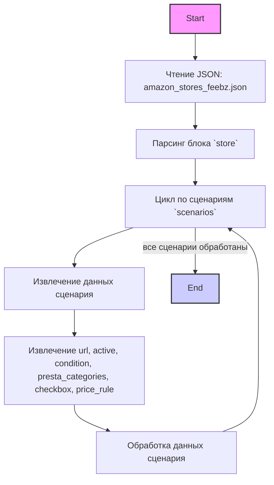

## <алгоритм>

1. **Чтение JSON:**
   - Начинаем с чтения JSON файла `amazon_stores_feebz.json`.
   - JSON парсится и преобразуется в структуру данных (словарь Python).

2.  **Разбор блока `store`:**
   - Извлекается информация о магазине, такая как `store_id`, `supplier_id`, `description`, `about`, `url` и другие метаданные.
   -  `store`  - это словарь, содержащий основные сведения о магазине,  например, его идентификатор, описание и URL.
  
    ```json
    "store": {
        "store_id": "AEDB03CA-8DE9-4437-9DDE-F5BFFAAA3ADC",
        "supplier_id": 4534,
        "get store banners": true,
        "description": "FEEBZ",
        "about": "OCULUS",
        "url": "https://www.amazon.com/-/he/stores/Feebz/page/AEDB03CA-8DE9-4437-9DDE-F5BFFAAA3ADC",
        "shop categories page": "",
        "shop categories json file": ""
        }
    ```

3.  **Итерация по сценариям в `scenarios`:**
    - Проходим в цикле по каждому ключу (например, `"ZenBook"`, `"ROG Gaming"`, и т.д.) в словаре `scenarios`.
    - Каждый ключ представляет собой отдельный сценарий парсинга страниц Amazon.

4.  **Обработка каждого сценария:**
    -   Для каждого сценария извлекается информация:
         - `url`: URL страницы магазина для конкретного сценария.
         -  `active`: Статус активности сценария (true/false).
         -  `condition`:  Состояние товара (например, `"new"`).
         -  `presta_categories`: Словарь, связывающий идентификаторы категорий PrestaShop с их названиями.
         -  `checkbox`: Логическое значение (true/false).
         - `price_rule`: Правило цены.

     ```json
     "ZenBook": {
        "url": "https://www.amazon.com/stores/page/D844B8DB-D9D3-42D4-8FC2-F2DE0800864B?ingress=2&visitId=7527aa1d-ac4c-46e5-8bec-04f6ae5a2068&ref_=ast_bln",
        "active": true,
        "condition":"new",
        "presta_categories": {
          "6484": "ZENBOOK",
           "3198": "CONSUMER ELECTRONICS",
          "3202": "computer, gaming console, devices",
          "3225": "notebooks",
          "6482": "Asus",
          "2258": "ASUS",
          "2287": "Laptops",
          "4167": "Zenbook"
           },
           "checkbox": false,
         "price_rule": 1
        }
     ```

5.  **Использование данных:**
    - Извлеченные данные используются для настройки процесса сбора данных (скрейпинга) с Amazon.
    - Данные передаются в другие функции или классы для дальнейшей обработки (не показано в этом JSON, но подразумевается в логике приложения).

## <mermaid>



**Объяснение диаграммы `mermaid`:**

-   **Start**: Начало процесса.
-   **ReadJson**: Чтение содержимого JSON файла `amazon_stores_feebz.json`.
-   **ParseStore**: Разбор блока `store`, выделение общих данных магазина.
-   **LoopScenarios**:  Начало цикла, проходящего по всем сценариям, определенным в блоке `scenarios`.
-   **Scenario**:  Извлечение данных для конкретного сценария.
-  **ExtractData**: Извлечение конкретных параметров сценария: URL, статус активности, состояние товара, категории,  чекбокс, ценовое правило.
-   **ProcessData**: Обработка данных сценария (логика обработки не описана в этом JSON, но подразумевается в приложении).
-   **LoopScenarios**:  Возврат к началу цикла для обработки следующего сценария.
-   **End**: Завершение процесса после обработки всех сценариев.

## <объяснение>

**Общая структура JSON:**
JSON файл `amazon_stores_feebz.json` представляет собой конфигурацию для сбора данных с магазина Amazon "FEEBZ". Он структурирован в два основных блока: `store` и `scenarios`.

**Блок `store`:**
-  **`store_id`**: Уникальный идентификатор магазина на Amazon.
-  **`supplier_id`**: Идентификатор поставщика в системе.
-  **`get store banners`**: Логическое значение, указывающее, нужно ли загружать баннеры магазина.
-   **`description`**: Краткое описание магазина.
-  **`about`**: Дополнительная информация о магазине.
-   **`url`**: URL-адрес страницы магазина на Amazon.
-  **`shop categories page`**: (пусто) URL-адрес страницы категорий магазина (не используется).
-  **`shop categories json file`**: (пусто) Путь к файлу JSON с категориями (не используется).

**Блок `scenarios`:**
-  Содержит словарь, где каждый ключ – это название сценария (например, `"ZenBook"`, `"ROG Gaming"`, и т.д.).
-  Каждый сценарий содержит следующие поля:
    - **`url`**: URL-адрес страницы Amazon для этого конкретного сценария.
    - **`active`**: Булево значение, определяющее, активен ли сценарий (нужно ли его использовать).
    - **`condition`**: Состояние товара для сценария (обычно "new").
    - **`presta_categories`**: Словарь, связывающий идентификаторы категорий в PrestaShop с названиями категорий.
    - **`checkbox`**: Логическое значение (true/false), предназначение которого не ясно из контекста.
    - **`price_rule`**: Числовое значение, представляющее правило для обработки цен, назначение которого не ясно из контекста.

**Примеры:**

-   Сценарий `"ZenBook"`:
    -   URL: `https://www.amazon.com/stores/page/D844B8DB-D9D3-42D4-8FC2-F2DE0800864B?ingress=2&visitId=7527aa1d-ac4c-46e5-8bec-04f6ae5a2068&ref_=ast_bln`
    -   Активен (`active: true`).
    -   Состояние товара: `new`.
    -   Сопоставление категорий PrestaShop с названиями, например, `6484`: "ZENBOOK".

**Использование:**
Этот JSON файл используется как конфигурация для системы, которая будет собирать данные о товарах с сайта Amazon для магазина FEEBZ. Сценарии позволяют настроить, с каких конкретных страниц магазина нужно собирать информацию и в какие категории PrestaShop её помещать.

**Потенциальные улучшения:**
1. **Определение `checkbox` и `price_rule`**: Необходимо выяснить, для чего используются `checkbox` и `price_rule`, чтобы понять их роль в системе.
2. **Описание назначения категорий:** Внутри `presta_categories` нужно добавить описание, что означают эти категории и как они должны быть сопоставлены с категориями PrestaShop.
3. **Обработка URL**: Возможно, стоит добавить валидацию URL, чтобы убедиться, что они корректны.

**Связь с другими частями проекта:**
- Вероятно, данные из этого JSON файла используются в скриптах, которые обращаются к Amazon и обрабатывают полученную информацию.
- Данные категорий `presta_categories`, могут использоваться для автоматического распределения товаров по нужным категориям в PrestaShop после сбора с Amazon.