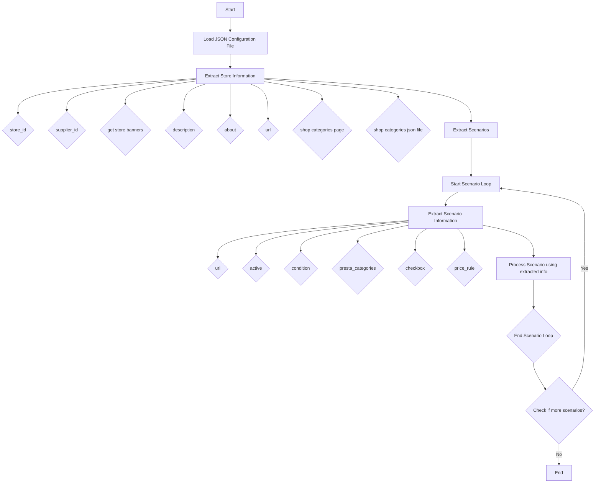

## АНАЛИЗ КОДА

### 1. <алгоритм>

Этот код представляет собой JSON-файл, описывающий настройки для парсинга магазинов Lenovo на Amazon. Он содержит информацию о магазине и наборе сценариев парсинга.

**Блок-схема:**

1.  **Начало**: Загрузка JSON-файла.
2.  **Объект магазина:**
    *   `store_id` (Пример: "2C6395BA-C701-4025-9D7E-BAE1BD647EEE"): Уникальный идентификатор магазина.
    *   `supplier_id` (Пример: 4534): Идентификатор поставщика.
    *   `get store banners` (Пример: `true`): Указывает, нужно ли собирать баннеры магазина.
    *   `description` (Пример: "LENOVO Official store"): Описание магазина.
    *   `about` (Пример: " "): Информация о магазине.
    *   `url` (Пример: `"https://www.amazon.com/-/he/stores/LENOVO/page/2C6395BA-C701-4025-9D7E-BAE1BD647EEE"`): URL-адрес страницы магазина.
    *   `shop categories page` (Пример: ""): URL страницы категорий магазина.
    *   `shop categories json file` (Пример: ""): Путь к JSON-файлу с категориями магазина.
3.  **Объект сценариев:**
    *   Для каждого сценария (например, "ZenBook", "ROG Gaming"):
        *   `url` (Пример: `"https://www.amazon.com/stores/page/D844B8DB-D9D3-42D4-8FC2-F2DE0800864B?ingress=2&visitId=7527aa1d-ac4c-46e5-8bec-04f6ae5a2068&ref_=ast_bln"`): URL-адрес страницы сценария.
        *   `active` (Пример: `true`): Указывает, активен ли сценарий.
        *   `condition` (Пример: `"new"`): Состояние товара.
        *   `presta_categories` (Пример: `{ "6484": "ZENBOOK", "3198": "CONSUMER ELECTRONICS"}`): Соответствие категорий PrestaShop и названия категорий на Amazon.
        *   `checkbox` (Пример: `false`): Флаг для чекбокса.
        *   `price_rule` (Пример: `1`): Правило ценообразования.
4.  **Конец**: JSON-файл готов к использованию для парсинга.

**Поток данных:**

1.  JSON-файл загружается в программу парсинга.
2.  Программа извлекает информацию о магазине (store_id, supplier_id, url и т.д.).
3.  Программа итерируется по сценариям (ZenBook, ROG Gaming и т.д.).
4.  Для каждого сценария программа извлекает url, active, condition, presta_categories и т.д.
5.  Используя эту информацию, программа парсит соответствующие страницы Amazon.
6.  Данные парсинга сохраняются или используются для других целей.

### 2. <mermaid>

**Объяснение зависимостей:**

Диаграмма `mermaid` описывает процесс обработки JSON-конфигурации для парсинга магазина. Она показывает поток управления и данных:

*   **Load JSON Configuration File:** Начальная точка, где загружается JSON-файл.
*   **Extract Store Information:** Извлекает данные о магазине (id, поставщик, URL и т.д.).
*   **Extract Scenarios:** Извлекает данные о сценариях парсинга.
*   **Start Scenario Loop:** Начало цикла обработки сценариев.
*   **Extract Scenario Information:** Извлекает данные о каждом сценарии (url, активность, категории и т.д.).
*   **Process Scenario using extracted info:**  Место где происходит парсинг страниц на основе извлеченных данных.
*   **Check if more scenarios?:** Проверка, есть ли еще сценарии для обработки.
*   **End:** Конечная точка.

Диаграмма отображает последовательность операций, а также наличие цикла для обработки нескольких сценариев. Каждый блок представляет собой логический шаг в процессе парсинга.

### 3. <объяснение>

**Импорты:**

В данном коде импорты не используются, так как это JSON файл, а не код на Python. Он представляет собой структуру данных для конфигурации.

**Классы:**

Здесь нет классов, так как это JSON-файл.

**Функции:**

Здесь нет функций, так как это JSON-файл.

**Переменные:**

*   **store**: Объект, содержащий общую информацию о магазине.
    *   `store_id` (string): Уникальный идентификатор магазина на Amazon.
    *   `supplier_id` (integer): Идентификатор поставщика.
    *   `get store banners` (boolean): Флаг, указывающий, нужно ли собирать баннеры магазина.
    *   `description` (string): Описание магазина.
    *   `about` (string): Дополнительная информация о магазине.
    *   `url` (string): URL-адрес страницы магазина.
    *   `shop categories page` (string): URL-адрес страницы с категориями магазина.
    *   `shop categories json file` (string): Путь к файлу JSON с категориями магазина.
    *   `scenarios` (object): Объект, содержащий сценарии парсинга.
*   **scenarios**: Объект, содержащий различные сценарии парсинга. Ключи этого объекта – это названия сценариев (например, "ZenBook").
    *   `url` (string): URL-адрес страницы сценария.
    *   `active` (boolean): Флаг, указывающий, активен ли сценарий.
    *   `condition` (string): Состояние товара, которое нужно парсить ("new").
    *   `presta_categories` (object): Словарь, содержащий соответствие между идентификаторами категорий PrestaShop и названиями категорий на Amazon.
    *   `checkbox` (boolean):  Флаг для чекбокса.
    *  `price_rule` (integer): Правило ценообразования.

**Потенциальные ошибки и области для улучшения:**

*   **Отсутствие валидации**: Нет валидации данных в JSON-файле. Например, можно добавить проверку типов данных для `store_id`, `supplier_id`, `active` и т.д. для избежания ошибок.
*   **Дублирование кода**: Повторение структуры `presta_categories` в разных сценариях, что может привести к ошибкам при внесении изменений.
*   **Жестко закодированные URL**: URL-адреса магазинов и сценариев жестко прописаны в JSON. Можно сделать более гибкую систему, например, с использованием переменных окружения или конфигурационного файла.
*   **Нет обработки ошибок:** В самой структуре нет обработки ошибок.
*   **Отсутствие документации**: Нет пояснения для некоторых полей, таких как `checkbox` и `price_rule`.
*   **Слабая структура**: Файл JSON является объемным, и его сложно анализировать. Стоит рассмотреть разбивку на несколько файлов.

**Взаимосвязь с другими частями проекта:**

Этот JSON-файл предназначен для использования парсером, написанным на Python. Парсер использует данные из этого JSON-файла для определения, какие страницы Amazon нужно парсить, какие категории товаров извлекать, и в какие категории PrestaShop их добавлять. Файл является частью системы, которая автоматизирует процесс парсинга данных с Amazon для интеграции с PrestaShop.

**Пример использования:**

1.  Загрузка JSON-файла в парсер.
2.  Парсер извлекает `store_id`, `url` и другие настройки магазина.
3.  Парсер проходит по списку сценариев.
4.  Для каждого сценария извлекается `url`, `presta_categories`.
5.  Парсер переходит по `url` сценария, парсит данные о товарах и относит их к категориям PrestaShop, используя `presta_categories`.
6.  Парсер может также собирать баннеры магазина, если `get store banners` установлен в `true`.

Этот анализ дает полное представление о структуре и назначении представленного JSON-кода.