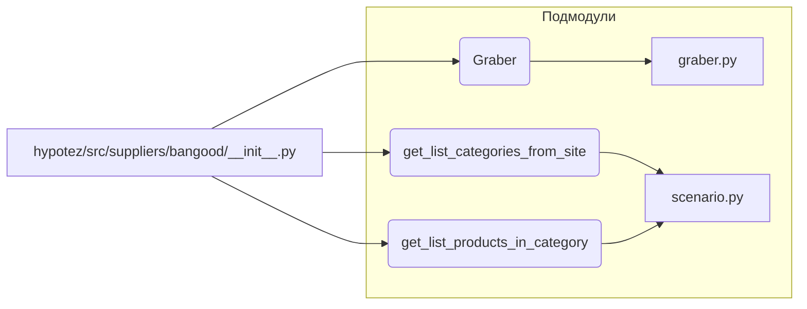

# <input code>

```python
## \file hypotez/src/suppliers/bangood/__init__.py
# -*- coding: utf-8 -*-
#! venv/Scripts/python.exe
#! venv/bin/python/python3.12

"""
.. module: src.suppliers.bangood 
	:platform: Windows, Unix
	:synopsis:

"""
MODE = 'dev'

from .graber import Graber
from .scenario import get_list_categories_from_site, get_list_products_in_category
```

# <algorithm>

Этот код представляет собой модуль инициализации для поставщика Bangood.  Он импортирует необходимые классы и функции из подмодулей `graber` и `scenario`.  Алгоритм состоит из одной стадии: импорта.  В данном случае никакой обработки данных или вычислений не производится.

**Пошаговая блок-схема:**

1. **Импорт:** Модуль `hypotez/src/suppliers/bangood/__init__.py` импортирует классы и функции из подмодулей `graber` и `scenario`.  
    * Пример: При импорте `from .graber import Graber` Python ищет и загружает модуль `graber` из текущего пакета (`hypotez/src/suppliers/bangood`).  Это позволяет использовать класс `Graber` в других частях модуля.

**Пример данных:**

В этом случае нет непосредственного движения данных, но если бы были функции, возвращающие данные, то они передавались бы в качестве аргументов или результатов другим функциям/методам.

# <mermaid>



# <explanation>

**Импорты:**

* `from .graber import Graber`: Импортирует класс `Graber` из модуля `graber`, расположенного в подпапке `.graber` текущего каталога. Это указывает на предполагаемую организацию проекта: в `src.suppliers.bangood` есть отдельный файл `graber.py` (который не виден в данном фрагменте, но предполагается), содержащий определение класса `Graber`. Это позволяет использовать класс `Graber` в этом модуле.
* `from .scenario import get_list_categories_from_site, get_list_products_in_category`: Импортирует функции `get_list_categories_from_site` и `get_list_products_in_category` из модуля `scenario`, также расположенного в подпапке `.scenario` текущего каталога. Предполагается, что `scenario.py` содержит логику для работы с сайтом Bangood, например, для получения списков категорий и продуктов.

**Классы (явные):**

* `Graber`:  Определяется в файле `graber.py` и, судя по названию, отвечает за взаимодействие с API или веб-сайтом Bangood для сбора данных (например, загрузки). В данном файле `__init__.py` он импортируется, но не используется напрямую.

**Функции:**

* `get_list_categories_from_site`: Предполагается, что эта функция из `scenario.py` возвращает список категорий с сайта Bangood.
* `get_list_products_in_category`: Предполагается, что эта функция из `scenario.py` возвращает список продуктов для указанной категории с сайта Bangood.

**Переменные:**

* `MODE = 'dev'`:  Переменная, вероятно, определяет режим работы (например, 'dev' для разработки, 'prod' для производства).  Значение  важно для конфигурации поведения других частей приложения (например, выбор API-ключа, URL или другие настройки).


**Возможные ошибки или улучшения:**

* **Отсутствие документации:** Классы и функции, импортированные в `__init__.py`, не имеют документации в данном файле. Это усложняет понимание их назначения и использования.
* **Недостаточная ясность назначения `MODE`:**  Непонятно, как используется переменная `MODE`. Для улучшения следует добавить комментарий о том, как она влияет на поведение кода.
* **Пустой __init__.py:** Модуль `__init__.py` содержит только импорты и глобальную переменную `MODE`.  Он не содержит никакой обработки данных.


**Взаимосвязи с другими частями проекта:**

Модуль `__init__.py` в `src.suppliers.bangood` служит точкой входа для использования функций и класса поставщика Bangood. Он взаимодействует с файлами `graber.py` и `scenario.py`, которые содержат детали реализаций.  Дальнейшее взаимодействие будет происходить через вызовы функций из `scenario.py`, которые могут возвращать данные для обработки и дальнейшей работы в других частях проекта.