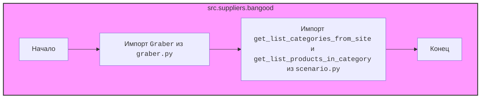

## АНАЛИЗ КОДА: `hypotez/src/suppliers/bangood/__init__.py`

### <алгоритм>

1.  **Импорт модулей:**
    *   Импортируется модуль `Graber` из `src.suppliers.bangood.graber`. Этот модуль, вероятно, содержит класс или функции для сбора данных (парсинга) со страниц Banggood.
    *   Импортируются функции `get_list_categories_from_site` и `get_list_products_in_category` из `src.suppliers.bangood.scenario`. Эти функции, вероятно, отвечают за конкретные сценарии работы: получение списка категорий товаров и получение списка товаров в рамках конкретной категории.

2.  **Пример использования (гипотетический):**

    ```python
    from src.suppliers.bangood import Graber, get_list_categories_from_site, get_list_products_in_category

    # Создание экземпляра граббера (пример, реальная логика в классе Graber)
    # Предполагаем, что Graber имеет метод download_page(), который скачивает страницу по url
    graber_instance = Graber()

    # Получение списка категорий
    categories = get_list_categories_from_site(graber_instance)
    print(f"Список категорий: {categories}")

    # Получение списка товаров в первой категории
    if categories:
         first_category = categories[0]
         products = get_list_products_in_category(graber_instance, first_category)
         print(f"Список товаров в категории {first_category}: {products}")

    ```

### <mermaid>



### <объяснение>

**Импорты:**

*   `from .graber import Graber`:
    *   Импортирует класс `Graber` из модуля `graber.py`, расположенного в том же пакете (`src.suppliers.bangood`).
    *   `Graber`, вероятно, реализует логику сбора (парсинга) данных со страниц сайта Banggood. Он может включать в себя методы для загрузки страниц, извлечения нужных данных и т.д.
    *   **Связь с `src`**: Это часть пакета поставщиков (`suppliers`), и, вероятно,  предназначен для работы с конкретным сайтом поставщика Banggood.
*   `from .scenario import get_list_categories_from_site, get_list_products_in_category`:
    *   Импортирует функции `get_list_categories_from_site` и `get_list_products_in_category` из модуля `scenario.py`, расположенного в том же пакете (`src.suppliers.bangood`).
    *   `get_list_categories_from_site`, скорее всего, получает список категорий товаров, доступных на сайте.
    *   `get_list_products_in_category` получает список товаров в конкретной категории.
    *    **Связь с `src`**: Функции представляют сценарии работы с сайтом Banggood и являются частью пакета `suppliers`.

**Классы:**

*   В текущем файле нет классов, только импорт `Graber` из `graber.py`. Логика класса `Graber` находится в отдельном файле.
    *  **Предполагаемые атрибуты класса `Graber`:**
        *   `session`: Объект сессии для работы с сайтом.
        *   `settings`: Настройки для парсинга.
     * **Предполагаемые методы класса `Graber`:**
        *   `download_page(url)`: Скачивает html страницу.
        *   `parse_data(html_page)`: Парсит html страницу и возвращает нужные данные.

**Функции:**

*   `get_list_categories_from_site(graber_instance)`:
    *   **Аргументы:** Принимает экземпляр класса `Graber`.
    *   **Возвращаемое значение:** Ожидается, что вернет список категорий товаров.
    *   **Назначение:** Запускает сценарий получения списка категорий с сайта Banggood.
*   `get_list_products_in_category(graber_instance, category)`:
    *   **Аргументы:** Принимает экземпляр класса `Graber` и строку, представляющую категорию.
    *   **Возвращаемое значение:** Ожидается, что вернет список товаров в данной категории.
    *   **Назначение:** Запускает сценарий получения списка товаров из заданной категории.

**Переменные:**

*   В текущем файле переменных нет.

**Потенциальные ошибки и области для улучшения:**

*   Код полагается на существование модулей `graber.py` и `scenario.py`, которые не включены в предоставленный код. Без их содержимого сложно полностью оценить функциональность и потенциальные ошибки.
*   Необходимо добавить обработку ошибок, например, сетевых ошибок при скачивании страниц или ошибок при парсинге данных.
*   Хорошей практикой было бы добавить логирование, чтобы отслеживать работу парсера и облегчить отладку.

**Цепочка взаимосвязей:**

1.  `src`: Корневой каталог проекта.
2.  `src.suppliers`: Пакет, содержащий логику для работы с различными поставщиками.
3.  `src.suppliers.bangood`: Пакет, специфичный для работы с сайтом Banggood.
4.  `src.suppliers.bangood.graber`: Модуль, содержащий класс `Graber` для сбора данных.
5.  `src.suppliers.bangood.scenario`: Модуль, содержащий функции для сценариев работы с сайтом Banggood.

**Заключение:**
Данный файл `__init__.py` служит точкой входа для пакета `src.suppliers.bangood`, экспортируя необходимые классы и функции для работы с сайтом Banggood. Он импортирует функциональность парсинга (`Graber`) и сценарии работы (`get_list_categories_from_site` и `get_list_products_in_category`) из других модулей пакета, предоставляя интерфейс для использования в других частях проекта.