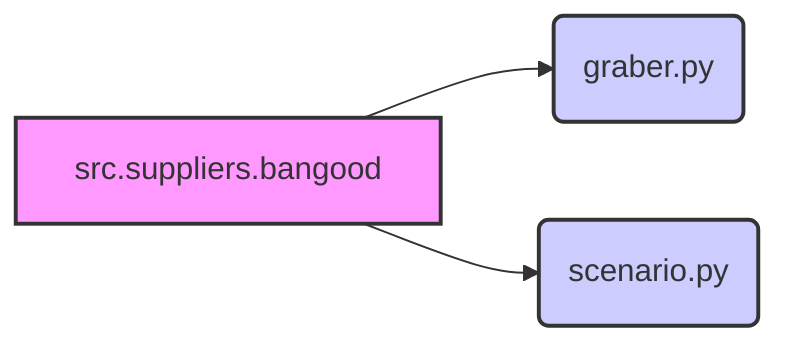

## <алгоритм>

1.  **Импорт модулей**:
    *   Импортируются модули `Graber` и `get_list_categories_from_site`, `get_list_products_in_category` из текущего пакета (`.`).
2.  **Экспорт модулей**:
    *   Модули `Graber`, `get_list_categories_from_site`, `get_list_products_in_category` становятся доступными для импорта в других частях проекта.

## <mermaid>

**Объяснение диаграммы:**

*   `src.suppliers.bangood`: текущий пакет, определенный в `__init__.py`.
*   `graber.py`: модуль, содержащий класс `Graber` для сбора данных.
*   `scenario.py`: модуль, содержащий функции `get_list_categories_from_site` и `get_list_products_in_category` для определения сценариев работы.

## <объяснение>

**Импорты:**

*   `.graber`: Импортирует модуль `graber.py` из текущего пакета (`src.suppliers.bangood`). Этот модуль, вероятно, содержит класс `Graber`, используемый для сбора данных с сайта Banggood.
*   `.scenario`: Импортирует модуль `scenario.py` из текущего пакета. Этот модуль содержит функции `get_list_categories_from_site` и `get_list_products_in_category`, которые, вероятно, используются для определения сценариев работы (например, получение списка категорий и товаров).

**Переменные:**

*   В данном файле переменные отсутствуют. Файл `__init__.py` используется для импорта и экспорта модулей и функций, чтобы сделать их доступными для других частей проекта.

**Потенциальные ошибки и области для улучшения:**

*   Отсутствует документация на уровне файла. Можно добавить краткое описание назначения пакета `src.suppliers.bangood`.
*   Отсутствуют комментарии, объясняющие назначение каждой импортируемой сущности.

**Взаимосвязи с другими частями проекта:**

Данный пакет (`src.suppliers.bangood`) предоставляет функциональность для работы с сайтом Banggood, включая сбор данных и определение сценариев работы. Он может использоваться другими частями проекта, такими как модули для обработки и хранения данных, или модули для автоматизации задач.