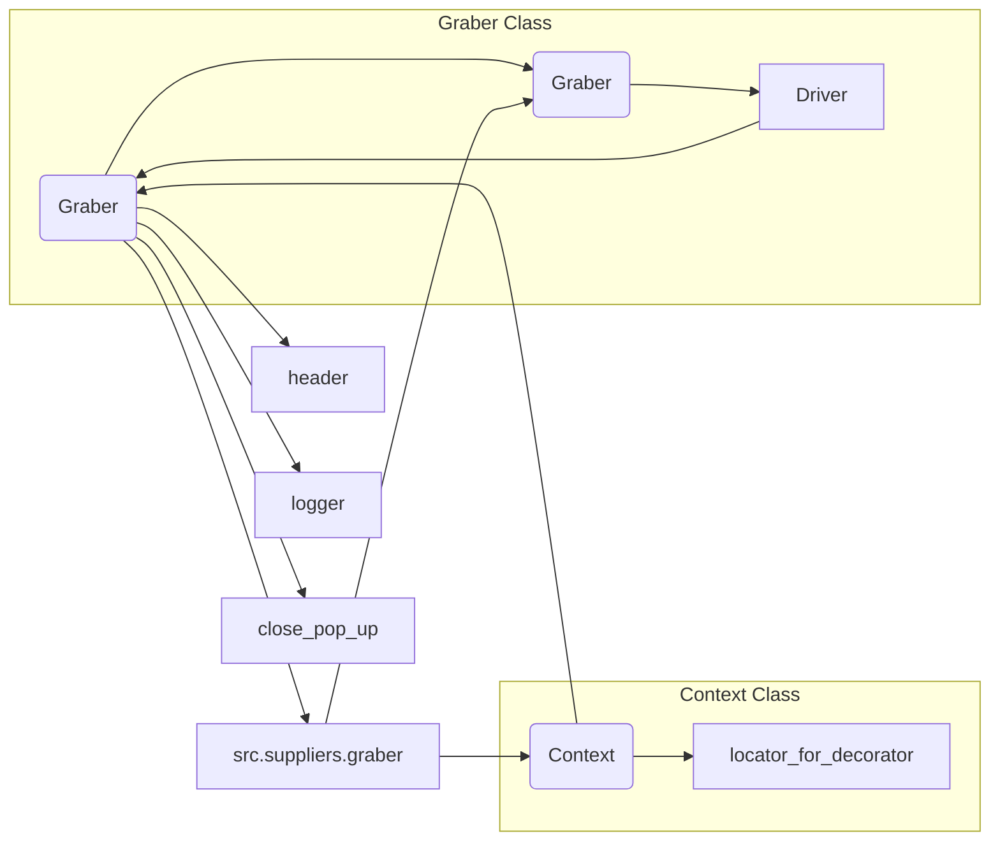

```MD
# <input code>

```python
## \file hypotez/src/suppliers/bangood/graber.py
# -*- coding: utf-8 -*-\
#! venv/Scripts/python.exe
#! venv/bin/python/python3.12

"""
.. module:: src.suppliers.bangood 
	:platform: Windows, Unix
	:synopsis:  Класс собирает значение полей на странице  товара `bangood.com`. 
    Для каждого поля страницы товара сделана функция обработки поля в родительском классе.
    Если нужна нестандертная обработка, функция перегружается в этом классе.
    ------------------
    Перед отправкой запроса к вебдрайверу можно совершить предварительные действия через декоратор. 
    Декоратор по умолчанию находится в родительском классе. Для того, чтобы декоратор сработал надо передать значение 
    в `Context.locator`, Если надо реализовать свой декоратор - раскоментируйте строки с декоратором и переопределите его поведение

"""
MODE = 'dev'

from typing import Any
import header
from src.suppliers.graber import Graber as Grbr, Context, close_pop_up
from src.webdriver.driver import Driver
from src.logger import logger


# # Определение декоратора для закрытия всплывающих окон
# # В каждом отдельном поставщике (`Supplier`) декоратор может использоваться в индивидуальных целях
# # Общее название декоратора `@close_pop_up` можно изменить 


# def close_pop_up(value: Any = None) -> Callable:
#     """Создает декоратор для закрытия всплывающих окон перед выполнением основной логики функции.

#     Args:
#         value (Any): Дополнительное значение для декоратора.

#     Returns:
#         Callable: Декоратор, оборачивающий функцию.
#     """
#     def decorator(func: Callable) -> Callable:
#         @wraps(func)
#         async def wrapper(*args, **kwargs):
#             try:
#                 # await Context.driver.execute_locator(Context.locator.close_pop_up)  # Await async pop-up close  
#                 ... 
#             except ExecuteLocatorException as e:
#                 logger.debug(f'Ошибка выполнения локатора: {e}')
#             return await func(*args, **kwargs)  # Await the main function
#         return wrapper
#     return decorator


class Graber(Grbr):
    """Класс для операций захвата Morlevi."""
    supplier_prefix: str

    def __init__(self, driver: Driver):
        """Инициализация класса сбора полей товара."""
        self.supplier_prefix = 'bangood'
        super().__init__(supplier_prefix=self.supplier_prefix, driver=driver)
        # Устанавливаем глобальные настройки через Context
        
        Context.locator_for_decorator = None # <- если будет уастановлено значение - то оно выполнится в декораторе `@close_pop_up`

```

# <algorithm>

**Блок-схема:**

```mermaid
graph TD
    A[Инициализация Graber(driver)] --> B{Проверка Context.locator_for_decorator};
    B -- True --> C[super().__init__(supplier_prefix, driver)];
    B -- False --> D[Установка self.supplier_prefix = 'bangood'];
    C --> E[Завершение инициализации];
    D --> E;
    E --> F[Возврат экземпляра Graber];

```

**Описание:**

1. **Инициализация Graber(driver):** Принимает экземпляр Driver.
2. **Проверка Context.locator_for_decorator:** Проверяется, установлено ли значение в переменной `Context.locator_for_decorator`.
3. **super().__init__(supplier_prefix, driver):** Вызов конструктора родительского класса, передаются `supplier_prefix` и `driver`.
4. **Установка self.supplier_prefix = 'bangood':** Установка значения атрибута `supplier_prefix`.
5. **Завершение инициализации:** Инициализация завершена.
6. **Возврат экземпляра Graber:**  Возвращается созданный объект `Graber`.

**Пример:**

Пусть `driver` - экземпляр класса `Driver`. Тогда вызов `Graber(driver)` приведет к выполнению вышеописанных шагов и возврату созданного экземпляра класса `Graber`.


# <mermaid>



**Анализ диаграммы и зависимостей:**

* **Graber Class:** Класс `Graber` наследуется от класса `Grbr` из модуля `src.suppliers.graber`.
* **Context Class:** Класс `Context` взаимодействует с классом `Graber`, а также содержит переменную `locator_for_decorator`.
* **Driver Class:** Класс `Driver` используется классом `Graber` для управления веб-драйвером.
* **header module:** Подключаемый модуль `header`, вероятно, содержит необходимые конфигурации или настройки.
* **logger module:** Подключаемый модуль `logger` для ведения журнала.
* **src.suppliers.graber:** Модуль, содержащий родительский класс `Graber`, и возможно, другие полезные классы или функции.


# <explanation>

* **Импорты:**
    * `header`: Вероятно, содержит конфигурационные параметры или вспомогательные функции для модуля.
    * `src.suppliers.graber`: Импортирует класс `Graber` (наследуемый) и, возможно, другие классы и функции для обработки данных о поставщиках.
    * `src.webdriver.driver`: Импортирует класс `Driver`, отвечающий за взаимодействие с веб-драйвером.
    * `src.logger`: Импортирует модуль `logger`, используемый для регистрации сообщений.
* **Классы:**
    * `Graber`: Класс для сбора данных с сайта bangood.com. Наследуется от `Grbr`, расширяя функционал.  Атрибут `supplier_prefix` задает префикс для идентификации поставщика.  `__init__` инициализирует объект.
    * `Grbr` (Родительский): Предположительно, абстрактный класс или класс-базовый для `Graber`, содержащий общие методы и атрибуты для работы с веб-драйвером.
    * `Context`: Глобальный контекст для хранения переменных, таких как `locator_for_decorator`.
    * `Driver`: Класс для взаимодействия с веб-драйвером.
* **Функции:**
    * `close_pop_up` (комментированная):  Декоратор для закрытия всплывающих окон. В текущей реализации закомментирован, но потенциально может использоваться для предварительной обработки перед запросом к веб-драйверу.
* **Переменные:**
    * `supplier_prefix`:  Строковая переменная, хранящая префикс для названия поставщика (bangood в данном случае).
    * `Context.locator_for_decorator`: Переменная в контексте, устанавливаемая в классе Graber.
* **Возможные ошибки или области для улучшений:**
    * Код содержит закомментированный декоратор `close_pop_up`.  Для его активации необходимо раскомментировать соответствующие строки и реализовать логику.
    * Недостаточно информации о классе `Grbr`. Понимание функциональности родительского класса поможет в оценке полноты реализации.
    * Нет описания `Context`, `locator`, и других связанных классов.  Пояснения к `Context.locator_for_decorator` и их использования будут полезны.
    * Отсутствие реализации методов класса `Grbr`.

**Цепочка взаимосвязей:**

`Graber` -> `Grbr` (наследование) -> `Context` (использование глобальных данных) -> `Driver` (для взаимодействия с веб-драйвером) -> Веб-сайт bangood.com.  Модули `header`, `logger` и `src.suppliers.graber` поддерживают и обеспечивают функциональность для работы класса `Graber`.