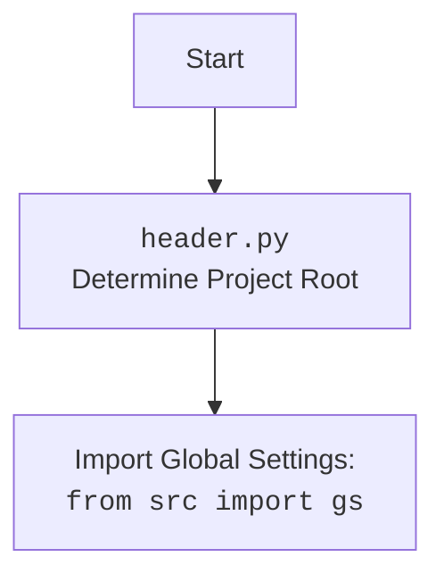

## ИНСТРУКЦИЯ:

Анализируй предоставленный код подробно и объясни его функциональность. Ответ должен включать три раздела:  

1.  **<алгоритм>**: Опиши рабочий процесс в виде пошаговой блок-схемы, включая примеры для каждого логического блока, и проиллюстрируй поток данных между функциями, классами или методами.  
2.  **<mermaid>**: Напиши код для диаграммы в формате `mermaid`, проанализируй и объясни все зависимости,
    которые импортируются при создании диаграммы.
    **ВАЖНО!** Убедитесь, что все имена переменных, используемые в диаграмме `mermaid`,
    имеют осмысленные и описательные имена. Имена переменных вроде `A`, `B`, `C`, и т.д., не допускаются!
    
    **Дополнительно**: Если в коде есть импорт `import header`, добавьте блок `mermaid` flowchart, объясняющий `header.py`:\
    ```mermaid\
    flowchart TD\
        Start --> Header[<code>header.py</code><br> Determine Project Root]\
    
        Header --> import[Import Global Settings: <br><code>from src import gs</code>] \
    ```
    
3.  **<объяснение>**: Предоставьте подробные объяснения:
    *   **Импорты**: Их назначение и взаимосвязь с другими пакетами `src.`.
    *   **Классы**: Их роль, атрибуты, методы и взаимодействие с другими компонентами проекта.
    *   **Функции**: Их аргументы, возвращаемые значения, назначение и примеры.
    *   **Переменные**: Их типы и использование.
    *   Выделите потенциальные ошибки или области для улучшения.

Дополнительно, постройте цепочку взаимосвязей с другими частями проекта (если применимо).

Это обеспечивает всесторонний и структурированный анализ кода.
## Формат ответа: `.md` (markdown)
**КОНЕЦ ИНСТРУКЦИИ**

## <алгоритм>

```mermaid
graph TD
    A[Start] --> B{Импорт библиотек};
    B --> C[Определение класса Graber];
    C --> D{Инициализация класса Graber <br> __init__(self, driver: Driver)};
    D --> E[Установка supplier_prefix = 'bangood'];
    E --> F[Вызов конструктора родительского класса Graber <br> super().__init__(supplier_prefix, driver)];
    F --> G[Установка Context.locator_for_decorator = None];
    G --> H[Конец инициализации];
    H --> I[Использование методов класса Graber для сбора данных];
    I --> J[Завершение работы];
```

**Примеры:**

*   **Импорт библиотек (B):** Импортируются модули `header`, `src.suppliers.graber.Graber` (как `Grbr`), `src.webdriver.driver.Driver`, `src.logger.logger.logger`, а также `typing.Any`.
*   **Определение класса `Graber` (C):** Создается класс `Graber`, наследующий от `Grbr` (родительского класса).
*   **Инициализация класса `Graber` (D):** Метод `__init__` принимает объект `driver` типа `Driver`.
*   **Установка `supplier_prefix` (E):**  Атрибут `supplier_prefix` устанавливается в значение "bangood".
*   **Вызов конструктора родительского класса (F):** Вызывается конструктор родительского класса `Graber`, передается `supplier_prefix` и `driver`.
*   **Установка `Context.locator_for_decorator` (G):**  Атрибут `Context.locator_for_decorator` устанавливается в `None`.
*   **Использование методов класса `Graber` (I):** (Пример) Вызываются методы родительского класса для сбора данных о товаре (например `get_price()`, `get_title()` и тд).

## <mermaid>

```mermaid
flowchart TD
    Start --> ImportHeader[<code>header.py</code><br> Determine Project Root];
    ImportHeader --> ImportGlobalSettings[Import Global Settings: <br><code>from src import gs</code>];
    ImportGlobalSettings -->  ImportTyping[<code>from typing import Any</code>];
    ImportGlobalSettings -->  ImportGraber[<code>from src.suppliers.graber import Graber as Grbr, Context, close_pop_up</code>];
    ImportGlobalSettings --> ImportDriver[<code>from src.webdriver.driver import Driver</code>];
    ImportGlobalSettings --> ImportLogger[<code>from src.logger.logger import logger</code>];
    ImportTyping --> ClassGraber[<code>class Graber(Grbr)</code>];
    ImportGraber --> ClassGraber;
    ImportDriver --> ClassGraber;
    ImportLogger --> ClassGraber;
    ClassGraber --> InitMethod[<code>__init__(self, driver: Driver)</code>];
    InitMethod --> SetPrefix[<code>self.supplier_prefix = 'bangood'</code>];
    SetPrefix --> SuperInit[<code>super().__init__(supplier_prefix=self.supplier_prefix, driver=driver)</code>];
    SuperInit --> SetLocator[<code>Context.locator_for_decorator = None</code>];
    SetLocator --> End;
```


**Зависимости:**

*   `header.py`: Определяет корень проекта и загружает глобальные настройки.
*  `typing.Any`: Импортируется для статической типизации. `Any` используется в качестве аннотации типа, указывающей, что переменная или аргумент функции может иметь любое значение.
*   `src.suppliers.graber.Graber` (как `Grbr`):  Импортируется родительский класс `Graber` и  `Context`, `close_pop_up` для наследования и использования общих методов.
*   `src.webdriver.driver.Driver`: Импортируется класс `Driver` для управления веб-драйвером.
*   `src.logger.logger.logger`: Импортируется для логирования событий.

## <объяснение>

**Импорты:**

*   `# -*- coding: utf-8 -*-`: Объявление кодировки файла.
*   `#! venv/bin/python/python3.12`: Указание интерпретатора Python.
*   `from typing import Any`: Импортирует `Any` для аннотации типов.
*   `import header`: Импортирует модуль `header`, который, как следует из описания `mermaid`, определяет корень проекта и загружает глобальные настройки.
*   `from src.suppliers.graber import Graber as Grbr, Context, close_pop_up`: Импортирует класс `Graber` из модуля `src.suppliers.graber` и переименовывает его в `Grbr`, `Context` (контекст выполнения) и `close_pop_up`. Это делается для наследования и использования общих методов и контекста.
*    `from src.webdriver.driver import Driver`: Импортирует класс `Driver` из модуля `src.webdriver.driver`, используемый для управления веб-драйвером.
*   `from src.logger.logger import logger`: Импортирует объект `logger` из модуля `src.logger.logger` для логирования событий.

**Классы:**

*   `class Graber(Grbr):`: Определяет класс `Graber`, который наследует от класса `Grbr` (родительского класса) из `src.suppliers.graber`.
    *   `supplier_prefix: str`: Атрибут класса, который будет содержать префикс поставщика.
    *   `__init__(self, driver: Driver)`: Конструктор класса.
        *   `self.supplier_prefix = 'bangood'`: Устанавливает префикс поставщика.
        *   `super().__init__(supplier_prefix=self.supplier_prefix, driver=driver)`: Вызывает конструктор родительского класса `Grbr` для инициализации.
        *   `Context.locator_for_decorator = None`: Устанавливает `Context.locator_for_decorator` в `None`. Это указывает, что декоратор по умолчанию  не будет использовать конкретный локатор для выполнения каких либо действий перед выполнением логики функции.

**Функции:**

*  В коде есть закомментированный пример декоратора `close_pop_up` (хоть он и не используется), он предназначен для закрытия всплывающих окон перед выполнением основной логики.
    *   Принимает `value: Any = None` в качестве аргумента.
    *   Возвращает функцию-декоратор.
    *   Декоратор оборачивает функцию, выполняя действия до и после ее выполнения.
    *   `try-except` блок обрабатывает ошибки при выполнении локатора, и логирует их через `logger.debug`.
    *   `@wraps(func)` сохраняет метаданные оборачиваемой функции.

**Переменные:**

*   `supplier_prefix: str`: Атрибут класса, содержащий префикс поставщика (в данном случае 'bangood').
*   `driver: Driver`: Объект класса `Driver`, используется для взаимодействия с веб-драйвером.
*   `Context.locator_for_decorator`: Переменная в `Context`, которая определяет, какой локатор использовать для выполнения действий в декораторе. По умолчанию установлено `None`, и если не установлено другое значение, то декоратор не будет выполнять действий.

**Потенциальные ошибки и области для улучшения:**

*   **Закомментированный декоратор:** Декоратор `close_pop_up` закомментирован, но он может пригодиться в будущем для обработки всплывающих окон. Стоит рассмотреть возможность его использования и доработки, если это необходимо.
*   **Обработка ошибок:** В примере декоратора есть обработка `ExecuteLocatorException`, но стоит добавить общую обработку исключений при выполнении методов класса, чтобы повысить отказоустойчивость.
*   **Контекст:** Класс `Context` используется для передачи данных между методами. Необходимо убедиться в его корректном использовании и избежать неявных зависимостей.
*   **Логирование:** Можно добавить больше логирования в разные части кода, чтобы облегчить отладку и мониторинг работы класса.

**Взаимосвязи с другими частями проекта:**

*   **`header.py`:** Определяет настройки проекта.
*   **`src.suppliers.graber.Graber`:** Родительский класс, предоставляющий общую логику для сбора данных.
*   **`src.webdriver.driver.Driver`:** Класс, управляющий веб-драйвером, необходимый для взаимодействия с веб-страницами.
*   **`src.logger.logger.logger`:** Используется для логирования событий, помогает отслеживать работу и отлаживать код.

**Цепочка взаимосвязей:**

1.  `header.py` → `src.suppliers.bangood.graber.py`: Настройки проекта, используемые в грабере.
2.  `src.suppliers.graber.Graber` → `src.suppliers.bangood.graber.py`: Наследование общей логики.
3.  `src.webdriver.driver.Driver` → `src.suppliers.bangood.graber.py`: Управление веб-драйвером для парсинга.
4.  `src.logger.logger.logger` → `src.suppliers.bangood.graber.py`: Логирование работы грабера.

Этот анализ представляет собой полное описание кода, включая его функциональность, структуру и взаимодействие с другими частями проекта.