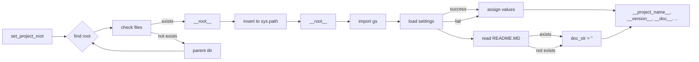

# <input code>

```python
## \file hypotez/src/suppliers/bangood/header.py
# -*- coding: utf-8 -*-\
#! venv/Scripts/python.exe
#! venv/bin/python/python3.12

"""
.. module: src.suppliers.bangood 
	:platform: Windows, Unix
	:synopsis:

"""
MODE = 'dev'


import sys
import json
from packaging.version import Version

from pathlib import Path
def set_project_root(marker_files=('pyproject.toml', 'requirements.txt', '.git')) -> Path:
    """
    Finds the root directory of the project starting from the current file's directory,
    searching upwards and stopping at the first directory containing any of the marker files.

    Args:
        marker_files (tuple): Filenames or directory names to identify the project root.
    
    Returns:
        Path: Path to the root directory if found, otherwise the directory where the script is located.
    """
    __root__:Path
    current_path:Path = Path(__file__).resolve().parent
    __root__ = current_path
    for parent in [current_path] + list(current_path.parents):
        if any((parent / marker).exists() for marker in marker_files):
            __root__ = parent
            break
    if __root__ not in sys.path:
        sys.path.insert(0, str(__root__))
    return __root__


# Get the root directory of the project
__root__ = set_project_root()
"""__root__ (Path): Path to the root directory of the project"""

from src import gs

settings:dict = None
try:
    with open(gs.path.root / 'src' /  'settings.json', 'r') as settings_file:
        settings = json.load(settings_file)
except (FileNotFoundError, json.JSONDecodeError):
    ...

doc_str:str = None
try:
    with open(gs.path.root / 'src' /  'README.MD', 'r') as settings_file:
        doc_str = settings_file.read()
except (FileNotFoundError, json.JSONDecodeError):
    ...


__project_name__ = settings.get("project_name", 'hypotez') if settings  else 'hypotez'
__version__: str = settings.get("version", '')  if settings  else ''
__doc__: str = doc_str if doc_str else ''
__details__: str = ''
__author__: str = settings.get("author", '')  if settings else ''
__copyright__: str = settings.get("copyrihgnt", '')  if settings else ''
__cofee__: str = settings.get("cofee", "Treat the developer to a cup of coffee for boosting enthusiasm in development: https://boosty.to/hypo69")  if settings else "Treat the developer to a cup of coffee for boosting enthusiasm in development: https://boosty.to/hypo69"
```

# <algorithm>

**Шаг 1**: Функция `set_project_root` ищет корневую директорию проекта, начиная с текущей директории скрипта.

* **Вход:** Кортеж `marker_files` с именами файлов/папок, указывающих на корень проекта.
* **Пример:** `marker_files = ('pyproject.toml', 'requirements.txt', '.git')`
* **Логика:** Функция итерируется по родительским директориям текущей директории, проверяя наличие файлов/папок из `marker_files`.
* **Результат:** Возвращает `Path` объекта корневой директории, либо текущую директорию, если корень не найден.
* **Пример:** Если в родительской директории существует `pyproject.toml`, функция вернет путь к этой родительской директории.


**Шаг 2**:  `__root__` получает корневую директорию, вызвав `set_project_root`.

* **Вход:** Нет
* **Логика:** Вызов функции.
* **Результат:** `Path` объекта к корневой директории.
* **Пример:** Если в `pyproject.toml` есть корневой путь, `__root__` содержит этот путь.

**Шаг 3**: Модуль `gs` импортируется.

* **Вход:** Нет
* **Логика:** Импорт модуля.
* **Результат:** Доступ к объектам и функциям модуля `gs`.
* **Пример:**  Возможно, модуль `gs` содержит пути (`gs.path.root`) и другие инструменты для работы с проектом.


**Шаг 4**:  Чтение настроек из `settings.json`.

* **Вход:** Путь к файлу `settings.json`.
* **Логика:** Пытается открыть файл, загрузить JSON данные.
* **Результат:** `settings` словарь, содержащий данные из `settings.json`.
* **Пример:** Если `settings.json` существует и содержит данные, `settings` будет заполнен.

**Шаг 5**: Чтение `README.MD` файла.

* **Вход:** Путь к файлу `README.MD`
* **Логика:** Пытается открыть файл и прочитать содержимое.
* **Результат:**  `doc_str` со строковым содержимым `README.MD`, или `None`, если файл не найден.
* **Пример:** Если `README.MD` существует, `doc_str` будет заполнен.


**Шаг 6**: Присваивание значений переменным.

* **Вход:** Словарь `settings`, строка `doc_str`.
* **Логика:** Присвоение значений переменным `__project_name__`, `__version__`, `__doc__`, `__author__`, `__copyright__`, `__cofee__`. Используется `get` для безопасного получения значений из `settings`.
* **Результат:** Переменные содержат значения из файла настроек или их значения по умолчанию.

# <mermaid>


**Описание диаграммы:**
* `set_project_root` (A) находит корневую директорию проекта, используя итерацию по родительским директориям. (B,C,E)
* `gs` (H) импортируется для доступа к необходимым данным.
* Загрузка настроек (I) из файла `settings.json`.
* Чтение содержимого файла `README.MD`. (J)
* Присвоение значений переменным `__project_name__`, `__version__`, и т.д. (L,M).


# <explanation>

**Импорты:**
* `sys`: Предоставляет доступ к системным переменным, включая `sys.path`.
* `json`: Для работы с JSON-файлами, в частности, загрузки данных из `settings.json`.
* `packaging.version`: Для работы с версиями программного обеспечения. Не используется напрямую, но импортируется в зависимость от `packaging`.
* `pathlib`: Для удобной работы с путями к файлам.
* `src.gs`:  Предполагаемый модуль, содержащий данные о путях и настройках проекта. Связь с другими частями проекта через импорт `gs`.  Без знания структуры `gs`, точную функциональность  описать сложно.


**Классы:**
Нет явных классов в коде.

**Функции:**
* `set_project_root(marker_files)`: Находит корневую директорию проекта, начиная с текущего файла. Принимает кортеж `marker_files` (файлы/директории, указывающие на корень проекта), возвращает `Path` объекта к корневой директории.

**Переменные:**
* `MODE`: Строковая переменная, содержащая режим работы.
* `__root__`: `Path` объект, содержащий путь к корневой директории проекта.
* `settings`: Словарь, содержащий данные из `settings.json`.
* `doc_str`: Строка с содержимым `README.MD`, если файл найден.
* `__project_name__`, `__version__`, `__doc__`, `__details__`, `__author__`, `__copyright__`, `__cofee__`: Строковые переменные, содержащие данные из настроек.

**Возможные ошибки и улучшения:**
* Обработка исключений `FileNotFoundError` и `json.JSONDecodeError` является хорошим подходом.
* Более подробная документация для функций и переменных была бы полезна.
* Улучшение обработки ошибок: вместо `...` можно добавить более подробное сообщение об ошибке.
* Переменные с двумя подчеркиваниями (`__variable__`) обычно используются для обозначения внутренних переменных, но в данном случае это не обязательное соглашение.
* Необходимы дополнительные сведения о модуле `gs` для лучшего понимания.


**Цепочка взаимосвязей:**
Код в `header.py` получает пути к важным файлам проекта (`settings.json`, `README.MD`) через модуль `gs`.  Поэтому `header.py` зависит от  модуля `gs`.  Модуль `gs` в свою очередь, вероятно, взаимодействует с другими частями проекта, такими как система настроек, файлы конфигурации и т.д.  Без дополнительных сведений об `gs`, сложно сказать точно, как `header.py` интегрируется в более широкий проект.