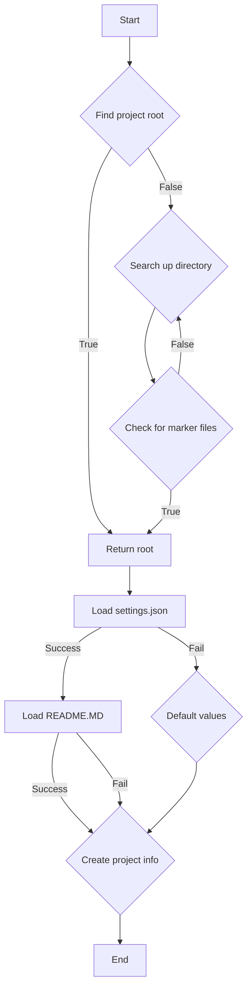

# <input code>

```python
## \file hypotez/src/suppliers/bangood/header.py
# -*- coding: utf-8 -*-\
#! venv/Scripts/python.exe
#! venv/bin/python/python3.12

"""
.. module: src.suppliers.bangood 
	:platform: Windows, Unix
	:synopsis:

"""
MODE = 'dev'


import sys
import json
from packaging.version import Version

from pathlib import Path
def set_project_root(marker_files=('pyproject.toml', 'requirements.txt', '.git')) -> Path:
    """
    Finds the root directory of the project starting from the current file's directory,
    searching upwards and stopping at the first directory containing any of the marker files.

    Args:
        marker_files (tuple): Filenames or directory names to identify the project root.
    
    Returns:
        Path: Path to the root directory if found, otherwise the directory where the script is located.
    """
    __root__:Path
    current_path:Path = Path(__file__).resolve().parent
    __root__ = current_path
    for parent in [current_path] + list(current_path.parents):
        if any((parent / marker).exists() for marker in marker_files):
            __root__ = parent
            break
    if __root__ not in sys.path:
        sys.path.insert(0, str(__root__))
    return __root__


# Get the root directory of the project
__root__ = set_project_root()
"""__root__ (Path): Path to the root directory of the project"""

from src import gs

settings:dict = None
try:
    with open(gs.path.root / 'src' /  'settings.json', 'r') as settings_file:
        settings = json.load(settings_file)
except (FileNotFoundError, json.JSONDecodeError):
    ...

doc_str:str = None
try:
    with open(gs.path.root / 'src' /  'README.MD', 'r') as settings_file:
        doc_str = settings_file.read()
except (FileNotFoundError, json.JSONDecodeError):
    ...


__project_name__ = settings.get("project_name", 'hypotez') if settings  else 'hypotez'
__version__: str = settings.get("version", '')  if settings  else ''
__doc__: str = doc_str if doc_str else ''
__details__: str = ''
__author__: str = settings.get("author", '')  if settings  else ''
__copyright__: str = settings.get("copyrihgnt", '')  if settings  else ''
__cofee__: str = settings.get("cofee", "Treat the developer to a cup of coffee for boosting enthusiasm in development: https://boosty.to/hypo69")  if settings  else "Treat the developer to a cup of coffee for boosting enthusiasm in development: https://boosty.to/hypo69"
```

# <algorithm>



**Пример:**
Если файл `header.py` находится в `/home/user/project/hypotez/src/suppliers/bangood`, а корневой каталог проекта находится в `/home/user/project`, то алгоритм выполнит поиск `pyproject.toml`, `requirements.txt` и `.git` в директориях, начиная с `/home/user/project/hypotez/src/suppliers/bangood` и поднимаясь вверх по дереву каталогов до тех пор, пока не найдет каталог, содержащий хотя бы один из этих файлов.  Найдет `/home/user/project` и установит его как корневой каталог.

# <mermaid>

```mermaid
graph LR
    subgraph Project Structure
        A[header.py] --> B(gs);
        B --> C[settings.json];
        B --> D[README.MD];
        C -.-> E[__root__];
        D -.-> F[__doc__];
        E --root path-->> G[set_project_root];
    end
    subgraph External Dependencies
        G --> H[Pathlib];
        G --> I[json];
        G --> J[sys];
        G --> K[packaging];
    end
```


# <explanation>

**Импорты:**

- `sys`: Предоставляет доступ к системным переменным, в частности `sys.path`, что позволяет динамически добавлять пути в поисковый путь Python. Используется для добавления пути к корневому каталогу проекта в `sys.path`.
- `json`: Для работы с JSON-файлами (загрузка и парсинг).
- `packaging.version`: Для работы с версиями пакетов. Непосредственно используется в данном файле, но не играет ключевой роли.
- `pathlib`: Для работы с путями к файлам.  Используется для построения путей к `settings.json` и `README.MD`
- `src.gs`:  Этот импорт указывает на модуль `gs` внутри проекта, который, скорее всего, содержит функции или классы для работы с файловой системой.  (Подробное объяснение `gs` не представлено, но по названию можно предположить что это utility функции для работы с файлами, пайплайнами, или другими настройками проекта)

**Классы:**

В данном файле нет определенных классов, только функции и переменные.


**Функции:**

- `set_project_root(marker_files=...)`:  Функция находит корневой каталог проекта, начиная с текущего каталога и поднимаясь по родительским каталогам до тех пор, пока не найдет каталог, содержащий один из файлов из списка `marker_files`. Она возвращает путь к корневому каталогу проекта.
  - Аргументы: `marker_files` (кортеж строк, по умолчанию `('pyproject.toml', 'requirements.txt', '.git')`)
  - Возвращаемое значение: `Path` - путь к корневому каталогу проекта
  - Пример: если файл `header.py` находится в `/home/user/project/hypotez/src/suppliers/bangood`, то эта функция найдёт каталог `/home/user/project` и вернет `Path('/home/user/project')`

**Переменные:**

- `__root__`:  Переменная, которая хранит путь к корневому каталогу проекта, найденный функцией `set_project_root()`.  Это ключевая переменная для последующей работы с ресурсами проекта.
- `MODE`: Переменная, хранящая строковое значение `'dev'`. Скорее всего, это конфигурационная переменная для выбора режимов работы.
- `settings`, `doc_str`: Переменные, хранящие загруженные данные из `settings.json` и `README.MD` соответственно.


**Возможные ошибки и улучшения:**

- **Обработка ошибок:**  Блоки `try...except` обрабатывают возможные ошибки при чтении и парсинге файлов.  Это хорошо.  Можно добавить более информативные сообщения об ошибках, чтобы помочь в отладке.
- **Переменные:**  Имена некоторых переменных (`__root__`, `__project_name__`, etc.) могут быть изменены для большей ясности (например, `project_root`, `projectName`).
- **Зависимости:** Нет явных ошибок, но стоит убедиться, что все импортируемые модули доступны, а также, что `gs.path` содержит нужные функции для работы с путями.  В идеале, следует явно указывать типы.
- **Поиск корня:** Поиск корня по списку файлов - хороший подход.  Можно добавить валидацию `marker_files` для проверки того, что передаются строки (возможно, нужно расширить список для более robust'ного поиска).

**Взаимосвязь с другими частями проекта:**

Функция `set_project_root` жизненно необходима, так как она устанавливает путь к корню проекта.  Эта информация будет использоваться в других модулях для доступа к файлам, таким как `settings.json` и `README.MD`. Файл `gs` (скорее всего) предоставляет утилиты для доступа к файлам в корне проекта.  Таким образом, данный код является частью общей инфраструктуры проекта `hypotez`.