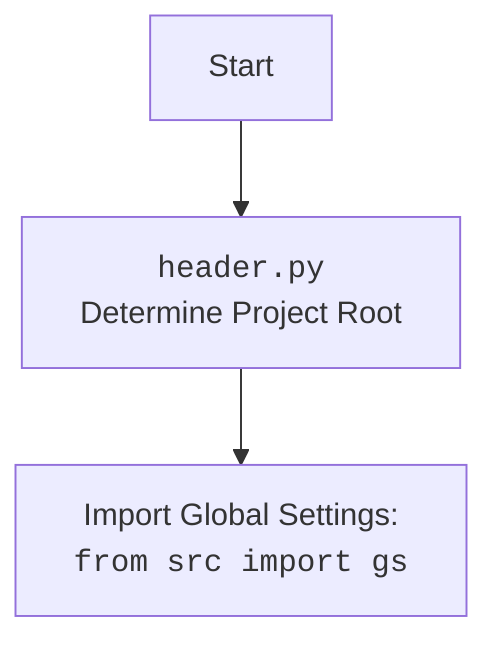

## ИНСТРУКЦИЯ:

Анализируй предоставленный код подробно и объясни его функциональность. Ответ должен включать три раздела:

1.  **<алгоритм>**: Опиши рабочий процесс в виде пошаговой блок-схемы, включая примеры для каждого логического блока, и проиллюстрируй поток данных между функциями, классами или методами.
2.  **<mermaid>**: Напиши код для диаграммы в формате `mermaid`, проанализируй и объясни все зависимости,
    которые импортируются при создании диаграммы.
    **ВАЖНО!** Убедитесь, что все имена переменных, используемые в диаграмме `mermaid`,
    имеют осмысленные и описательные имена. Имена переменных вроде `A`, `B`, `C`, и т.д., не допускаются!

    **Дополнительно**: Если в коде есть импорт `import header`, добавьте блок `mermaid` flowchart, объясняющий `header.py`:
    ```mermaid
    flowchart TD
        Start --> Header[<code>header.py</code><br> Determine Project Root]

        Header --> import[Import Global Settings: <br><code>from src import gs</code>]
    ```

3.  **<объяснение>**: Предоставьте подробные объяснения:
    -   **Импорты**: Их назначение и взаимосвязь с другими пакетами `src.`.
    -   **Классы**: Их роль, атрибуты, методы и взаимодействие с другими компонентами проекта.
    -   **Функции**: Их аргументы, возвращаемые значения, назначение и примеры.
    -   **Переменные**: Их типы и использование.
    -   Выделите потенциальные ошибки или области для улучшения.

Дополнительно, постройте цепочку взаимосвязей с другими частями проекта (если применимо).

Это обеспечивает всесторонний и структурированный анализ кода.
## Формат ответа: `.md` (markdown)
**КОНЕЦ ИНСТРУКЦИИ**
### <алгоритм>
1.  **Определение корня проекта (`set_project_root`):**
    -   Начало: Получение абсолютного пути к текущему файлу (`__file__`) и его родительской директории.
        *   Пример: Если `hypotez/src/suppliers/bangood/header.py` - текущий файл, то начальный путь будет `hypotez/src/suppliers/bangood`.
    -   Инициализация переменной `__root__` начальным путем.
    -   Итерация по родительским директориям: Цикл идет вверх по дереву директорий, от текущей до корня файловой системы.
        *   Пример: `hypotez/src/suppliers/bangood` -> `hypotez/src/suppliers` -> `hypotez/src` -> `hypotez`.
    -   Поиск маркерных файлов: В каждой директории проверяется наличие файлов из `marker_files` (`__root__` по умолчанию).
        *   Пример: Проверяется наличие файла `__root__` в каждой директории.
    -   Обновление `__root__`: Если маркерный файл найден, `__root__` устанавливается в путь к этой директории, и цикл прерывается.
    -   Добавление `__root__` в `sys.path`: Если `__root__` отсутствует в путях поиска модулей, он добавляется. Это позволяет импортировать модули из корня проекта.
    -   Возврат `__root__`: Возвращается путь к корневой директории.

2.  **Загрузка настроек из `settings.json`:**
    -   Попытка открытия `settings.json`: Попытка открыть файл `settings.json` из каталога `src` относительно корневого каталога проекта.
        *   Пример: `hypotez/src/settings.json`
    -   Загрузка настроек: Если файл успешно открыт, его содержимое загружается как JSON в переменную `settings`.
    -   Обработка исключений: Если файл не найден или JSON не может быть декодирован, то переменная `settings` остается `None`.

3.  **Загрузка документации из `README.MD`:**
    -   Попытка открытия `README.MD`: Попытка открытия файла `README.MD` из каталога `src` относительно корневого каталога проекта.
        *   Пример: `hypotez/src/README.MD`
    -   Чтение документации: Если файл успешно открыт, его содержимое считывается в переменную `doc_str`.
    -   Обработка исключений: Если файл не найден, или при ошибке чтения, то `doc_str` остается `None`.

4.  **Инициализация глобальных переменных:**
    -   `__project_name__`: Извлекается имя проекта из `settings` или используется `hypotez` по умолчанию.
    -   `__version__`: Извлекается версия проекта из `settings` или используется пустая строка по умолчанию.
    -   `__doc__`: Устанавливается в `doc_str` (из `README.MD`) или в пустую строку, если `doc_str` пуста.
    -   `__details__`: Устанавливается в пустую строку.
    -   `__author__`: Извлекается имя автора из `settings` или используется пустая строка по умолчанию.
    -   `__copyright__`: Извлекается текст авторских прав из `settings` или используется пустая строка по умолчанию.
    -   `__cofee__`: Извлекается текст о поддержке разработчика из `settings` или используется ссылка на Boosty по умолчанию.

### <mermaid>
```mermaid
flowchart TD
    Start --> SetProjectRoot[set_project_root() <br> Find Project Root]
    SetProjectRoot --> LoopThroughParents[Loop through parent directories]
    LoopThroughParents -- "Marker file found" --> UpdateRoot[Update project root]
    LoopThroughParents -- "Marker file not found" --> NextParent
     NextParent -->  LoopThroughParents
    UpdateRoot --> AddToSysPath[Add root to sys.path]
    AddToSysPath --> ReturnRoot[Return project root]
    ReturnRoot --> LoadSettings[Load settings from settings.json]
    LoadSettings -- "Settings loaded" --> LoadReadme[Load documentation from README.MD]
    LoadSettings -- "Error" --> LoadReadme[Load documentation from README.MD]
    LoadReadme -- "Readme loaded" --> InitGlobalVars[Initialize global variables]
    LoadReadme -- "Error" --> InitGlobalVars[Initialize global variables]
    InitGlobalVars --> End
   
    
   classDef current fill:#f9f,stroke:#333,stroke-width:2px
    class Start,End current
    
```



**Анализ зависимостей:**

-   `Start`: Начало выполнения скрипта `header.py`.
-   `set_project_root()`: Функция для определения корневой директории проекта.
-   `Loop through parent directories`: Цикл для перебора родительских директорий в поиске маркерных файлов.
-   `Update project root`: Обновляет путь к корню проекта, когда маркерный файл найден.
-    `Add root to sys.path`: Добавляет путь к корню проекта в `sys.path`
-   `Return project root`: Функция возвращает путь к корневой директории.
-   `Load settings from settings.json`: Попытка загрузить настройки из файла `settings.json`.
-   `Load documentation from README.MD`: Попытка загрузить документацию из `README.MD`.
-   `Initialize global variables`: Инициализация глобальных переменных проекта.
-   `End`: Завершение выполнения скрипта `header.py`.
-   Импортированные модули:
    -   `sys`: Используется для доступа к переменным и функциям, связанным с интерпретатором Python, в частности, для добавления пути проекта в `sys.path`.
    -   `json`: Используется для работы с JSON, для загрузки настроек из файла `settings.json`.
    -   `packaging.version.Version`: Используется для сравнения версий (не используется в данном коде, но импортирован).
    -   `pathlib.Path`: Используется для работы с путями файлов и директорий в операционной системе, заменяет работу со строками для путей.
    -   `src`: Используется для импорта глобальных настроек (`gs`).

### <объяснение>
**Импорты:**

*   `import sys`: Модуль `sys` используется для манипуляции с системными переменными и функциями. В данном случае `sys.path.insert(0, str(__root__))` добавляет путь к корневому каталогу проекта в начало списка путей поиска модулей. Это позволяет Python находить и импортировать модули из этого каталога.
*   `import json`: Модуль `json` используется для работы с файлами в формате JSON, в частности, для загрузки настроек приложения из `settings.json`.
*   `from packaging.version import Version`: Модуль `packaging.version` используется для работы с версиями, в частности, для сравнения версий программного обеспечения, но в данном коде не используется.
*   `from pathlib import Path`: Модуль `pathlib` используется для работы с путями файлов и каталогов в операционной системе. Заменяет работу со строками для путей, что делает код более читаемым и надежным.
*   `from src import gs`: Импортирует модуль `gs` из пакета `src`. `gs` предположительно содержит глобальные настройки проекта, включая пути к каталогам.

**Функции:**

*   `set_project_root(marker_files=('__root__')) -> Path`:
    *   **Аргументы**: `marker_files` - это кортеж (tuple) строк, которые будут использоваться для поиска маркеров в директории (по умолчанию - `('__root__')`).
    *   **Возвращаемое значение**:  `Path` - объект, представляющий путь к корневой директории проекта.
    *   **Назначение**: Функция находит корень проекта, начиная с директории, в которой находится текущий файл.  Она поднимается по дереву директорий, пока не найдет директорию, содержащую маркерный файл (например, `__root__`). Затем она добавляет корень проекта в `sys.path`, что позволяет импортировать модули из проекта.
    *   **Пример**:
        ```python
        # Предположим, что текущий файл находится в hypotez/src/suppliers/bangood/header.py
        # и маркерный файл '__root__' находится в hypotez.
        root_path = set_project_root()
        # root_path будет Path('hypotez')
        ```

**Переменные:**

*   `__root__`:  `Path` -  путь к корневому каталогу проекта.
*   `settings`: `dict` - словарь, содержащий настройки приложения, загруженные из `settings.json`. Если файл не найден или не может быть прочитан, значение `None`.
*   `doc_str`: `str` - строка, содержащая содержимое файла `README.MD`. Если файл не найден или не может быть прочитан, значение `None`.
*    `__project_name__`: `str` - имя проекта, берется из `settings`, если присутствует, иначе `'hypotez'`.
*   `__version__`: `str` - версия проекта, берется из `settings`, если присутствует, иначе `''`.
*   `__doc__`: `str` - строка документации проекта, берется из `doc_str`, если доступна, иначе `''`.
*   `__details__`:  `str` - строка для деталей проекта (в данном коде - пустая строка `''`).
*   `__author__`:  `str` -  имя автора проекта, берется из `settings`, если присутствует, иначе `''`.
*    `__copyright__`: `str` - строка с информацией об авторских правах, берется из `settings`, если присутствует, иначе `''`.
*   `__cofee__`:  `str` -  строка с предложением поддержать разработчика, берется из `settings`, если присутствует, иначе ссылка на Boosty по умолчанию.

**Цепочка взаимосвязей:**
1.  `header.py` определяет корень проекта с помощью функции `set_project_root`, используя маркерные файлы.
2.  `header.py` загружает настройки проекта из файла `settings.json` и документацию из `README.MD`, используя  пути из  `gs.path.root`.
3.  `header.py` инициализирует глобальные переменные проекта (`__project_name__`, `__version__`, `__doc__`, `__author__`, `__copyright__`, `__cofee__`), используя загруженные настройки и документацию.

**Потенциальные ошибки и области для улучшения:**
*   **Отсутствие обработки ошибок**:  Исключения `FileNotFoundError` и `json.JSONDecodeError` перехватываются, но ошибки никак не логируются и не обрабатываются. Было бы полезно, как минимум, логировать эти ошибки.
*   **Отсутствие проверки версии**: Импорт `packaging.version.Version` есть, но он не используется, можно добавить сравнение версий.
*   **Использование `...`**:  Использование `...` (многоточие) в блоке `except` не является лучшей практикой.  Стоит добавить как минимум логирование.
*   **Отсутствие документации в коде**: Добавить docstring к переменным верхнего уровня.

**Взаимосвязь с другими частями проекта:**
*   `gs` (глобальные настройки): Этот модуль используется для доступа к глобальным переменным проекта, таким как пути к каталогам,  и влияет на корректность работы данного модуля.
*   `settings.json`: Файл с настройками проекта, от которого зависят значения глобальных переменных в `header.py`.
*   `README.MD`: Файл с документацией проекта, который используется для инициализации переменной `__doc__`.

Этот код служит для определения основных параметров проекта, используемых в разных его частях.