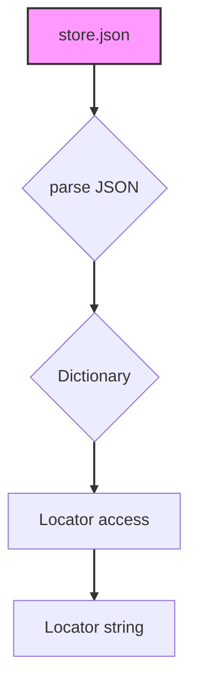

## Анализ кода `hypotez/src/suppliers/bangood/locators/store.json`

### 1. <алгоритм>

Представленный файл `store.json` содержит JSON-структуру данных, представляющую собой словарь. Этот словарь определяет локаторы для элементов веб-страницы, используемые при автоматизации тестирования или скрапинга. Ключи словаря представляют собой названия элементов (например, "main_menu", "search_input"), а значения - это сами локаторы, в виде строк. 

**Блок-схема:**

```mermaid
graph LR
    A[Начало] --> B{Загрузка JSON-файла};
    B --> C{Парсинг JSON-данных в словарь};
    C --> D[Доступ к локатору по ключу (название элемента)];
    D --> E{Возвращение значения (локатора)};
    E --> F[Конец];
    
    subgraph Примеры
    	style F fill:#f9f,stroke:#333,stroke-width:2px
		D --> D1(Пример: 'main_menu');
    	D1 --> E1(Возвращает значение: "css:#nav-global");
    
    	D --> D2(Пример: 'search_input');
    	D2 --> E2(Возвращает значение: "css:#search_input");
    	
    	D --> D3(Пример: 'product_card');
    	D3 --> E3(Возвращает значение: "css:.goods-list div.goods-item");
    end
```

**Пояснения к блок-схеме:**

1.  **Начало**: Начало процесса использования файла `store.json`.
2.  **Загрузка JSON-файла**: Файл `store.json` читается и загружается в память. 
3.  **Парсинг JSON-данных в словарь**:  Загруженные JSON-данные преобразуются в Python-словарь.
4.  **Доступ к локатору по ключу (название элемента)**: К словарю обращаются по ключу, представляющему название веб-элемента, который требуется найти. Например, `store['main_menu']`, `store['search_input']`, `store['product_card']`
5.  **Возвращение значения (локатора)**: Возвращается строка, представляющая собой CSS-селектор или XPath, соответствующий запрошенному элементу. 
6.  **Конец**: Завершение процесса.

### 2. <mermaid>



**Описание зависимостей:**

*   `store.json`:  Представляет собой JSON файл, содержащий данные для локаторов.
*   `parse JSON`: Процесс разбора JSON-файла в Python-словарь.
*    `Dictionary`: Python словарь, содержащий пары ключ-значение, где ключ - имя элемента, значение - его локатор.
*   `Locator access`:  Операция получения значения из словаря по ключу.
*   `Locator string`: Строка, представляющая собой локатор веб-элемента (например, CSS-селектор или XPath).

### 3. <объяснение>

**Импорты:**

В данном случае, файл `store.json` не импортирует никаких модулей или пакетов из `src`. Он является файлом данных и используется другими частями проекта. Например,  модулями, которые занимаются поиском элементов на веб-странице. 

**Структура файла:**

Файл `store.json` содержит JSON-словарь, где ключи - это названия веб-элементов (например, "main_menu", "search_input", "product_card"), а значения - это соответствующие CSS-селекторы, которые используются для их поиска на веб-странице.

```json
{
  "main_menu": "css:#nav-global",
  "search_input": "css:#search_input",
  "search_button": "css:#search_button",
  "product_card": "css:.goods-list div.goods-item",
   "product_name": "css:.goods-list div.goods-item .title",
    "product_price": "css:.goods-list div.goods-item .price"
}
```

**Примеры использования:**

*   `store['main_menu']` вернет `"css:#nav-global"`, CSS-селектор для основного меню на сайте.
*   `store['search_input']` вернет `"css:#search_input"`, CSS-селектор для поля ввода поиска.
*    `store['product_card']` вернет `"css:.goods-list div.goods-item"`,  CSS-селектор для карточки товара.
*  `store['product_name']` вернет `"css:.goods-list div.goods-item .title"`, CSS-селектор для имени товара.
*  `store['product_price']` вернет `"css:.goods-list div.goods-item .price"`, CSS-селектор для цены товара.

**Назначение:**

Основная цель этого файла - централизованно хранить локаторы элементов веб-страницы Banggood. Это упрощает поддержку и модификацию автоматизированных тестов или скраперов, поскольку локаторы хранятся в одном месте, и их не требуется искать по всему коду. 

**Цепочка взаимосвязей:**

1.  Этот файл используется в модулях `src.suppliers.bangood`, которые отвечают за взаимодействие с сайтом Banggood.
2.  Он также используется для веб-скрапинга или автоматизированного тестирования элементов на веб-страницах Banggood.

**Потенциальные проблемы и улучшения:**

*   **Зависимость от разметки**: Если разметка сайта Banggood изменится, локаторы в `store.json` станут недействительными, что потребует их обновления. Необходимо будет следить за изменениями на сайте и вносить корректировки.
*   **Добавление новых элементов:** При добавлении новых элементов в автоматизацию, нужно будет добавлять и их локаторы в файл `store.json`.
*   **Поддержка других типов локаторов:** Можно расширить данный файл, добавив возможность хранить в нём не только CSS-селекторы, но и XPath.

**Заключение:**

Файл `store.json` играет важную роль в проекте, обеспечивая централизованное хранение локаторов для веб-элементов. Это упрощает поддержку и масштабирование автоматизированных тестов и скраперов для сайта Banggood.