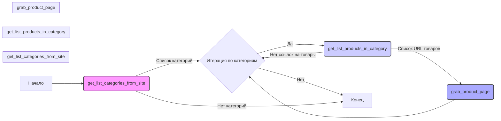

## <алгоритм>

**Блок-схема:**

1. **Начало**: Запуск сценария сбора данных с сайта Banggood.
2. **`get_list_categories_from_site(s)`**: 
    -   Функция принимает объект поставщика `s` (Supplier).
    -   Выполняет некую логику для получения списка категорий (в предоставленном коде заглушка - `...`).
    -   Возвращает список категорий (фактически не реализовано).
3.  **`get_list_products_in_category(s)`**:
    -   Принимает объект поставщика `s` (Supplier).
    -   Получает драйвер веб-браузера `d` из объекта `s`.
    -   Получает локаторы `l` для категории из объекта `s`.
    -   Закрывает баннер, используя локатор `s.locators['product']['close_banner']`.
    -   Проверяет наличие локаторов. Если локаторы отсутствуют, записывает ошибку в лог и завершает выполнение.
       *   Пример: `l` может быть словарем с ключами, такими как `product_links`
    -   Выполняет скролл страницы.
       *   Пример: прокрутка страницы вниз для загрузки динамически подгружаемого контента.
    -   Получает список ссылок на товары, используя локатор `l['product_links']` и метод `execute_locator`.
       *   Пример: `execute_locator(l['product_links'])` возвращает `['https://example.com/product1', 'https://example.com/product2']`
    -   Проверяет, является ли результат строкой или списком. Если строка - преобразует в список.
       *   Пример: если вернулась строка `'https://example.com/product1'`, преобразует в `['https://example.com/product1']`.
    -   Записывает в лог количество найденных товаров.
    -   Возвращает список URL-адресов товаров.
       *   Пример: `['https://example.com/product1', 'https://example.com/product2']`. Если товаров не найдено, то вернет `None`
4. **Итерация по категориям (не реализована)**:
    - Для каждой категории (если бы она была получена):
        - Вызывается `get_list_products_in_category(s)`.
        - Полученный список товаров передается в `grab_product_page()` (не реализовано в примере кода).
5. **`grab_product_page()` (не реализовано)**:
    - Функция принимает URL товара.
    -   Извлекает данные о товаре со страницы.
    - Создает объект `Product` (не реализовано в примере кода).
6. **Завершение**: Сценарий завершает работу.

## <mermaid>

**Зависимости:**

*   `typing.Union`: Импортируется для определения типов, которые могут принимать переменные или параметры.
*   `pathlib.Path`: Используется для работы с путями к файлам и директориям, но в предоставленном коде не используется.
*   `src.gs`: Импортируется, вероятно, для доступа к глобальным настройкам или объектам, но в предоставленном коде не используется.
*   `src.logger.logger`: Импортируется для логирования событий и ошибок.

## <объяснение>

**Импорты:**

*   `from typing import Union`: `Union` используется для указания, что переменная или параметр могут иметь один из нескольких указанных типов. В данном коде не используется, но импортирован.
*   `from pathlib import Path`: `Path` используется для представления путей к файлам и каталогам в виде объектов, облегчая работу с файловой системой. В предоставленном коде не используется, но импортирован.
*   `from src import gs`: Импортирует модуль `gs` из пакета `src`. Вероятно, используется для доступа к глобальным настройкам или общим объектам в проекте. В примере не используется.
*   `from src.logger.logger import logger`: Импортирует объект `logger` из модуля `logger` пакета `src.logger`. Используется для записи сообщений (информационных, предупреждающих и об ошибках) в лог файл.

**Переменные:**

*   `MODE = 'dev'`: Глобальная переменная, устанавливающая режим работы приложения в значение `'dev'` (режим разработки).
*   `s`: В функциях `get_list_products_in_category` и `get_list_categories_from_site` это объект класса `Supplier` (не показан в примере). Он хранит информацию о поставщике, включая драйвер веб-браузера, локаторы элементов на сайте поставщика и другие данные, необходимые для работы.
*   `d`: В функции `get_list_products_in_category` это драйвер веб-браузера (например, Selenium WebDriver), используемый для взаимодействия с веб-страницей.
*   `l`: В функции `get_list_products_in_category` это словарь локаторов для элементов на странице.
*   `list_products_in_category`: В функции `get_list_products_in_category` это список URL-адресов товаров, полученных со страницы категории.

**Классы:**

*   В предоставленном коде нет явного определения классов. Предполагается, что объект `s` является экземпляром класса `Supplier`, но его определение не представлено.
*   Класс `Product` не определен в предоставленном коде. Предполагается, что он отвечает за обработку и хранение информации о товаре.

**Функции:**

*   `get_list_products_in_category(s) -> list[str, str, None]`:
    *   Аргументы:
        *   `s`: Объект поставщика.
    *   Возвращает: Список URL-адресов товаров или `None`.
    *   Назначение: Получает список URL-адресов товаров со страницы категории.
        1. Получает драйвер браузера и локаторы.
        2. Закрывает баннер, используя локаторы.
        3. Выполняет скролл страницы.
        4. Получает список ссылок на товары, используя локаторы.
        5. Логирует информацию о количестве найденных товаров.
        6. Возвращает список URL-адресов товаров.
* `get_list_categories_from_site(s)`:
    * Аргументы:
        * `s`: Объект поставщика.
    * Возвращает:
        *  Предполагается, что должна возвращать список URL-адресов категорий, но в текущем коде это не реализовано.
    * Назначение: Предполагается, что функция должна получать список категорий с сайта поставщика, но в предоставленном коде ее реализация отсутствует (`...`).

**Потенциальные ошибки и области для улучшения:**

1. **Отсутствие реализации** `get_list_categories_from_site()`: Функция имеет заглушку `...` и не выполняет никакой логики. Это нужно исправить, чтобы сценарий мог работать с категориями.
2. **Нет листалки страниц**: В функции `get_list_products_in_category` не реализована логика для постраничной навигации по страницам категории, если товары распределены по нескольким страницам.
3. **Неполная обработка ошибок**: Код проверяет наличие локаторов и наличие ссылок, но не обрабатывает другие потенциальные исключения при работе с веб-драйвером или при получении данных со страницы.
4.  **Отсутствие `grab_product_page`**: Функция, которая должна обрабатывать страницы товаров, не реализована.
5. **Зависимость от структуры HTML**: Локаторы элементов (`s.locators`) сильно зависят от HTML-структуры сайта поставщика. Любые изменения на сайте могут привести к поломке кода.
6. **Отсутствие класса `Product`**: Код предполагает взаимодействие с объектами класса `Product`, но сам класс не определен.
7.  **Жестко заданный режим `MODE = 'dev'`**: Режим работы приложения задан жестко. Может быть полезно сделать его настраиваемым через переменные окружения или параметры запуска.
8.  **Нет проверки на изменения категорий**: Отсутствует проверка на изменения категорий на сайте поставщика (добавление, переименование, удаление).
9.  **Нет связи с PrestaShop**: В коде упоминается `PrestaShop.categories <-> aliexpress.shop.categoies`, но нет явного взаимодействия с PrestaShop.

**Цепочка взаимосвязей:**

1.  Сценарий (этот файл) является частью модуля `suppliers.bangood` в пакете `src`.
2.  Он зависит от драйвера веб-браузера, который предоставляется через объект `Supplier`.
3.  Использует логгер (`src.logger.logger`) для записи сообщений.
4.  Предполагает взаимодействие с глобальными настройками или объектами через `src.gs`.
5.  Предполагает взаимодействие с классом `Product` для обработки данных о товарах, а также с `PrestaShop`.

Этот сценарий является частью более крупной системы, предназначенной для сбора данных о товарах с сайта Banggood. Он обрабатывает страницы категорий, извлекает ссылки на товары и передает их для дальнейшей обработки.