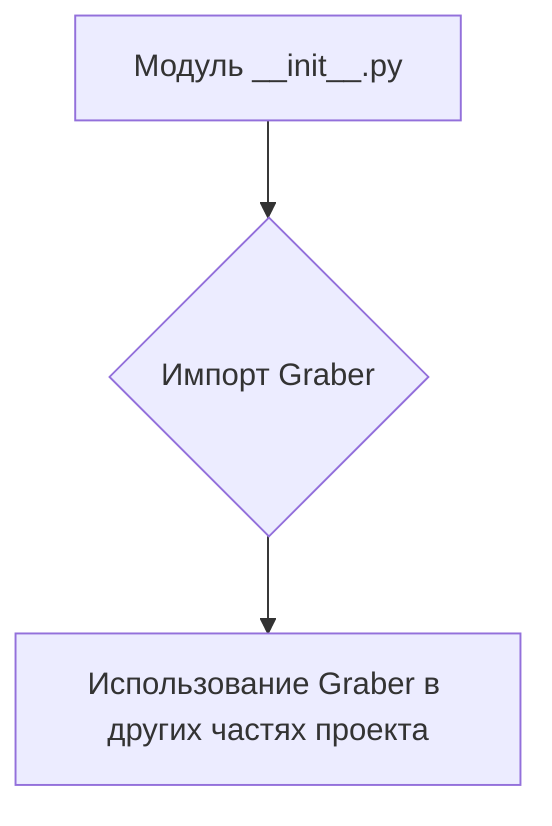
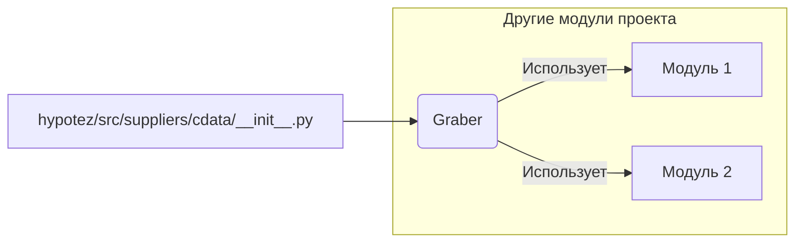

# <input code>

```python
## \file hypotez/src/suppliers/cdata/__init__.py
# -*- coding: utf-8 -*-
#! venv/Scripts/python.exe
#! venv/bin/python/python3.12

"""
.. module: src.suppliers.cdata 
	:platform: Windows, Unix
	:synopsis:

"""
MODE = 'dev'


from .graber import Graber
```

# <algorithm>

Этот код представляет собой модуль инициализации для пакета `cdata` в проекте `hypotez`.  Он импортирует класс `Graber` из подпакета `graber`.  По сути, он предоставляет способ доступа к классу `Graber`  из других частей проекта.  Алгоритм работы очень простой: импорт необходимых классов.

**Блок-схема:**



**Пример:**

В другом модуле проекта можно будет использовать:

```python
from hypotez.src.suppliers.cdata import Graber
graber_instance = Graber()
# ... использование грабера
```

# <mermaid>



# <explanation>

* **Импорты:**
    * `from .graber import Graber`: Этот импорт подключает класс `Graber` из файла `graber.py` внутри текущей директории (`.`) пакета `cdata`. Это означает, что `cdata` предоставляет доступ к функциональности, реализованной в `graber.py`.  Связь с другими частями проекта здесь заключается в том, что  `graber.py` вероятно содержит логику для получения данных (как подразумевает имя `Graber`), и этот инициализирующий модуль делает его доступным.   Связь с другими частями проекта косвенная,  `Graber` будет использован другими модулями.

* **Классы:**
    * `Graber`:  Этот класс (определённый в файле `graber.py`) является ключевым компонентом пакета.  Без знания определения класса `Graber` сложно точно сказать, что он делает.  Но, скорее всего, `Graber` отвечает за сбор данных из какого-то источника, например, веб-сайта.  Этот класс реализует функциональность, необходимую другим частям приложения.

* **Функции:**
    * В данном файле нет функций.

* **Переменные:**
    * `MODE = 'dev'`:  Это константа, хранящая строку 'dev'.  Вероятно, используется для управления режимом работы приложения (разработка, производство).

* **Возможные ошибки/улучшения:**
    * Не указана какая-либо обработка исключений. Если `graber.py` может генерировать ошибки, то их нужно обработать здесь для предотвращения срыва работы приложения.
    * Нет информации о том, как именно класс `Graber` используется, и какая информация собирается.
    * Нет информации о том, какие типы данных используются, какие ресурсы (базы данных, файлы и т.д.) требуются для работы класса.

**Цепочка взаимосвязей:**

Модуль `hypotez/src/suppliers/cdata/__init__.py` является частью пакета `suppliers`, который, вероятно, отвечает за взаимодействие с различными источниками данных (`cdata` - один из них).  В свою очередь, другие модули приложения `hypotez` могут использовать `cdata` для получения данных, реализуемых в `Graber`.  Без кода `graber.py` сложно установить полную цепочку.