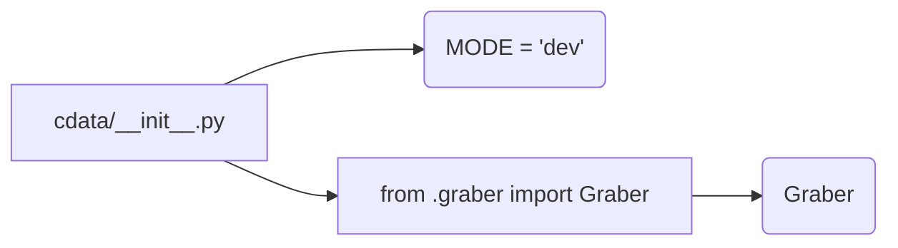

```MD
# <input code>

```python
## \file hypotez/src/suppliers/cdata/__init__.py
# -*- coding: utf-8 -*-\
#! venv/Scripts/python.exe
#! venv/bin/python/python3.12

"""
.. module: src.suppliers.cdata 
	:platform: Windows, Unix
	:synopsis:

"""
MODE = 'dev'


from .graber import Graber
```

# <algorithm>

Алгоритм работы данного файла достаточно прост. Он представляет собой инициализацию модуля `cdata` в пакете `suppliers`.

1. **Инициализация:** Модуль определяет константу `MODE` со значением 'dev'. Это, вероятно, параметр для определения режима работы, например, режим разработки ('dev'), или продакшен ('prod').

2. **Импорт:** Из подмодуля `graber` импортируется класс `Graber`.  Это указывает на то, что этот модуль предполагает использование функциональности класса `Graber` для работы с данными.


# <mermaid>



# <explanation>

**Импорты:**

- `from .graber import Graber`:  Импортирует класс `Graber` из подмодуля `graber` внутри того же пакета `cdata`.  Это ключевой импорт, указывающий на то, что данный файл (и, вероятно, весь модуль `cdata`) будет взаимодействовать с классом `Graber` для работы с данными.  Важно понимать, что `.` в начале импорта указывает на поиск в текущем пакете (`suppliers/cdata`).

**Классы:**

- `Graber`: Класс `Graber` (определенный в файле `graber.py`)  пока не описан, но, судя по импорту, он содержит функциональность для сбора и обработки данных (grabbing). Этот класс необходим для работы с данными.

**Функции:**

- Нет определенных функций в данном файле.

**Переменные:**

- `MODE`: Строковая константа, вероятно, определяющая режим работы модуля.

**Возможные ошибки/улучшения:**

- **Не хватает документации:** Необходимо дополнить файл документацией в виде docstrings (как это сделано в docstring модуля) для классов `Graber` и других элементов, если они присутствуют.
- **Отсутствие логики:** Файл `__init__.py` пока не содержит логики для работы с классом `Graber`. Он лишь подготавливает импорт, что означает, что работа с данными или другой функционал будут реализованы в других частях проекта.
- **Отсутствие описания `MODE`:**  Было бы полезно добавить комментарии, объясняющие, какие значения может принимать переменная `MODE` и что означает каждое из них.


**Взаимосвязи с другими частями проекта:**

Модуль `cdata` связан с модулем `graber`, который, по-видимому, содержит функционал для получения данных.   Эта функциональность, скорее всего, понадобится в других частях проекта, которые будут использовать модуль `cdata` для работы с этими данными.  Без доступа к `graber.py`,  сложно точно описать характер связи.  Однако, можно предположить, что `cdata` отвечает за подготовку и предоставление данных, собранных `graber`.  Скорее всего, в других файлах проекта находятся функции, которые используют этот модуль.