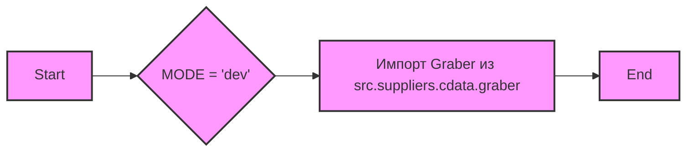

## Анализ кода `hypotez/src/suppliers/cdata/__init__.py`

### <алгоритм>

1. **Инициализация:**
   - Задается переменная `MODE` со значением `'dev'`. Это может указывать на режим разработки, в котором будут выполняться какие-то специфичные операции.
    *Пример:* `MODE = 'dev'` - Указывает, что код запущен в режиме разработки.
2. **Импорт:**
   - Импортируется класс `Graber` из модуля `src.suppliers.cdata.graber`. Этот класс, вероятно, отвечает за получение данных (парсинг, скрапинг) для поставщиков.
     *Пример:* `from .graber import Graber` - Импортирует класс Graber для использования в этом модуле.
3. **Конец:**
   - На этом код завершается.

**Поток данных:**
Данные не передаются явно в этом файле, но `Graber`, вероятно, будет получать данные извне (например, через API или веб-страницы) и использовать их для выполнения своей работы.

### <mermaid>

**Объяснение `mermaid`:**
-   `A[Start]`: Начало процесса.
-   `B{MODE = 'dev'}`: Устанавливается переменная `MODE` в значение `'dev'`. Это определяет рабочий режим.
-   `C[Импорт Graber из src.suppliers.cdata.graber]`: Импортируется класс `Graber` из модуля `graber`, который находится в том же пакете `cdata`. Это действие позволяет использовать функциональность класса `Graber` в данном модуле.
-   `D[End]`: Завершение выполнения кода.
-   `classDef default fill:#f9f,stroke:#333,stroke-width:2px`: Определяет стиль по умолчанию для узлов графа.
-   `class A,B,C,D default`: Применяет стиль по умолчанию к узлам `A`, `B`, `C` и `D`.

**Зависимости:**
-   Модуль зависит от модуля `graber` внутри пакета `cdata`.

### <объяснение>

**Импорты:**
-   `from .graber import Graber`: Импортирует класс `Graber` из модуля `graber`, который находится в том же пакете `cdata`. Этот импорт нужен для того, чтобы использовать класс `Graber`, вероятно, для сбора данных для поставщиков. Модуль `graber`, скорее всего, содержит логику для получения данных с внешних источников.

**Классы:**
-  В данном файле нет определения классов. Но упоминается класс `Graber`. Судя по названию, класс `Graber` - это инструмент для сбора (парсинга, скрапинга) данных, возможно, из веб-страниц или API.

**Функции:**
-   В данном файле нет функций.

**Переменные:**
-   `MODE = 'dev'`: Глобальная переменная, которая устанавливает режим работы приложения в значение `'dev'` (разработка). Значение этой переменной может влиять на то, как приложение будет вести себя, например, выводить более подробные логи или использовать тестовые данные.

**Потенциальные ошибки и области для улучшения:**
- **Отсутствие документации:** Код имеет только общую docstring для модуля. Было бы хорошо иметь docstring для каждого класса, метода и функции, если они есть в модулях, которые импортируются.
- **Зависимость от `MODE`:** Если `MODE` будет использован в других модулях, то необходимо будет следить за его состоянием.
- **Неизвестное назначение `Graber`:** Без кода `Graber` сложно сказать, как он работает.  Необходимо углубиться в детали класса `Graber` для понимания его назначения и влияния на работу системы.

**Взаимосвязь с другими частями проекта:**
- Данный файл служит входной точкой для пакета `cdata`, который, вероятно, отвечает за сбор данных для поставщиков. Он использует класс `Graber` для этого, который, вероятно, зависит от других частей системы, например, для настройки соединения с базой данных или для отправки HTTP запросов.  Дальнейшее изучение класса `Graber` и его связей помогло бы составить полную картину проекта.