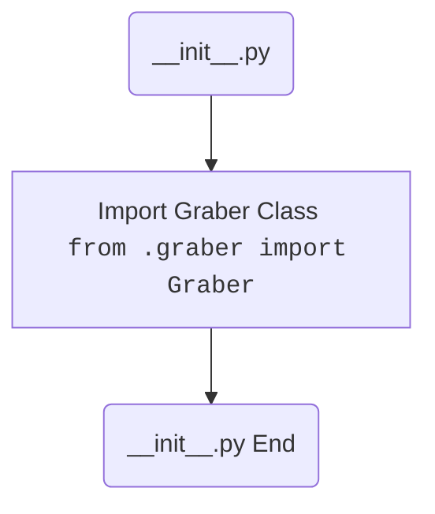

## Анализ кода `hypotez/src/suppliers/cdata/__init__.py`

### <алгоритм>

1. **Начало:** Исполнение скрипта `__init__.py` начинается. Этот файл выполняется при импорте пакета `src.suppliers.cdata`.
2. **Импорт `Graber`:** Из модуля `graber.py`, расположенного в том же пакете `src.suppliers.cdata`, импортируется класс `Graber`.
3. **Конец:** Выполнение файла завершается. Класс `Graber` становится доступным для использования при импорте пакета `src.suppliers.cdata`.

**Пример:**
```python
# где-то в другом модуле
from src.suppliers.cdata import Graber

# Теперь можно создать экземпляр класса Graber
graber_instance = Graber()
```
### <mermaid>


**Объяснение диаграммы:**

- `Start(__init__.py)`: Начальная точка выполнения скрипта `__init__.py`, который автоматически выполняется при импорте пакета `src.suppliers.cdata`.
- `ImportGraber`: Импорт класса `Graber` из модуля `graber.py`, который находится в том же пакете (`.graber`).
- `End(__init__.py End)`: Конечная точка выполнения скрипта `__init__.py`. После импорта класс `Graber` доступен для использования в других частях проекта.
### <объяснение>

**Импорты:**

- `from .graber import Graber`: Эта строка импортирует класс `Graber` из модуля `graber.py`, который находится в той же директории (пакете) `src.suppliers.cdata`. Точка `.` указывает на текущий пакет. Это позволяет другим частям проекта, которые импортируют пакет `src.suppliers.cdata`, использовать класс `Graber`.

**Классы:**

- `Graber`: Судя по импорту, класс `Graber` определен в файле `graber.py`. Данный файл `__init__.py` делает его доступным для импорта из других модулей. Конкретная функциональность класса `Graber` зависит от его реализации в `graber.py`, но, как правило, такие классы используются для сбора и обработки данных.

**Функции:**

- В данном файле нет явных функций. Файл `__init__.py` служит для инициализации пакета и делает импортируемые сущности доступными.

**Переменные:**

- В данном файле нет явных переменных.

**Потенциальные ошибки и области для улучшения:**

- **Отсутствие документации:** Файл `__init__.py` имеет комментарий с описанием модуля, но он пуст. Следует добавить краткое описание пакета `cdata` и его назначения в проекте.
- **Зависимости:** Невозможно оценить полноценно работу класса `Graber` без просмотра кода `graber.py`.

**Цепочка взаимосвязей с другими частями проекта:**

1.  `src.suppliers.cdata` представляет собой пакет для работы с данными поставщиков (судя по названию `suppliers`).
2.  Импорт класса `Graber` в `__init__.py` делает его доступным для других модулей, которые могут использовать его для извлечения данных.
3.  Предположительно, `Graber` взаимодействует с внешними источниками данных.
4.  Другие модули в `src` могут импортировать `Graber` из `src.suppliers.cdata` для обработки данных, полученных от поставщиков.