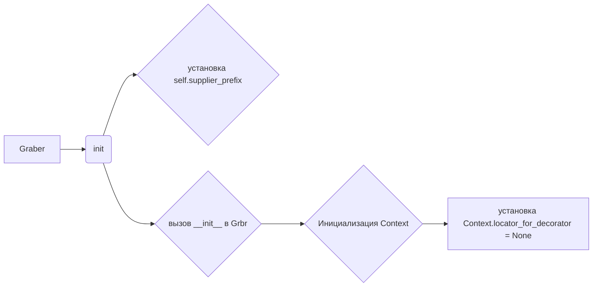

```MD
# <input code>

```python
## \file hypotez/src/suppliers/cdata/graber.py
# -*- coding: utf-8 -*-
#! venv/Scripts/python.exe
#! venv/bin/python/python3.12

"""
.. module: src.suppliers.cdata 
	:platform: Windows, Unix
	:synopsis:  Класс собирает значение полей на странице  товара `cdata.co.il`. 
    Для каждого поля страницы товара сделана функция обработки поля в родительском классе.
    Если нужна нестандертная обработка, функция перегружается в этом классе.
    ------------------
    Перед отправкой запроса к вебдрайверу можно совершить предварительные действия через декоратор. 
    Декоратор по умолчанию находится в родительском классе. Для того, чтобы декоратор сработал надо передать значение 
    в `Context.locator`, Если надо реализовать свой декоратор - раскоментируйте строки с декоратором и переопределите его поведение

"""
MODE = 'dev'

from typing import Any
import header
from src.suppliers.graber import Graber as Grbr, Context, close_pop_up
from src.webdriver.driver import Driver
from src.logger import logger


# # Определение декоратора для закрытия всплывающих окон
# # В каждом отдельном поставщике (`Supplier`) декоратор может использоваться в индивидуальных целях
# # Общее название декоратора `@close_pop_up` можно изменить 


# def close_pop_up(value: Any = None) -> Callable:
#     """Создает декоратор для закрытия всплывающих окон перед выполнением основной логики функции.

#     Args:
#         value (Any): Дополнительное значение для декоратора.

#     Returns:
#         Callable: Декоратор, оборачивающий функцию.
#     """
#     def decorator(func: Callable) -> Callable:
#         @wraps(func)
#         async def wrapper(*args, **kwargs):
#             try:
#                 # await Context.driver.execute_locator(Context.locator.close_pop_up)  # Await async pop-up close  
#                 ... 
#             except ExecuteLocatorException as e:
#                 logger.debug(f'Ошибка выполнения локатора: {e}')
#             return await func(*args, **kwargs)  # Await the main function
#         return wrapper
#     return decorator


class Graber(Grbr):
    """Класс для операций захвата Morlevi."""
    supplier_prefix: str

    def __init__(self, driver: Driver):
        """Инициализация класса сбора полей товара."""
        self.supplier_prefix = 'cdata'
        super().__init__(supplier_prefix=self.supplier_prefix, driver=driver)
        # Устанавливаем глобальные настройки через Context
        
        Context.locator_for_decorator = None # <- если будет уастановлено значение - то оно выполнится в декораторе `@close_pop_up`
```

# <algorithm>

1. **Импорт библиотек:** Код импортирует необходимые модули, включая `header`, `Graber` (из `src.suppliers.graber`), `Context`, `close_pop_up` (из `src.suppliers.graber`), `Driver` (из `src.webdriver.driver`), и `logger` (из `src.logger`).  Эти импорты определяют доступ к функциям, классам и переменным, которые используются для работы с веб-драйвером, логированием, и обработкой данных.


2. **Определение класса `Graber`:** Наследует класс `Grbr` (из `src.suppliers.graber`). Этот класс определяет методы для работы с веб-драйвером.


3. **Конструктор `__init__`:**  Инициализирует объект `Graber`, устанавливает `supplier_prefix` и вызывает конструктор родительского класса. Важный момент: устанавливает `Context.locator_for_decorator = None`. Это ключевое для понимания возможной обработки всплывающих окон. Если в `Context` будет установлено значение для этого ключа, то декоратор из родительского класса будет вызван.


# <mermaid>



# <explanation>

* **Импорты:**
    * `header`: Вероятно, модуль, содержащий конфигурацию или вспомогательные функции для проекта.
    * `src.suppliers.graber`, `Context`, `close_pop_up`:  Модуль `graber` содержит базовый класс `Graber` и его атрибуты (например, `Context`). `Context` скорее всего предоставляет глобальные переменные и настройки. `close_pop_up` скорее всего декоратор, позволяющий выполнять действия перед основным кодом. Все модули находятся в `src` - корневом каталоге проекта.
    * `src.webdriver.driver`: Модуль, управляющий взаимодействием с веб-драйвером.
    * `src.logger`: Модуль для логирования.


* **Классы:**
    * `Graber`: Наследует `Grbr`, предназначен для сбора данных со страницы товара `cdata.co.il`.  `supplier_prefix` устанавливает префикс для данных поставщика.  `__init__` - конструктор класса.


* **Функции:**
    * `close_pop_up`: (комментировано) Функция, которая должна реализовывать логику закрытия всплывающих окон.  Аргумент `value` позволяет передать дополнительные параметры.  `decorator` - это декоратор для функции, которая позволяет изменять поведение этой функции до и после её выполнения.  Именно этот декоратор, возможно, будет использоваться для взаимодействия с веб-драйвером.


* **Переменные:**
    * `MODE`:  Скорее всего, константа, определяющая режим работы программы ('dev' или 'prod').
    * `supplier_prefix`:  Строковая переменная, хранящая префикс имени поставщика.


* **Возможные ошибки и улучшения:**
    * Комментированный код декоратора `close_pop_up` - не реализован, но готов к использованию, если потребуется.
    * Непонятно, что делает `header` в импорте. Нужно уточнить его назначение.
    * Код `Context` и `Grbr` не раскрыт, поэтому сложно оценить всю функциональность. Необходимо ознакомиться с их реализацией.
    * Отсутствуют примеры использования класса `Graber`, функций и взаимодействий с другими частями проекта.


* **Взаимосвязи с другими частями проекта:**
    * `Graber` взаимодействует с `Context` для получения и установки глобальных настроек.
    * `Graber` взаимодействует с `Driver` для работы с веб-драйвером и отправки запросов.
    * `Graber` взаимодействует с `logger` для записи сообщений об ошибках и других действий.
    * `Graber` (и `Grbr`) вероятно взаимодействует с другими классами для обработки и хранения собранных данных, но это неясно из предоставленного фрагмента.

В целом код организован в соответствии с принципом ООП.  `Graber` наследует базовый функционал, необходимый для веб-скрейпинга, и переопределяет отдельные методы для специфических потребностей сбора данных для данного поставщика.  Для улучшения кода необходимо раскрыть функционал `Context`, `Graber` и `Grbr`, а также предоставить пример использования.