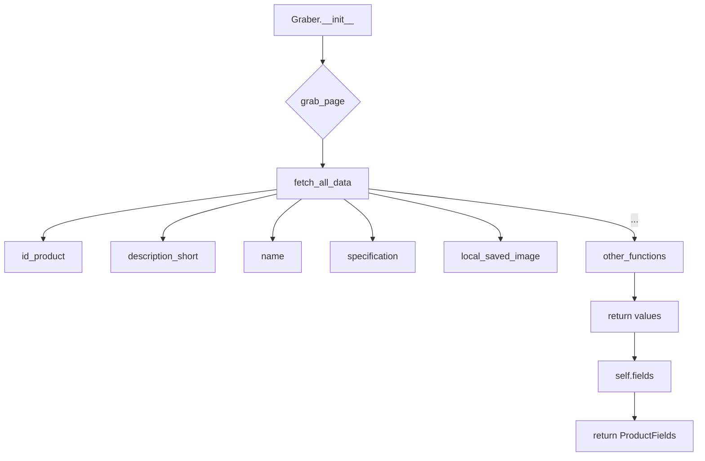
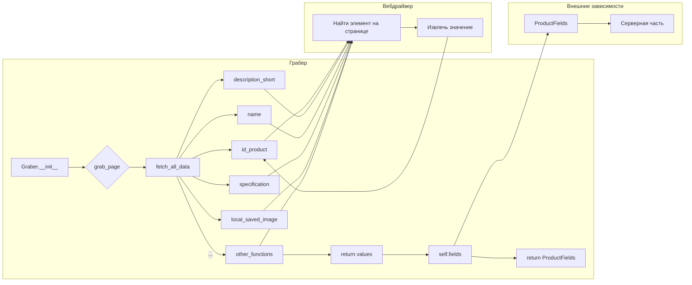

# <input code>

```python
## \file hypotez/src/suppliers/cdata/graber.py
# -*- coding: utf-8 -*-\
#! venv/Scripts/python.exe
#! venv/bin/python/python3.12

"""
.. module: src.suppliers.cdata 
	:platform: Windows, Unix
	:synopsis:  Класс собирает значение полей на странице  товара `cdata.co.il`. 
    Для каждого поля страницы товара сделана функция обработки поля в родительском классе.
    Если нужна нестандертная обработка, функция перегружается в этом классе.
    ------------------
    Перед отправкой запроса к вебдрайверу можно совершить предварительные действия через декоратор. 
    Декоратор по умолчанию находится в родительском классе. Для того, чтобы декоратор сработал надо передать значение 
    в `Context.locator`, Если надо реализовать свой декоратор - раскоментируйте строки с декоратором и переопределите его поведение

"""
MODE = 'dev'

import asyncio
from pathlib import Path
from types import SimpleNamespace
from typing import Any, Callable, Optional
from dataclasses import dataclass, field
from functools import wraps
from pydantic import BaseModel
from src import gs
from src.suppliers import Graber as Grbr, Context, close_pop_up
from src.product import ProductFields
from src.webdriver import Driver
from src.utils.jjson import j_loads_ns
from src.logger import logger
from src.logger.exceptions import ExecuteLocatorException

from dataclasses import dataclass, field
from types import SimpleNamespace
from typing import Any, Callable


# Определение декоратора для закрытия всплывающих окон
# В каждом отдельном поставщике (`Supplier`) декоратор может использоваться в индивидуальных целях
# Общее название декоратора `@close_pop_up` можно изменить 


# def close_pop_up(value: Any = None) -> Callable:
#     """Создает декоратор для закрытия всплывающих окон перед выполнением основной логики функции.

#     Args:
#         value (Any): Дополнительное значение для декоратора.

#     Returns:
#         Callable: Декоратор, оборачивающий функцию.
#     """
#     def decorator(func: Callable) -> Callable:
#         @wraps(func)
#         async def wrapper(*args, **kwargs):
#             try:
#                 # await Context.driver.execute_locator(Context.locator.close_pop_up)  # Await async pop-up close  
#                 ... 
#             except ExecuteLocatorException as e:
#                 logger.debug(f'Ошибка выполнения локатора: {e}')
#             return await func(*args, **kwargs)  # Await the main function
#         return wrapper
#     return decorator


class Graber(Grbr):
    """Класс для операций захвата Morlevi."""
    supplier_prefix: str

    def __init__(self, driver: Driver):
        """Инициализация класса сбора полей товара."""
        self.supplier_prefix = 'cdata'
        super().__init__(supplier_prefix=self.supplier_prefix, driver=driver)
        # Устанавливаем глобальные настройки через Context
        Context.locator_for_decorator = None # <- если будет уастановлено значение - то оно выполнится в декораторе `@close_pop_up`


    async def grab_page(self, driver: Driver) -> ProductFields:
        """Asynchronous function to grab product fields.

        Args:
            driver (Driver): The driver instance to use for grabbing.

        Returns:
            ProductFields: The grabbed product fields.
        """
        global d
        d = self.d = driver  

        ...
        # Логика извлечения данных
        async def fetch_all_data(**kwards):

            # Call function to fetch specific data
            # await fetch_specific_data(**kwards)  

            # Uncomment the following lines to fetch specific data
            await self.id_product(kwards.get("id_product", ''))
            # ... (many more await calls)

        # Call the function to fetch all data
        await fetch_all_data()
        return self.fields
```



# <algorithm>

1. **`Graber.__init__`**: Инициализирует объект класса `Graber`, устанавливая `supplier_prefix` и передавая `driver`.
2. **`grab_page`**: Запускает асинхронную функцию `fetch_all_data`, которая собирает данные по всем полям.
3. **`fetch_all_data`**: Вызывает множество асинхронных функций (`id_product`, `description_short`, `name`, `specification`, `local_saved_image` и другие), каждая из которых отвечает за извлечение данных для конкретного поля.
4. **`id_product`, `description_short`, `name`, `specification`, `local_saved_image` и др.**: Выполняют операции по извлечению значений полей из страницы товара.  Эти функции, скорее всего, взаимодействуют с веб-драйвером (`driver`) для нахождения и парсинга данных на странице.
5. **Возврат**: Функция `grab_page` возвращает заполненный объект `ProductFields`.

**Пример данных:**

Предположим, что `fetch_all_data` получила данные:

```
kwards = {
    "id_product": "123",
    "description_short": "Short description",
    "name": "Product Name",
}
```

Тогда функции `id_product`, `description_short` и `name` получат эти значения как аргументы и вернут извлечённые значения.

# <mermaid>



**Объяснение диаграммы:**

* Грабер: Основной класс, обрабатывающий запрос.
* Вебдрайвер: Представляет собой зависимость для работы с браузером.
* ProductFields: Класс, описывающий структуру возвращаемых данных.
* Серверная часть: Другие компоненты системы, которые, возможно, используют полученные данные.


# <explanation>

* **Импорты**: Стандартные импорты (`asyncio`, `Path`, `SimpleNamespace`, `typing`, `dataclasses`, `functools`, `pydantic`, `src.gs`, ...) и импорты из собственных пакетов проекта (`src.suppliers`, `src.product`, `src.webdriver`, `src.utils.jjson`, `src.logger`, `src.logger.exceptions`).  Это типичная структура импортов для Python-проектов, организованных в иерархию пакетов.
* **Классы**:
    * `Graber`: Наследуется от `Grbr` (предположительно, абстрактного класса для работы с поставщиками данных).  Отвечает за извлечение данных с конкретной страницы.  Содержит метод `grab_page` для получения данных.
    * `Grbr`: Скорее всего, родительский абстрактный или базовый класс, определяющий общие методы работы с веб-драйвером, структурой данных и логикой сбора данных.
* **Функции**:
    * `grab_page`: Асинхронная функция для извлечения данных продукта. Принимает `driver` и возвращает объект `ProductFields`.  Функция организована вокруг вспомогательной функции `fetch_all_data`, которая вызывает ряд других функций для каждого поля.
    * `fetch_all_data`: Асинхронная функция, которая вызывает функции для извлечения конкретных полей товара.
    * Функции `id_product`, `description_short`, `name`, `specification`, `local_saved_image` и т.д.:  Асинхронные функции, которые, скорее всего, содержат код для поиска и извлечения данных на веб-странице.


* **Переменные**: `d`, `self.d`, `Context.locator_for_decorator` - переменные класса `Graber`. 

* **Возможные ошибки/улучшения**:
    * **Неполная реализация декоратора `close_pop_up`:** Код декоратора закомментирован. Необходимо реализовать функциональность закрытия всплывающих окон, если необходимо.
    * **Недостающая обработка ошибок:** В коде отсутствует  обработка ошибок при извлечении данных (например, если элемент не найден).  Добавление `try...except` блоков значительно повысит надежность кода.
    * **Возможность некорректного получения данных:** Извлечение данных по каждому полю товара в коде сделано в одной большой функции. Возможно, логика могла бы быть более структурирована и оптимизирована.
    * **Неявные зависимости**: Нет ясности, как связаны `src.suppliers.Graber` и `Context` с другими частями проекта. Потребуются дальнейшие исследования.

* **Цепочка взаимосвязей**: 
`Graber` использует `Driver` для взаимодействия с веб-драйвером.  `ProductFields` служит для структурирования данных, полученных с веб-страницы. Вероятнее всего, полученные данные используются в дальнейшем для обработки, сохранения в базу данных или других операций.  Остальные компоненты (`src.utils.jjson`, `src.logger`)  помогают работать с JSON-данными и логированием.  Необходимо изучить взаимодействие с `Context` и `src.suppliers.Graber` чтобы понять полную картину.